# Mixin代码扩展系统

<cite>
**本文档引用的文件**
- [ExampleMixin.java](file://src/main/java/cn/pr0xy/mixin/ExampleMixin.java)
- [ExampleClientMixin.java](file://src/client/java/cn/pr0xy/client/mixin/ExampleClientMixin.java)
- [axon.mixins.json](file://src/main/resources/axon.mixins.json)
- [axon.client.mixins.json](file://src/client/resources/axon.client.mixins.json)
- [fabric.mod.json](file://src/main/resources/fabric.mod.json)
- [build.gradle](file://build.gradle)
- [gradle.properties](file://gradle.properties)
- [settings.gradle](file://settings.gradle)
</cite>

## 目录
1. [简介](#简介)
2. [项目结构](#项目结构)
3. [核心组件](#核心组件)
4. [架构概览](#架构概览)
5. [详细组件分析](#详细组件分析)
6. [依赖关系分析](#依赖关系分析)
7. [性能考虑](#性能考虑)
8. [故障排除指南](#故障排除指南)
9. [结论](#结论)

## 简介

本文件为BodyCam项目的Mixin代码扩展系统技术文档。BodyCam基于SpongePowered Mixin框架和Fabric模组平台构建，通过Mixin机制实现对Minecraft原版代码的非侵入式扩展。该系统采用客户端-服务器分离的架构设计，分别针对服务端和客户端环境提供定制化的代码注入能力。

Mixin框架允许开发者在不修改原始类代码的情况下，通过注解驱动的方式向目标类中注入自定义逻辑。在BodyCam项目中，这种机制被用于扩展Minecraft的核心功能，如服务器世界加载和客户端运行循环等关键流程。

## 项目结构

BodyCam项目采用标准的Fabric模组目录结构，实现了清晰的客户端-服务器分离架构：

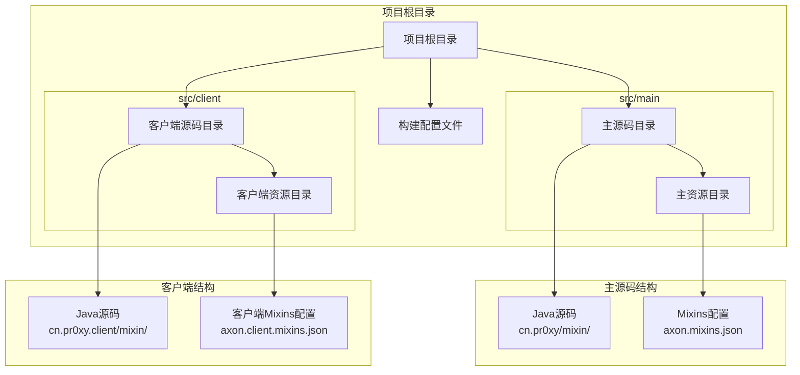

**图表来源**
- [ExampleMixin.java:1-15](file://src/main/java/cn/pr0xy/mixin/ExampleMixin.java#L1-L15)
- [ExampleClientMixin.java:1-15](file://src/client/java/cn/pr0xy/client/mixin/ExampleClientMixin.java#L1-L15)
- [axon.mixins.json:1-14](file://src/main/resources/axon.mixins.json#L1-L14)
- [axon.client.mixins.json:1-14](file://src/client/resources/axon.client.mixins.json#L1-L14)

**章节来源**
- [build.gradle:17-27](file://build.gradle#L17-L27)
- [fabric.mod.json:25-31](file://fabric.mod.json#L25-L31)

## 核心组件

### Mixin注解系统

Mixin框架通过一系列精心设计的注解来实现代码注入：

#### 基础注解
- **@Mixin**: 标识目标类，声明要扩展的原版类
- **@Inject**: 定义注入点，指定注入时机和位置
- **@At**: 精确定位注入点，支持多种匹配策略

#### 注入策略
- **方法注入**: 在目标方法的特定时机插入代码
- **字段访问**: 提供安全的字段访问接口
- **方法重写**: 允许部分重写目标方法行为

### 配置文件系统

每个环境都有独立的Mixin配置文件，确保正确的类加载顺序和兼容性：

#### 主配置文件 (axon.mixins.json)
- 指定主包路径：`cn.pr0xy.mixin`
- 设置兼容级别：JAVA_17
- 声明默认注入器要求：1
- 启用覆盖注解验证

#### 客户端配置文件 (axon.client.mixins.json)
- 指定客户端包路径：`cn.pr0xy.client.mixin`
- 专门针对客户端环境优化
- 支持客户端特有的注入需求

**章节来源**
- [ExampleMixin.java:9-14](file://src/main/java/cn/pr0xy/mixin/ExampleMixin.java#L9-L14)
- [ExampleClientMixin.java:9-14](file://src/client/java/cn/pr0xy/client/mixin/ExampleClientMixin.java#L9-L14)
- [axon.mixins.json:1-14](file://src/main/resources/axon.mixins.json#L1-L14)
- [axon.client.mixins.json:1-14](file://src/client/resources/axon.client.mixins.json#L1-L14)

## 架构概览

BodyCam的Mixin架构采用分层设计，确保代码注入的安全性和可维护性：

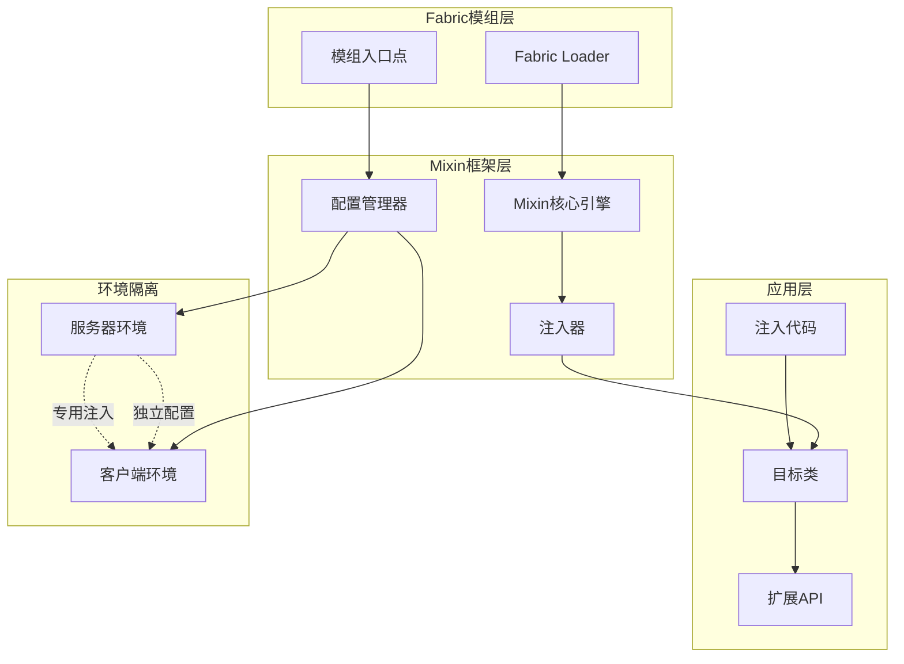

**图表来源**
- [fabric.mod.json:25-31](file://fabric.mod.json#L25-L31)
- [ExampleMixin.java:9-14](file://src/main/java/cn/pr0xy/mixin/ExampleMixin.java#L9-L14)
- [ExampleClientMixin.java:9-14](file://src/client/java/cn/pr0xy/client/mixin/ExampleClientMixin.java#L9-L14)

### 环境分离机制

系统实现了严格的环境分离，确保服务器和客户端功能的独立性：

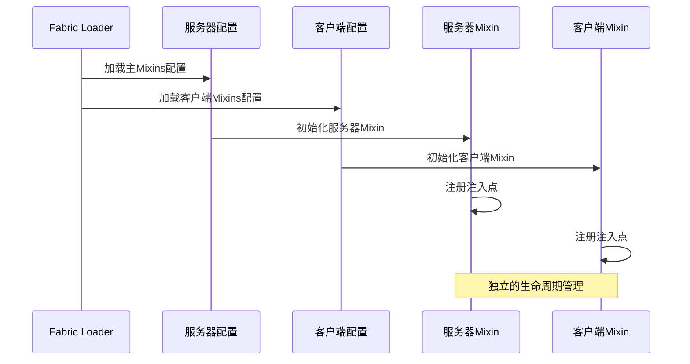

**图表来源**
- [fabric.mod.json:25-31](file://fabric.mod.json#L25-L31)
- [axon.mixins.json:1-14](file://src/main/resources/axon.mixins.json#L1-L14)
- [axon.client.mixins.json:1-14](file://src/client/resources/axon.client.mixins.json#L1-L14)

## 详细组件分析

### ExampleMixin - 服务器端扩展

ExampleMixin展示了服务器端Mixin的基本实现模式：

#### 类结构分析
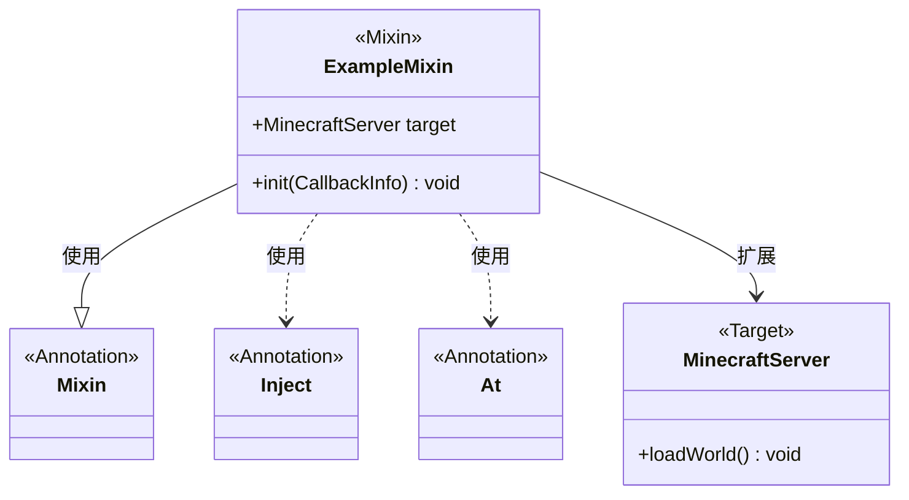

**图表来源**
- [ExampleMixin.java:9-14](file://src/main/java/cn/pr0xy/mixin/ExampleMixin.java#L9-L14)

#### 注入策略详解
- **目标类**: MinecraftServer
- **目标方法**: loadWorld
- **注入时机**: 方法头部 (HEAD)
- **注入类型**: 方法注入

#### 实现模式
1. 使用`@Mixin`注解标识目标类
2. 通过`@Inject`定义注入点
3. 使用`@At`精确控制注入位置
4. 实现回调方法处理注入逻辑

**章节来源**
- [ExampleMixin.java:1-15](file://src/main/java/cn/pr0xy/mixin/ExampleMixin.java#L1-L15)

### ExampleClientMixin - 客户端扩展

ExampleClientMixin演示了客户端环境下的Mixin实现：

#### 客户端特化
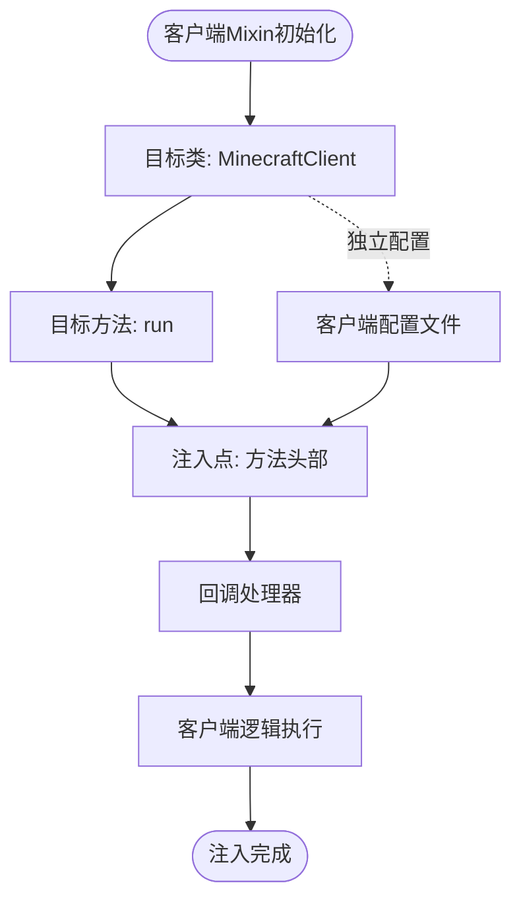

**图表来源**
- [ExampleClientMixin.java:9-14](file://src/client/java/cn/pr0xy/client/mixin/ExampleClientMixin.java#L9-L14)

#### 客户端特性
- 针对客户端特定的注入需求
- 独立的配置文件管理
- 与服务器端完全隔离的实现

**章节来源**
- [ExampleClientMixin.java:1-15](file://src/client/java/cn/pr0xy/client/mixin/ExampleClientMixin.java#L1-L15)

### 配置文件结构分析

#### 主Mixins配置 (axon.mixins.json)
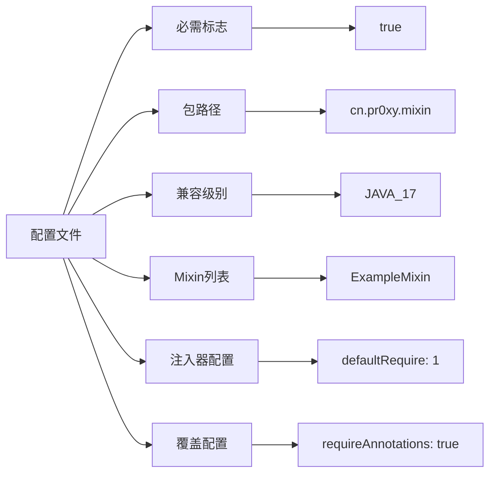

**图表来源**
- [axon.mixins.json:1-14](file://src/main/resources/axon.mixins.json#L1-L14)

#### 客户端Mixins配置 (axon.client.mixins.json)
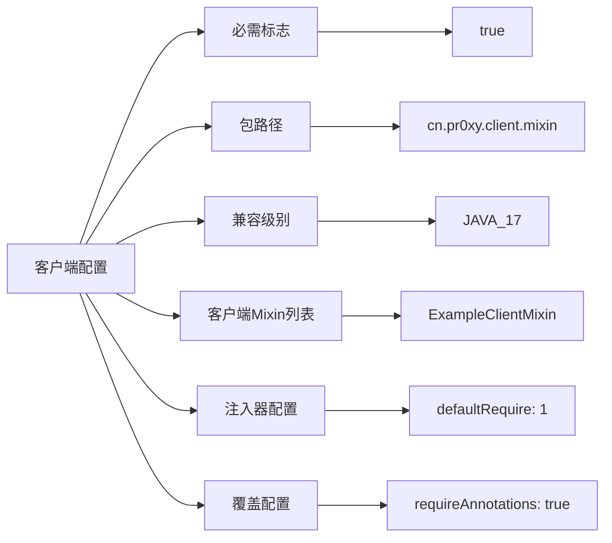

**图表来源**
- [axon.client.mixins.json:1-14](file://src/client/resources/axon.client.mixins.json#L1-L14)

**章节来源**
- [axon.mixins.json:1-14](file://src/main/resources/axon.mixins.json#L1-L14)
- [axon.client.mixins.json:1-14](file://src/client/resources/axon.client.mixins.json#L1-L14)

## 依赖关系分析

### 构建系统依赖

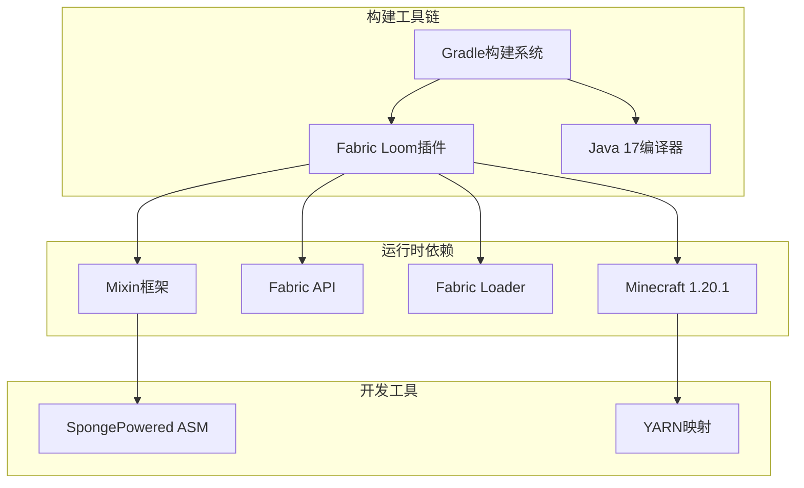

**图表来源**
- [build.gradle:29-38](file://build.gradle#L29-L38)
- [gradle.properties:10-20](file://gradle.properties#L10-L20)

### 模组集成机制

Fabric模组通过以下方式集成Mixin框架：

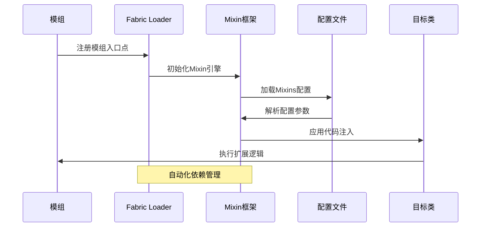

**图表来源**
- [fabric.mod.json:25-31](file://fabric.mod.json#L25-L31)
- [build.gradle:17-27](file://build.gradle#L17-L27)

**章节来源**
- [build.gradle:17-38](file://build.gradle#L17-L38)
- [gradle.properties:10-20](file://gradle.properties#L10-L20)
- [fabric.mod.json:25-31](file://fabric.mod.json#L25-L31)

## 性能考虑

### 编译时优化

Mixin系统在编译阶段进行大量优化：

- **字节码转换**: 在编译时生成优化的字节码
- **依赖解析**: 预先解析所有Mixin依赖关系
- **配置验证**: 编译时验证配置文件的有效性

### 运行时性能影响

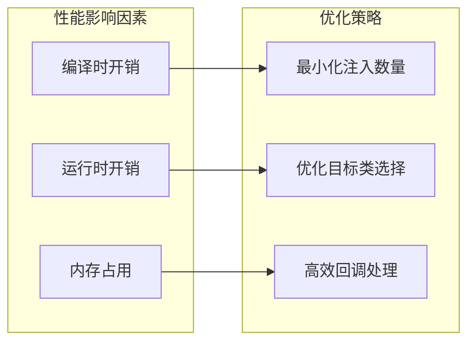

### 最佳实践建议

1. **注入点选择**: 仅在必要时使用注入，避免过度使用
2. **回调优化**: 使用轻量级回调处理，避免复杂的计算逻辑
3. **内存管理**: 注意注入代码的内存使用，及时释放不需要的对象
4. **线程安全**: 确保注入代码在多线程环境下的安全性

## 故障排除指南

### 常见配置错误

#### 包路径匹配问题
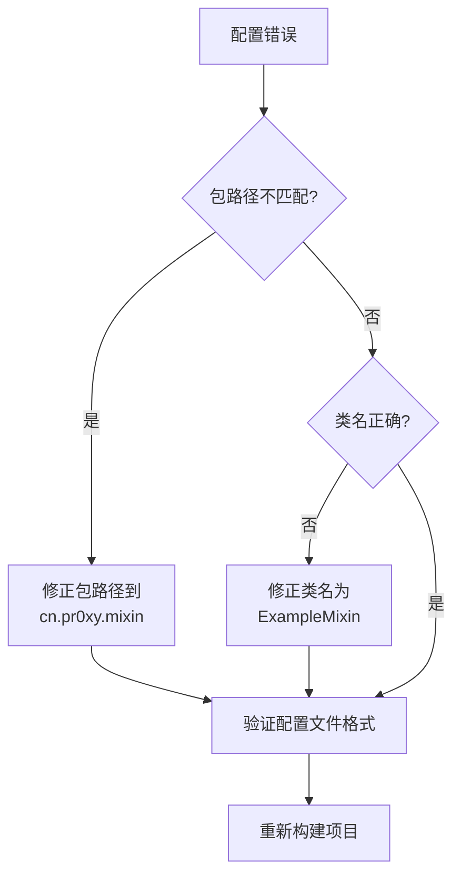

#### 兼容性级别问题
- 确保Java版本与兼容级别一致
- 检查YARN映射版本的匹配性
- 验证Fabric API版本的兼容性

### 调试技巧

#### 日志配置
启用详细的Mixin日志输出：
- 设置日志级别为DEBUG
- 监控注入过程的执行情况
- 捕获异常和错误信息

#### 常用调试命令
```bash
# 清理构建缓存
./gradlew clean

# 重新构建项目
./gradlew build

# 查看Mixin配置
./gradlew genSources

# 检查依赖关系
./gradlew dependencies
```

### 错误诊断流程

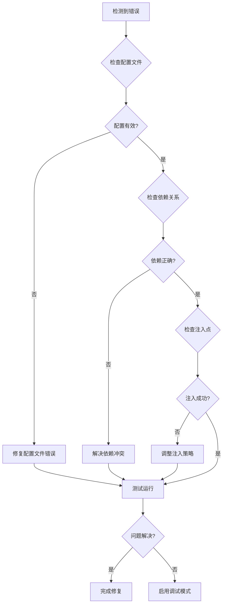

**章节来源**
- [axon.mixins.json:1-14](file://src/main/resources/axon.mixins.json#L1-L14)
- [axon.client.mixins.json:1-14](file://src/client/resources/axon.client.mixins.json#L1-L14)

## 结论

BodyCam的Mixin代码扩展系统展现了现代模组开发的最佳实践。通过精心设计的架构和严格的配置管理，该系统实现了对Minecraft核心功能的安全扩展。

### 主要优势

1. **模块化设计**: 清晰的客户端-服务器分离架构
2. **配置驱动**: 基于JSON的配置文件管理
3. **类型安全**: 编译时的类型检查和验证
4. **性能优化**: 最小化的运行时开销

### 技术特色

- **注解驱动**: 简洁直观的代码注入语法
- **环境隔离**: 独立的客户端和服务器实现
- **自动管理**: Fabric Loom提供的自动化构建支持
- **兼容性强**: 支持最新的Minecraft版本和Java标准

### 发展建议

对于未来的扩展开发，建议重点关注：

1. **性能监控**: 建立完善的性能指标收集机制
2. **错误处理**: 增强错误恢复和降级策略
3. **文档完善**: 提供更详细的API文档和示例
4. **测试覆盖**: 建立全面的单元测试和集成测试体系

该系统为Fabric模组开发者提供了一个可靠的代码扩展框架，通过Mixin机制实现了对Minecraft原版代码的优雅扩展，同时保持了良好的性能表现和可维护性。