# 客户端混入实现

<cite>
**本文档引用的文件**
- [ExampleClientMixin.java](file://src/client/java/cn/pr0xy/client/mixin/ExampleClientMixin.java)
- [ExampleMixin.java](file://src/main/java/cn/pr0xy/mixin/ExampleMixin.java)
- [axon.client.mixins.json](file://src/client/resources/axon.client.mixins.json)
- [axon.mixins.json](file://src/main/resources/axon.mixins.json)
- [AXONClient.java](file://src/client/java/cn/pr0xy/client/AXONClient.java)
- [BodyCamHUD.java](file://src/client/java/cn/pr0xy/client/BodyCamHUD.java)
- [AXON.java](file://src/main/java/cn/pr0xy/AXON.java)
- [fabric.mod.json](file://src/main/resources/fabric.mod.json)
- [build.gradle](file://build.gradle)
- [axon_body.json](file://src/main/resources/assets/axon/font/axon_body.json)
- [sounds.json](file://src/main/resources/assets/axon/sounds.json)
</cite>

## 目录
1. [简介](#简介)
2. [项目结构](#项目结构)
3. [核心组件](#核心组件)
4. [架构概览](#架构概览)
5. [详细组件分析](#详细组件分析)
6. [依赖关系分析](#依赖关系分析)
7. [性能考虑](#性能考虑)
8. [故障排除指南](#故障排除指南)
9. [结论](#结论)
10. [附录](#附录)

## 简介

本文档深入分析了BodyCam项目的客户端混入实现，重点研究ExampleClientMixin类的设计和实现。该模组基于Fabric API构建，展示了如何在Minecraft客户端环境中使用Mixin进行代码注入，实现自定义HUD渲染、声音播放和客户端生命周期管理等功能。

BodyCam项目采用分层架构设计，通过客户端混入技术在不修改原版游戏代码的情况下扩展功能。项目的核心特色包括：
- 基于Fabric Loader的客户端模组实现
- 使用Mixin框架进行代码注入
- 自定义HUD渲染系统
- 客户端声音管理系统
- 模组生命周期管理

## 项目结构

BodyCam项目采用标准的Fabric模组目录结构，实现了客户端和服务器端功能的分离：

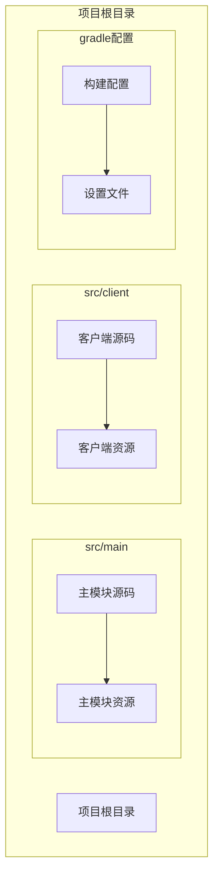

**图表来源**
- [build.gradle:17-27](file://build.gradle#L17-L27)
- [fabric.mod.json:17-31](file://src/main/resources/fabric.mod.json#L17-L31)

项目结构特点：
- **分层源码组织**：客户端和服务器端代码分离到不同目录
- **独立资源管理**：客户端和主模块拥有各自的资源配置
- **Gradle多环境支持**：通过splitEnvironmentSourceSets()实现客户端和服务器端分离
- **Fabric API集成**：完整集成了Fabric Loader和Fabric API

**章节来源**
- [build.gradle:17-27](file://build.gradle#L17-L27)
- [fabric.mod.json:17-31](file://src/main/resources/fabric.mod.json#L17-L31)

## 核心组件

### 客户端混入系统

客户端混入系统是BodyCam项目的核心技术实现，通过ExampleClientMixin展示了如何在Minecraft客户端中进行代码注入。

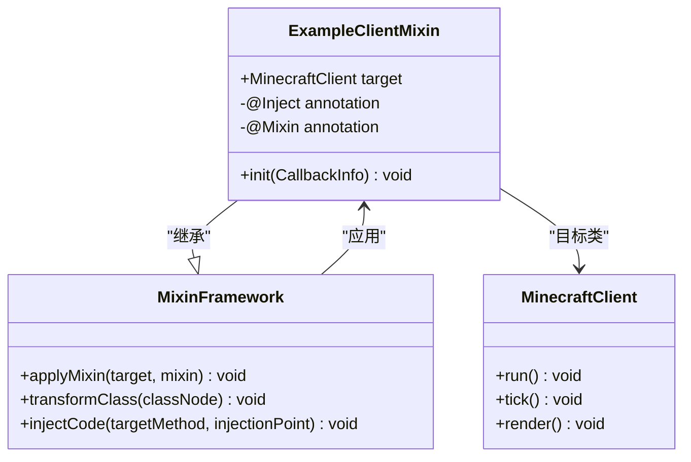

**图表来源**
- [ExampleClientMixin.java:9-15](file://src/client/java/cn/pr0xy/client/mixin/ExampleClientMixin.java#L9-L15)
- [ExampleClientMixin.java:11-14](file://src/client/java/cn/pr0xy/client/mixin/ExampleClientMixin.java#L11-L14)

### 客户端初始化系统

AXONClient类实现了客户端模组的初始化逻辑，负责注册各种回调和事件处理器。

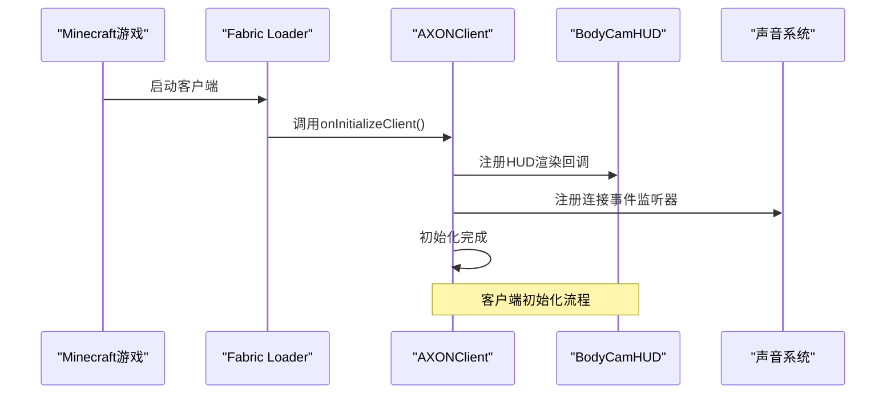

**图表来源**
- [AXONClient.java:12-20](file://src/client/java/cn/pr0xy/client/AXONClient.java#L12-L20)

**章节来源**
- [ExampleClientMixin.java:1-15](file://src/client/java/cn/pr0xy/client/mixin/ExampleClientMixin.java#L1-L15)
- [AXONClient.java:12-31](file://src/client/java/cn/pr0xy/client/AXONClient.java#L12-L31)

## 架构概览

### 混入配置架构

BodyCam项目实现了客户端和服务器端混入配置的分离，确保每个环境只加载必要的混入代码。

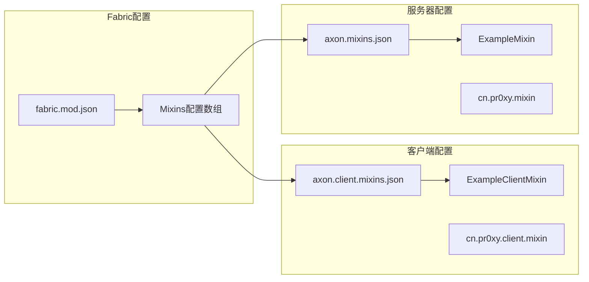

**图表来源**
- [axon.client.mixins.json:1-14](file://src/client/resources/axon.client.mixins.json#L1-L14)
- [axon.mixins.json:1-14](file://src/main/resources/axon.mixins.json#L1-L14)
- [fabric.mod.json:25-31](file://src/main/resources/fabric.mod.json#L25-L31)

### 客户端渲染架构

BodyCamHUD实现了复杂的HUD渲染系统，包括多个独立的渲染区域和动画效果。

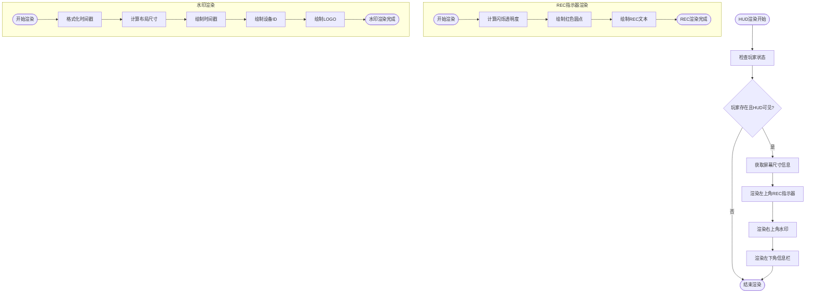

**图表来源**
- [BodyCamHUD.java:40-60](file://src/client/java/cn/pr0xy/client/BodyCamHUD.java#L40-L60)
- [BodyCamHUD.java:65-80](file://src/client/java/cn/pr0xy/client/BodyCamHUD.java#L65-L80)
- [BodyCamHUD.java:86-116](file://src/client/java/cn/pr0xy/client/BodyCamHUD.java#L86-L116)

**章节来源**
- [BodyCamHUD.java:14-139](file://src/client/java/cn/pr0xy/client/BodyCamHUD.java#L14-L139)

## 详细组件分析

### ExampleClientMixin 分析

ExampleClientMixin是客户端混入的核心实现，展示了如何在MinecraftClient.run()方法的头部进行代码注入。

#### 类设计分析

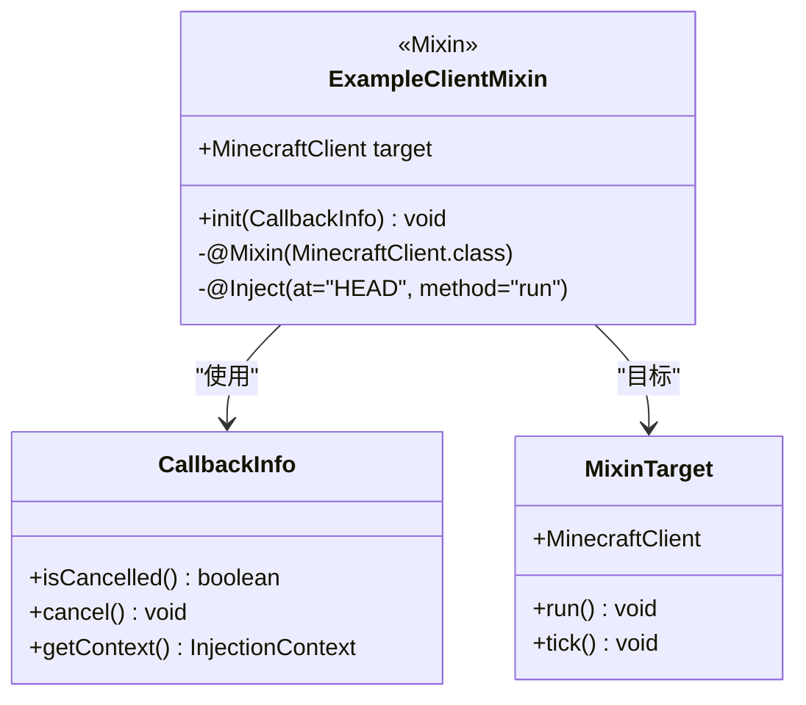

**图表来源**
- [ExampleClientMixin.java:9-15](file://src/client/java/cn/pr0xy/client/mixin/ExampleClientMixin.java#L9-L15)

#### 注入策略分析

客户端混入采用了"头部注入"策略，在MinecraftClient.run()方法执行前插入代码。这种选择具有以下优势：

1. **早期初始化**：确保在游戏主循环开始前执行必要的初始化逻辑
2. **无副作用**：不会干扰原方法的正常执行流程
3. **安全性**：避免与原方法的返回值或异常处理产生冲突

**章节来源**
- [ExampleClientMixin.java:11-14](file://src/client/java/cn/pr0xy/client/mixin/ExampleClientMixin.java#L11-L14)

### AXONClient 组件分析

AXONClient实现了完整的客户端模组初始化流程，包括HUD注册和声音播放。

#### 生命周期管理

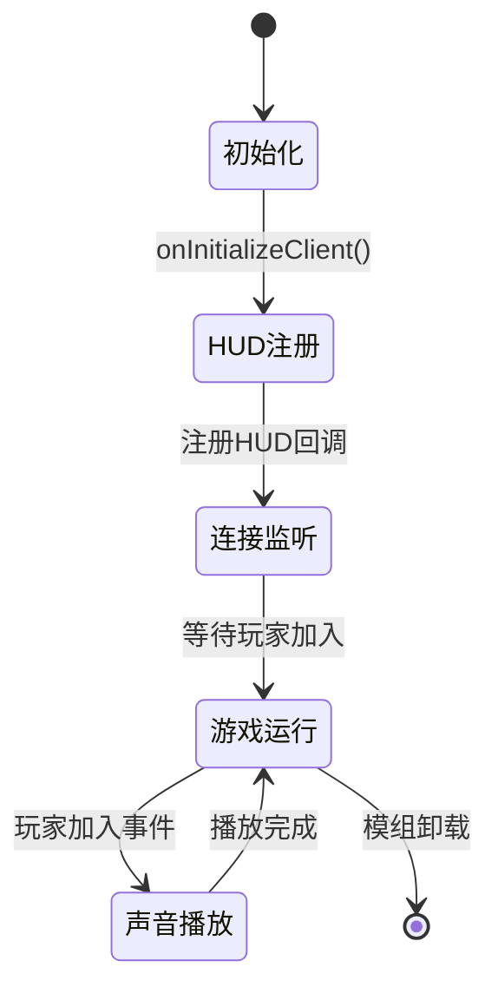

**图表来源**
- [AXONClient.java:14-20](file://src/client/java/cn/pr0xy/client/AXONClient.java#L14-L20)
- [AXONClient.java:22-30](file://src/client/java/cn/pr0xy/client/AXONClient.java#L22-L30)

#### 音频播放机制

AXONClient使用Fabric API的ClientPlayConnectionEvents.JOIN事件来监听玩家加入世界的时间点，然后通过MinecraftClient.execute()确保音频播放在正确的客户端线程中执行。

**章节来源**
- [AXONClient.java:12-31](file://src/client/java/cn/pr0xy/client/AXONClient.java#L12-L31)

### BodyCamHUD 组件分析

BodyCamHUD实现了复杂的HUD渲染系统，包含三个主要的渲染区域。

#### 渲染架构设计

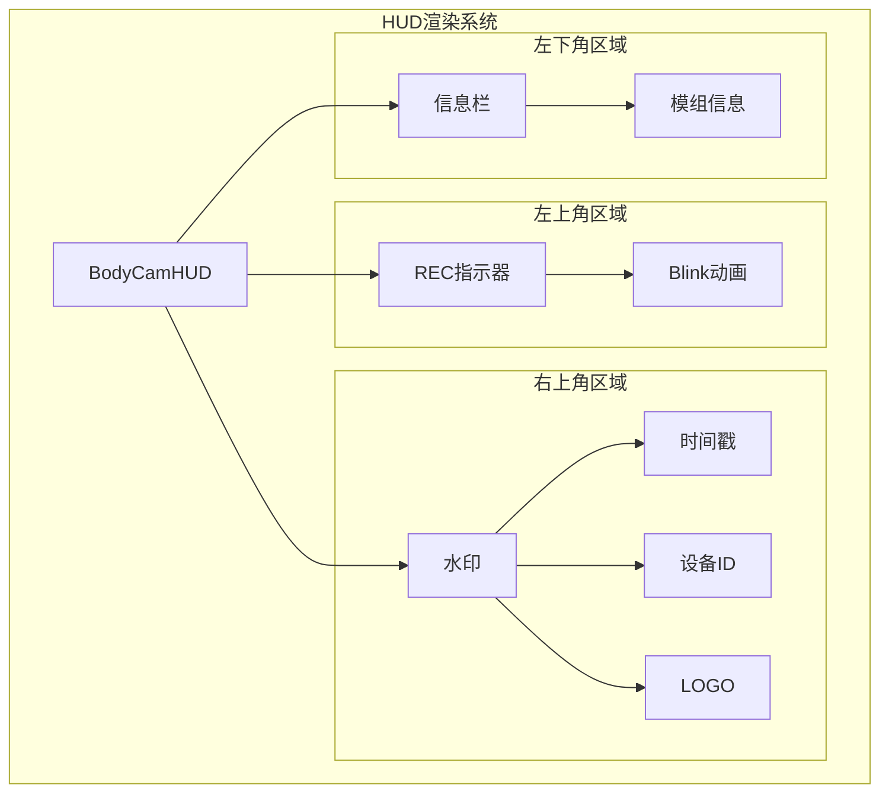

**图表来源**
- [BodyCamHUD.java:40-60](file://src/client/java/cn/pr0xy/client/BodyCamHUD.java#L40-L60)

#### 动画系统实现

REC指示器使用余弦函数实现约1秒周期的闪烁效果，通过计算当前毫秒数的模运算来确定相位值。

**章节来源**
- [BodyCamHUD.java:65-80](file://src/client/java/cn/pr0xy/client/BodyCamHUD.java#L65-L80)

### 客户端与服务器端混入对比

#### 混入目标差异

| 特性 | 客户端混入 | 服务器端混入 |
|------|------------|--------------|
| 目标类 | MinecraftClient | MinecraftServer |
| 主要用途 | HUD渲染、声音播放 | 世界加载、服务器逻辑 |
| 注入时机 | 游戏启动时 | 世界加载时 |
| 线程安全 | 客户端线程 | 服务器线程 |

#### 配置文件差异

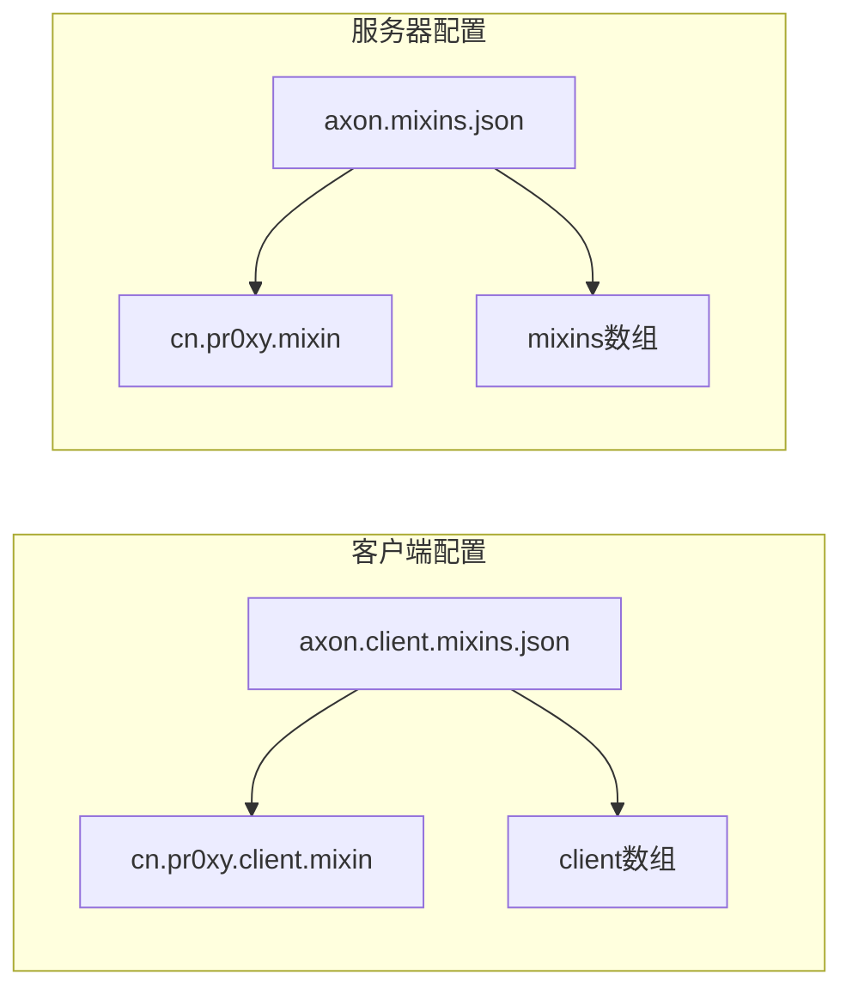

**图表来源**
- [axon.client.mixins.json:5-7](file://src/client/resources/axon.client.mixins.json#L5-L7)
- [axon.mixins.json:5-7](file://src/main/resources/axon.mixins.json#L5-L7)

**章节来源**
- [ExampleMixin.java:1-15](file://src/main/java/cn/pr0xy/mixin/ExampleMixin.java#L1-L15)
- [axon.client.mixins.json:1-14](file://src/client/resources/axon.client.mixins.json#L1-L14)
- [axon.mixins.json:1-14](file://src/main/resources/axon.mixins.json#L1-L14)

## 依赖关系分析

### Fabric API依赖

BodyCam项目依赖于多个Fabric API模块来实现其功能：

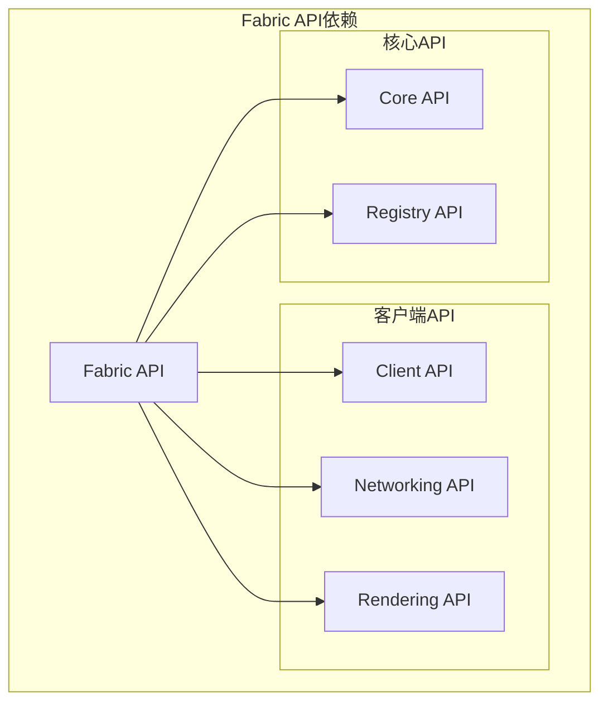

**图表来源**
- [build.gradle:35-36](file://build.gradle#L35-L36)

### 模组初始化流程

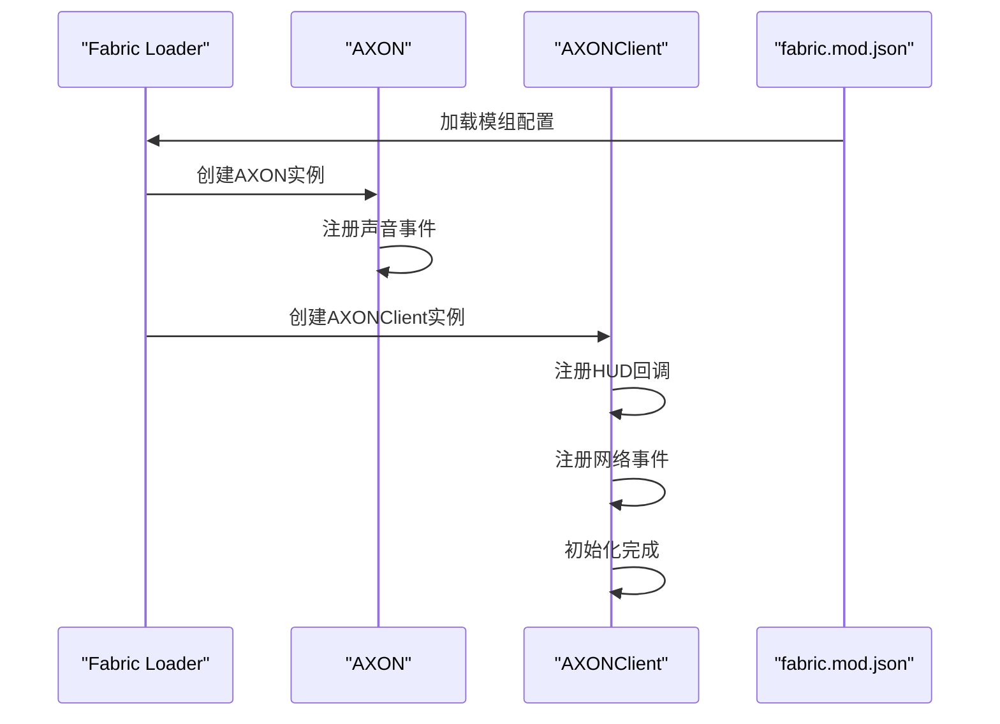

**图表来源**
- [fabric.mod.json:17-31](file://src/main/resources/fabric.mod.json#L17-L31)
- [AXON.java:19-24](file://src/main/java/cn/pr0xy/AXON.java#L19-L24)
- [AXONClient.java:12-20](file://src/client/java/cn/pr0xy/client/AXONClient.java#L12-L20)

**章节来源**
- [build.gradle:29-38](file://build.gradle#L29-L38)
- [fabric.mod.json:17-31](file://src/main/resources/fabric.mod.json#L17-L31)

## 性能考虑

### 渲染性能优化

BodyCamHUD在渲染过程中采用了多项性能优化策略：

1. **条件渲染**：仅在玩家存在且HUD未隐藏时进行渲染
2. **批量绘制**：使用DrawContext进行高效的批量图形绘制
3. **缓存字体**：复用TextRenderer实例减少对象创建开销
4. **最小化计算**：动画计算在必要时才执行

### 内存管理

客户端混入系统遵循以下内存管理原则：
- 避免在混入方法中创建大量临时对象
- 复用静态常量和单例对象
- 及时释放不需要的资源引用

## 故障排除指南

### 常见问题及解决方案

#### 混入注入失败

**问题症状**：客户端混入代码不执行
**可能原因**：
1. 混入配置文件路径错误
2. 目标类名不匹配
3. 方法签名不匹配

**解决步骤**：
1. 检查混入配置文件中的包名和类名
2. 验证目标类是否存在于运行时环境中
3. 确认方法签名与目标方法完全一致

#### HUD渲染异常

**问题症状**：HUD显示不正确或出现闪烁
**可能原因**：
1. 渲染坐标计算错误
2. 屏幕尺寸获取失败
3. 字体资源加载失败

**解决步骤**：
1. 检查屏幕尺寸获取逻辑
2. 验证字体资源文件是否存在
3. 确认渲染坐标计算公式

#### 声音播放问题

**问题症状**：启动声音无法播放
**可能原因**：
1. 声音事件未正确注册
2. 声音文件路径错误
3. 线程调用时机不当

**解决步骤**：
1. 验证声音事件注册逻辑
2. 检查声音文件资源路径
3. 确保在正确的客户端线程中播放

**章节来源**
- [BodyCamHUD.java:43-46](file://src/client/java/cn/pr0xy/client/BodyCamHUD.java#L43-L46)
- [AXONClient.java:22-30](file://src/client/java/cn/pr0xy/client/AXONClient.java#L22-L30)

## 结论

BodyCam项目的客户端混入实现展示了现代Minecraft模组开发的最佳实践。通过精心设计的混入架构、完善的客户端初始化流程和高效的HUD渲染系统，该项目成功地在不修改原版游戏代码的前提下扩展了功能。

关键技术要点：
- **分离式架构**：客户端和服务器端混入配置完全分离
- **生命周期管理**：通过Fabric API实现完整的模组生命周期控制
- **性能优化**：在渲染和音频播放方面都考虑了性能影响
- **错误处理**：提供了完善的错误检测和恢复机制

对于开发者而言，BodyCam项目提供了宝贵的实践经验，特别是在以下方面：
- 客户端混入的设计模式
- Fabric API的正确使用方式
- HUD渲染系统的实现技巧
- 客户端线程安全的处理方法

## 附录

### 开发者实用指南

#### 扩展现有功能

1. **添加新的HUD元素**：参考BodyCamHUD的渲染模式，实现独立的渲染方法
2. **扩展混入功能**：在现有的ExampleClientMixin基础上添加新的注入点
3. **集成新API**：利用Fabric API提供的新功能扩展模组能力

#### 添加新功能的步骤

1. **需求分析**：明确新功能的需求和实现目标
2. **架构设计**：设计功能的架构和数据流
3. **实现开发**：编写核心代码和必要的混入逻辑
4. **测试验证**：进行全面的功能测试和性能测试
5. **文档编写**：更新相关文档和注释

#### 最佳实践建议

- 始终遵循客户端线程安全原则
- 优先使用Fabric API而非直接操作底层实现
- 保持混入代码的简洁性和可维护性
- 充分考虑性能影响和资源消耗
- 提供适当的错误处理和日志记录