# 服务器端混入实现

<cite>
**本文档引用的文件**
- [ExampleMixin.java](file://src/main/java/cn/pr0xy/mixin/ExampleMixin.java)
- [axon.mixins.json](file://src/main/resources/axon.mixins.json)
- [AXON.java](file://src/main/java/cn/pr0xy/AXON.java)
- [ExampleClientMixin.java](file://src/client/java/cn/pr0xy/client/mixin/ExampleClientMixin.java)
- [axon.client.mixins.json](file://src/client/resources/axon.client.mixins.json)
- [AXONClient.java](file://src/client/java/cn/pr0xy/client/AXONClient.java)
- [BodyCamHUD.java](file://src/client/java/cn/pr0xy/client/BodyCamHUD.java)
- [fabric.mod.json](file://src/main/resources/fabric.mod.json)
- [build.gradle](file://build.gradle)
- [gradle.properties](file://gradle.properties)
</cite>

## 目录
1. [简介](#简介)
2. [项目结构](#项目结构)
3. [核心组件](#核心组件)
4. [架构概览](#架构概览)
5. [详细组件分析](#详细组件分析)
6. [依赖关系分析](#依赖关系分析)
7. [性能考虑](#性能考虑)
8. [故障排除指南](#故障排除指南)
9. [结论](#结论)
10. [附录](#附录)

## 简介

本文档深入分析了BodyCam项目的服务器端Mixin实现，重点研究了ExampleMixin类的设计与实现。BodyCam是一个基于Fabric API开发的Minecraft模组，通过Mixins技术对MinecraftServer类进行代码注入，实现了BodyCam功能的核心逻辑。

该项目展示了如何使用SpongePowered Mixin框架在不修改原生Minecraft代码的情况下，向MinecraftServer的loadWorld方法注入自定义逻辑。同时，项目还包含了完整的客户端实现，包括BodyCam HUD渲染和启动音效播放功能。

## 项目结构

BodyCam项目采用标准的Fabric模组结构，包含服务器端和客户端两个主要部分：

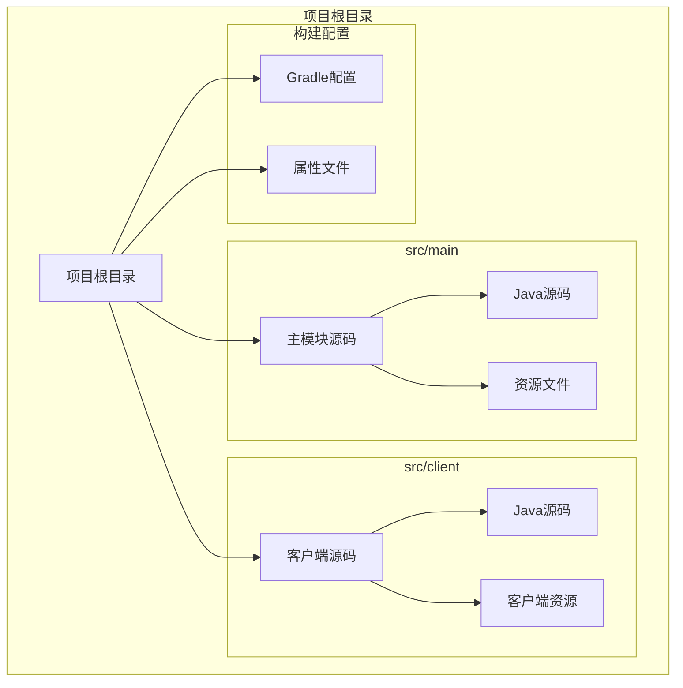

**图表来源**
- [build.gradle:17-27](file://build.gradle#L17-L27)
- [fabric.mod.json:25-31](file://src/main/resources/fabric.mod.json#L25-L31)

**章节来源**
- [build.gradle:17-27](file://build.gradle#L17-L27)
- [fabric.mod.json:17-31](file://src/main/resources/fabric.mod.json#L17-L31)

## 核心组件

### ExampleMixin类分析

ExampleMixin是服务器端混入的核心组件，负责向MinecraftServer类注入自定义逻辑：

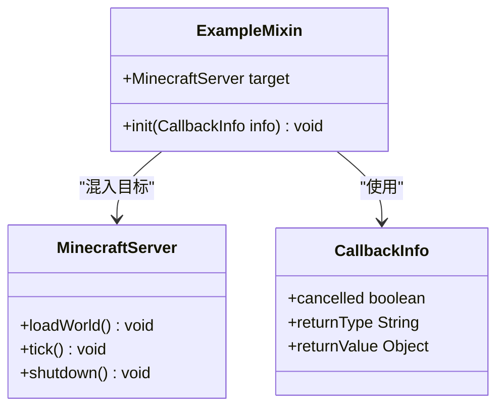

**图表来源**
- [ExampleMixin.java:9-15](file://src/main/java/cn/pr0xy/mixin/ExampleMixin.java#L9-L15)

ExampleMixin类的关键特性：
- 使用`@Mixin(MinecraftServer.class)`注解标识混入目标
- 通过`@Inject`注解在`loadWorld`方法的头部位置注入代码
- 方法签名使用私有访问修饰符，确保注入的安全性
- 接收CallbackInfo参数用于控制注入行为

**章节来源**
- [ExampleMixin.java:1-15](file://src/main/java/cn/pr0xy/mixin/ExampleMixin.java#L1-L15)

### 混入配置系统

项目使用JSON配置文件管理混入规则：

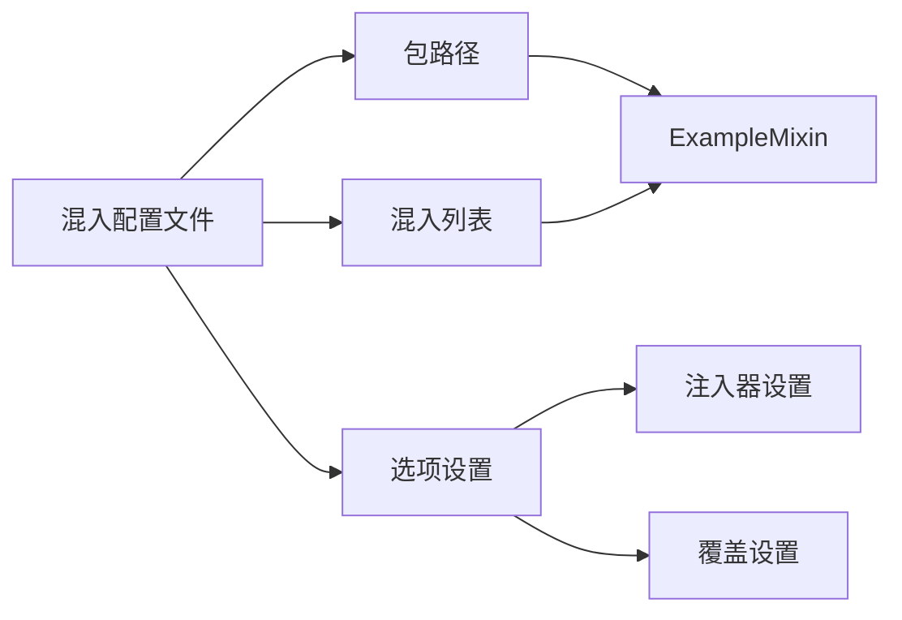

**图表来源**
- [axon.mixins.json:1-14](file://src/main/resources/axon.mixins.json#L1-L14)

**章节来源**
- [axon.mixins.json:1-14](file://src/main/resources/axon.mixins.json#L1-L14)

## 架构概览

BodyCam的整体架构展示了服务器端和客户端的分离设计：

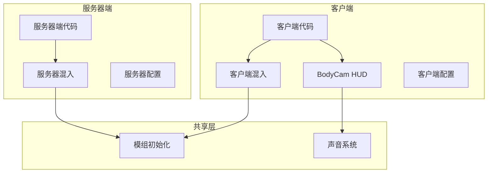

**图表来源**
- [fabric.mod.json:17-31](file://src/main/resources/fabric.mod.json#L17-L31)
- [AXON.java:11-25](file://src/main/java/cn/pr0xy/AXON.java#L11-L25)

## 详细组件分析

### 服务器端混入实现

#### ExampleMixin类详解

ExampleMixin类展示了服务器端混入的标准实现模式：

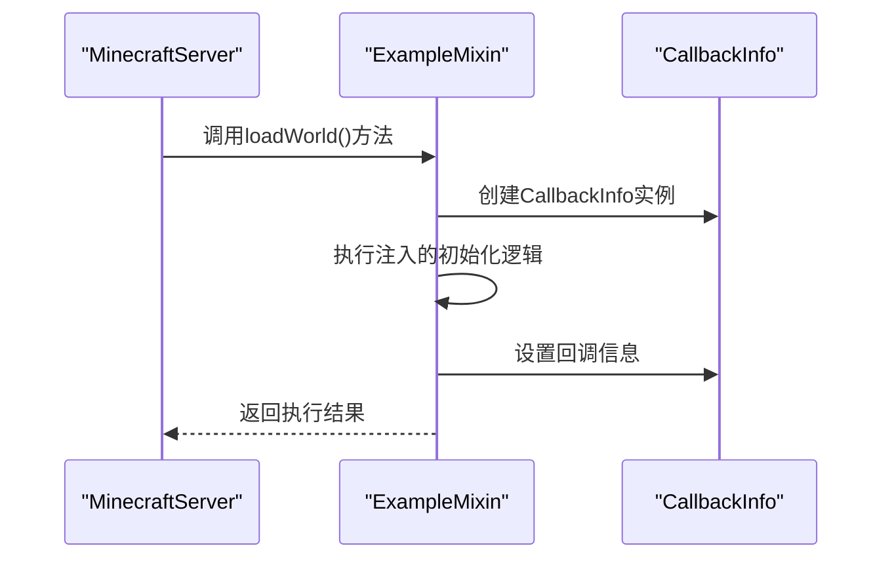

**图表来源**
- [ExampleMixin.java:11-14](file://src/main/java/cn/pr0xy/mixin/ExampleMixin.java#L11-L14)

关键实现要点：
- **目标类选择**：选择MinecraftServer作为混入目标，这是服务器端的核心类
- **注入时机**：使用`@At("HEAD")`在方法开始处注入，确保在原方法逻辑执行前执行
- **方法签名**：使用私有方法签名，避免破坏原方法的公共接口
- **参数处理**：接收CallbackInfo参数用于控制注入行为

#### @Mixin注解使用

@Mixin注解是Mixins框架的核心，它定义了混入的目标类：

```mermaid
flowchart TD
Start([开始混入]) --> TargetClass["选择目标类<br/>MinecraftServer.class"]
TargetClass --> Annotation["@Mixin注解<br/>标识混入关系"]
Annotation --> InjectionPoint["确定注入点<br/>@At(\"HEAD\")"]
InjectionPoint --> MethodSignature["匹配方法签名<br/>loadWorld()"]
MethodSignature --> PrivateMethod["创建私有注入方法<br/>init(CallbackInfo info)"]
PrivateMethod --> Execution["执行注入逻辑"]
Execution --> End([完成混入])
```

**图表来源**
- [ExampleMixin.java:9-15](file://src/main/java/cn/pr0xy/mixin/ExampleMixin.java#L9-L15)

**章节来源**
- [ExampleMixin.java:9-15](file://src/main/java/cn/pr0xy/mixin/ExampleMixin.java#L9-L15)

### 客户端混入对比分析

为了更好地理解混入模式，我们对比分析客户端和服务器端的实现差异：

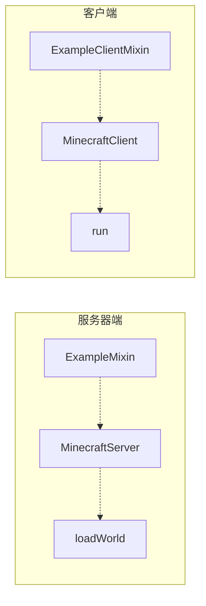

**图表来源**
- [ExampleMixin.java:3-4](file://src/main/java/cn/pr0xy/mixin/ExampleMixin.java#L3-L4)
- [ExampleClientMixin.java:3-4](file://src/client/java/cn/pr0xy/client/mixin/ExampleClientMixin.java#L3-L4)

**章节来源**
- [ExampleClientMixin.java:1-15](file://src/client/java/cn/pr0xy/client/mixin/ExampleClientMixin.java#L1-L15)

### CallbackInfo参数详解

CallbackInfo参数是Mixins框架提供的关键工具，用于控制注入行为：

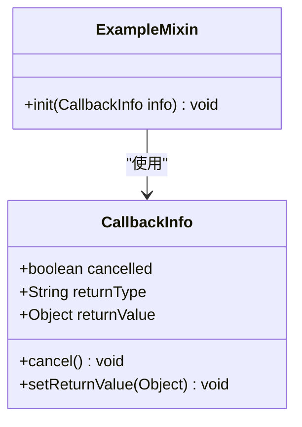

**图表来源**
- [ExampleMixin.java:7](file://src/main/java/cn/pr0xy/mixin/ExampleMixin.java#L7)

CallbackInfo的主要用途：
- **取消执行**：通过`cancelled`属性控制是否取消原方法执行
- **返回值控制**：通过`setReturnValue`设置自定义返回值
- **类型检查**：通过`returnType`获取原方法的返回类型信息

**章节来源**
- [ExampleMixin.java:12](file://src/main/java/cn/pr0xy/mixin/ExampleMixin.java#L12)

## 依赖关系分析

### Fabric API集成

BodyCam项目深度集成了Fabric API，提供了完整的模组生命周期管理：

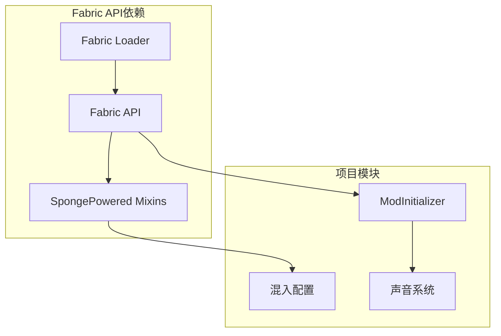

**图表来源**
- [build.gradle:29-37](file://build.gradle#L29-L37)
- [fabric.mod.json:32-37](file://src/main/resources/fabric.mod.json#L32-L37)

### 版本兼容性

项目严格遵循版本兼容性要求：

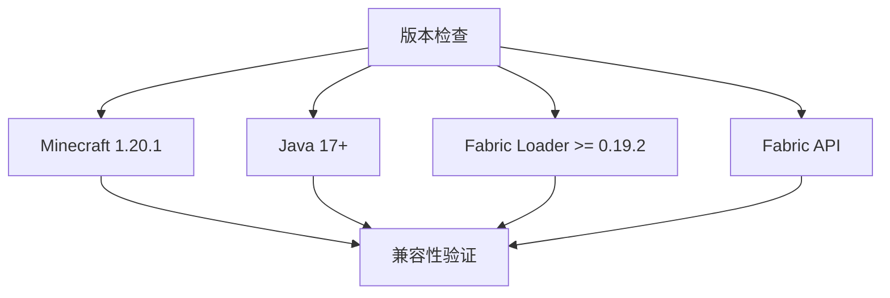

**图表来源**
- [gradle.properties:10-13](file://gradle.properties#L10-L13)
- [fabric.mod.json:33-37](file://src/main/resources/fabric.mod.json#L33-L37)

**章节来源**
- [build.gradle:29-37](file://build.gradle#L29-L37)
- [gradle.properties:10-13](file://gradle.properties#L10-L13)

## 性能考虑

### 混入性能优化

服务器端混入需要特别关注性能影响：

1. **注入时机选择**：使用`@At("HEAD")`可以最小化对原方法性能的影响
2. **方法签名优化**：私有方法签名避免了额外的访问控制开销
3. **回调信息使用**：合理使用CallbackInfo减少不必要的对象创建

### 线程安全考虑

Minecraft服务器环境下的线程安全要点：
- 混入代码应该避免阻塞操作
- 注意服务器端的同步需求
- 避免创建长时间运行的任务

### 内存管理

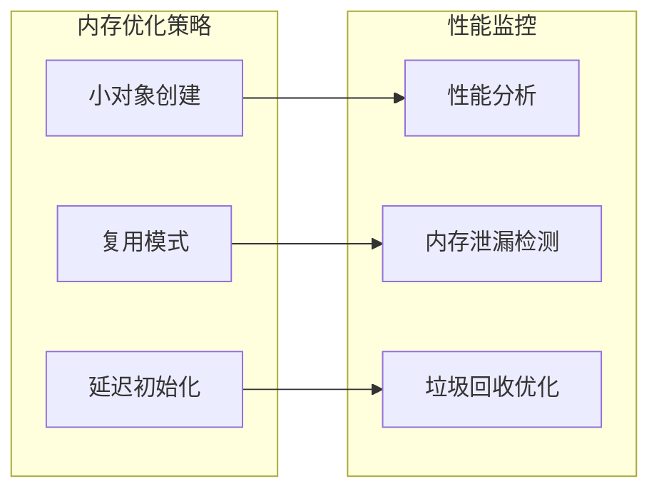

## 故障排除指南

### 常见问题诊断

1. **混入未生效**
   - 检查混入配置文件路径
   - 验证@Mixin注解的目标类正确性
   - 确认方法签名匹配

2. **编译错误**
   - 检查依赖版本兼容性
   - 验证Java版本设置
   - 确认Fabric API依赖正确

3. **运行时异常**
   - 检查CallbackInfo使用是否正确
   - 验证线程安全性
   - 确认资源文件路径

### 调试技巧

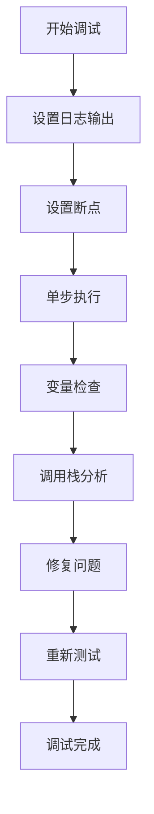

**章节来源**
- [AXON.java:20-24](file://src/main/java/cn/pr0xy/AXON.java#L20-L24)

## 结论

BodyCam项目展示了Fabric模组开发中Mixins技术的最佳实践。通过ExampleMixin类，我们看到了：

1. **清晰的架构分离**：服务器端和客户端功能明确分离
2. **标准的混入模式**：使用@Mixin和@Inject注解实现代码注入
3. **安全的实现方式**：通过私有方法签名和CallbackInfo确保安全性
4. **完整的配置管理**：通过JSON配置文件管理混入规则

这些实践为开发者提供了扩展现有服务器功能和添加新功能的实用指南，特别是在性能考虑、线程安全和调试技巧方面的经验总结。

## 附录

### 开发者最佳实践

1. **混入设计原则**
   - 保持混入类的单一职责
   - 使用清晰的方法命名约定
   - 避免过度依赖原方法内部状态

2. **性能优化建议**
   - 最小化注入代码的执行开销
   - 合理使用缓存机制
   - 避免频繁的对象创建

3. **测试策略**
   - 编写单元测试验证混入逻辑
   - 进行性能基准测试
   - 执行回归测试确保兼容性