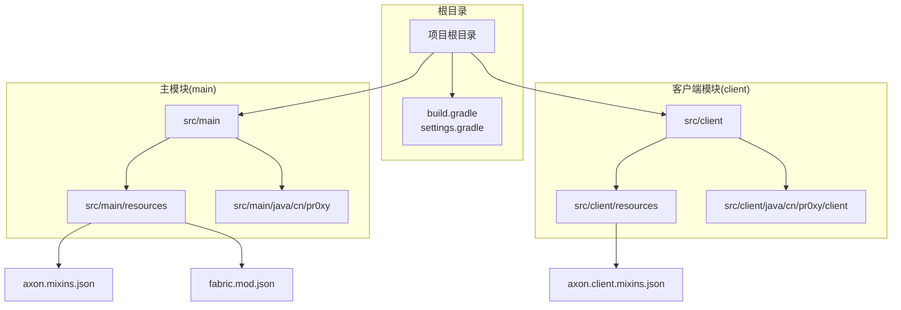
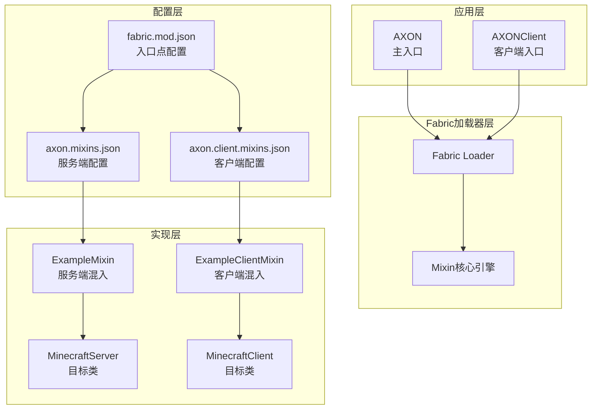
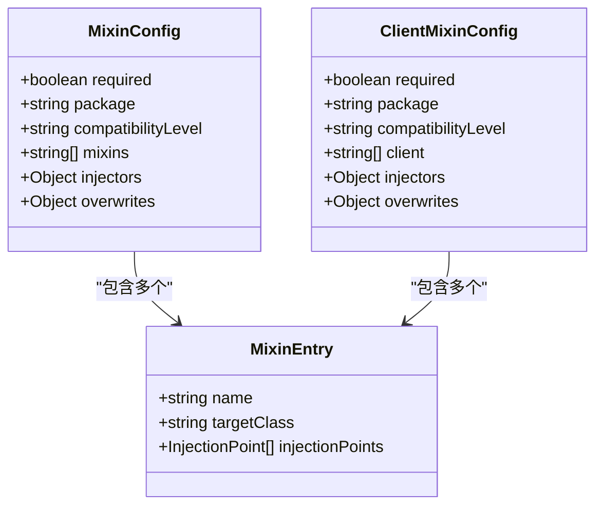
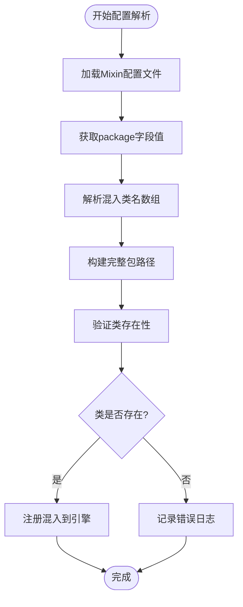
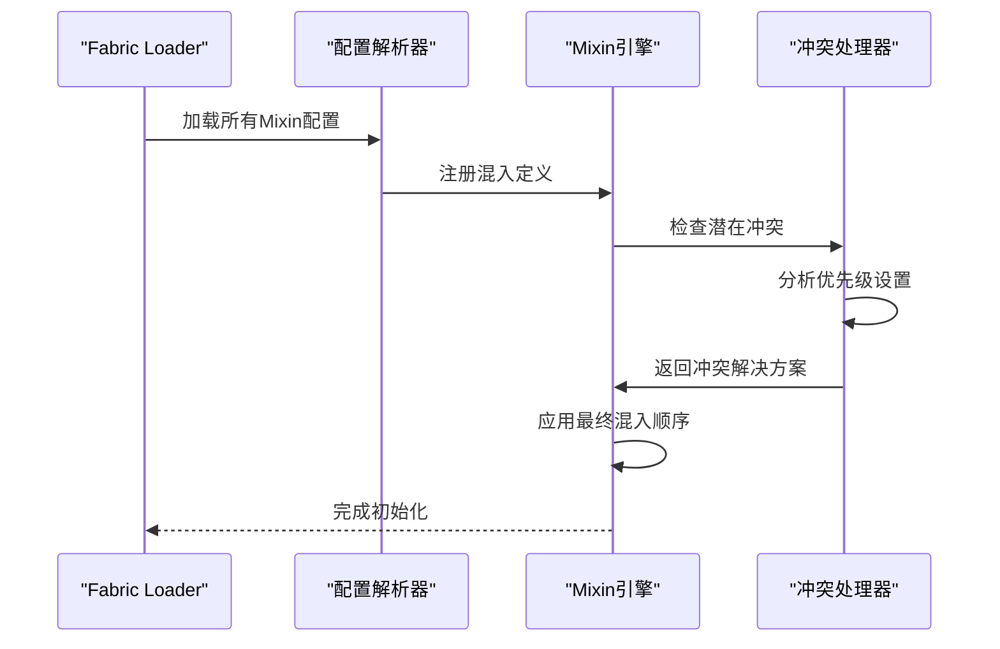
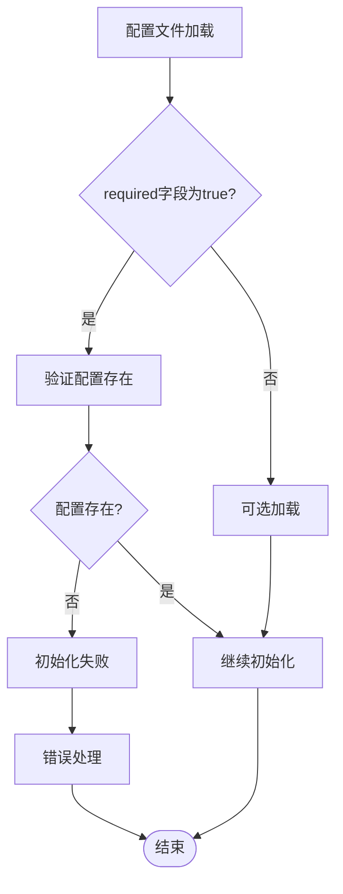
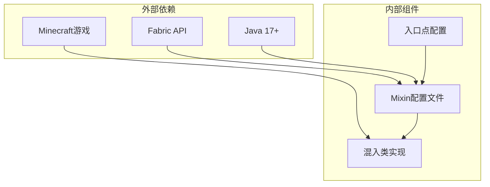

# 混入配置管理

<cite>
**本文档引用的文件**
- [axon.mixins.json](file://src/main/resources/axon.mixins.json)
- [axon.client.mixins.json](file://src/client/resources/axon.client.mixins.json)
- [fabric.mod.json](file://src/main/resources/fabric.mod.json)
- [ExampleMixin.java](file://src/main/java/cn/pr0xy/mixin/ExampleMixin.java)
- [ExampleClientMixin.java](file://src/client/java/cn/pr0xy/client/mixin/ExampleClientMixin.java)
- [AXON.java](file://src/main/java/cn/pr0xy/AXON.java)
- [AXONClient.java](file://src/client/java/cn/pr0xy/client/AXONClient.java)
- [build.gradle](file://build.gradle)
- [settings.gradle](file://settings.gradle)
</cite>

## 目录
1. [简介](#简介)
2. [项目结构](#项目结构)
3. [核心组件](#核心组件)
4. [架构概览](#架构概览)
5. [详细组件分析](#详细组件分析)
6. [依赖分析](#依赖分析)
7. [性能考虑](#性能考虑)
8. [故障排除指南](#故障排除指南)
9. [结论](#结论)
10. [附录](#附录)

## 简介
本文件为BodyCam项目的Mixin配置管理系统提供全面技术文档。BodyCam基于Fabric Loader和SpongePowered ASM框架实现运行时代码注入，通过两个独立的Mixin配置文件分别管理服务端和客户端的混入定义。本文档深入解析配置文件结构、包路径匹配规则、优先级机制、必需性验证以及最佳实践。

## 项目结构
BodyCam采用标准的Fabric Mod目录结构，区分服务端和客户端资源与源码：

**图表来源**
- [build.gradle:17-27](file://build.gradle#L17-L27)
- [fabric.mod.json:25-31](file://src/main/resources/fabric.mod.json#L25-L31)

**章节来源**
- [build.gradle:17-27](file://build.gradle#L17-L27)
- [settings.gradle:12-14](file://settings.gradle#L12-L14)

## 核心组件
本节详细分析两个核心配置文件及其关联组件：

### 主配置文件(axon.mixins.json)
主配置文件负责服务端混入定义，包含以下关键字段：
- required: 布尔值，指示配置是否必需
- package: 指定混入类的基础包路径
- compatibilityLevel: Java版本兼容性声明
- mixins: 服务端混入类名数组
- injectors: 注入器默认要求级别
- overwrites: 覆盖注解要求设置

### 客户端配置文件(axon.client.mixins.json)
客户端配置文件专门处理客户端特定的混入：
- 结构与主配置相同，但使用client字段而非mixins
- 仅在客户端环境加载
- 包路径前缀为cn.pr0xy.client.mixin

### 混入类实现
每个混入类都遵循统一模式：
- 使用@Mixin注解指定目标类
- 通过@Inject进行方法注入
- 遵循SpongePowered ASM框架规范

**章节来源**
- [axon.mixins.json:1-14](file://src/main/resources/axon.mixins.json#L1-L14)
- [axon.client.mixins.json:1-14](file://src/client/resources/axon.client.mixins.json#L1-L14)
- [ExampleMixin.java:1-15](file://src/main/java/cn/pr0xy/mixin/ExampleMixin.java#L1-L15)
- [ExampleClientMixin.java:1-15](file://src/client/java/cn/pr0xy/client/mixin/ExampleClientMixin.java#L1-L15)

## 架构概览
下图展示了BodyCam的Mixin架构层次和组件交互关系：

**图表来源**
- [fabric.mod.json:17-31](file://src/main/resources/fabric.mod.json#L17-L31)
- [axon.mixins.json:5-7](file://src/main/resources/axon.mixins.json#L5-L7)
- [axon.client.mixins.json:5-7](file://src/client/resources/axon.client.mixins.json#L5-L7)

## 详细组件分析

### 配置文件结构分析
两个配置文件都遵循相同的JSON结构模式，体现了良好的一致性设计：

**图表来源**
- [axon.mixins.json:1-14](file://src/main/resources/axon.mixins.json#L1-L14)
- [axon.client.mixins.json:1-14](file://src/client/resources/axon.client.mixins.json#L1-L14)

### 包路径匹配规则
配置文件通过package字段定义混入类的包前缀，系统自动匹配相应路径下的类：

**图表来源**
- [axon.mixins.json:3](file://src/main/resources/axon.mixins.json#L3)
- [axon.client.mixins.json:3](file://src/client/resources/axon.client.mixins.json#L3)

### 优先级设置与冲突解决
虽然当前配置未显式设置priority字段，但系统提供了完整的优先级机制：

**图表来源**
- [axon.mixins.json:8-13](file://src/main/resources/axon.mixins.json#L8-L13)
- [axon.client.mixins.json:8-13](file://src/client/resources/axon.client.mixins.json#L8-L13)

### 必需性验证与依赖管理
required字段确保配置的强制性验证：

**图表来源**
- [axon.mixins.json:2](file://src/main/resources/axon.mixins.json#L2)
- [axon.client.mixins.json:2](file://src/client/resources/axon.client.mixins.json#L2)

**章节来源**
- [axon.mixins.json:1-14](file://src/main/resources/axon.mixins.json#L1-L14)
- [axon.client.mixins.json:1-14](file://src/client/resources/axon.client.mixins.json#L1-L14)

## 依赖分析
本节分析Mixin配置系统的依赖关系和耦合度：

**图表来源**
- [fabric.mod.json:32-37](file://src/main/resources/fabric.mod.json#L32-L37)
- [build.gradle:29-38](file://build.gradle#L29-L38)

**章节来源**
- [fabric.mod.json:32-37](file://src/main/resources/fabric.mod.json#L32-L37)
- [build.gradle:29-38](file://build.gradle#L29-L38)

## 性能考虑
针对Mixin配置管理的最佳实践建议：

### 包路径组织优化
- 使用层级化的包结构：cn.pr0xy.mixin、cn.pr0xy.client.mixin
- 避免过深的包层次，保持在3-4级以内
- 为不同功能域创建独立子包

### 版本兼容性管理
- 统一设置compatibilityLevel为JAVA_17
- 在fabric.mod.json中明确声明Java版本要求
- 使用Yarn映射确保Minecraft版本兼容

### 性能优化策略
- 合理控制混入数量，避免过度注入
- 使用精确的目标类匹配，减少扫描范围
- 实施延迟加载机制，按需激活混入

## 故障排除指南
常见问题及解决方案：

### 配置文件加载失败
**症状**：启动时报错，提示找不到Mixin配置
**排查步骤**：
1. 检查fabric.mod.json中的mixins数组配置
2. 验证配置文件路径是否正确
3. 确认required字段设置是否合理

### 类路径匹配错误
**症状**：混入类无法找到或加载失败
**排查步骤**：
1. 对比package字段与实际包路径
2. 验证混入类名是否与数组项一致
3. 检查类的可见性和访问权限

### 注入点冲突
**症状**：多个混入同时修改同一方法导致冲突
**排查步骤**：
1. 分析混入的targetClass和method属性
2. 检查@Overwrite注解的使用情况
3. 调整混入的优先级设置

**章节来源**
- [fabric.mod.json:25-31](file://src/main/resources/fabric.mod.json#L25-L31)
- [axon.mixins.json:1-14](file://src/main/resources/axon.mixins.json#L1-L14)
- [axon.client.mixins.json:1-14](file://src/client/resources/axon.client.mixins.json#L1-L14)

## 结论
BodyCam的Mixin配置管理系统展现了清晰的架构设计和良好的扩展性。通过分离的服务端和客户端配置文件，实现了职责明确的混入管理。配置文件的标准化结构为后续的功能扩展奠定了坚实基础。建议在实际开发中遵循本文档提出的设计原则和最佳实践，以确保系统的稳定性和可维护性。

## 附录

### 配置文件字段参考表
| 字段名 | 类型 | 必需 | 描述 |
|--------|------|------|------|
| required | boolean | 是 | 配置是否必需加载 |
| package | string | 是 | 混入类的基础包路径 |
| compatibilityLevel | string | 是 | Java版本兼容性声明 |
| mixins | array[string] | 否 | 服务端混入类名列表 |
| client | array[string] | 否 | 客户端混入类名列表 |
| injectors.defaultRequire | number | 否 | 注入器默认要求级别 |
| overwrites.requireAnnotations | boolean | 否 | 覆盖注解要求设置 |

### 开发者指南
1. **新增混入类**：确保包路径与配置文件的package字段匹配
2. **配置文件维护**：修改后及时验证JSON格式有效性
3. **测试验证**：在开发环境中充分测试混入功能
4. **文档更新**：同步更新相关的技术文档