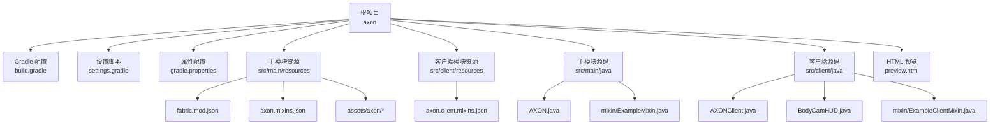
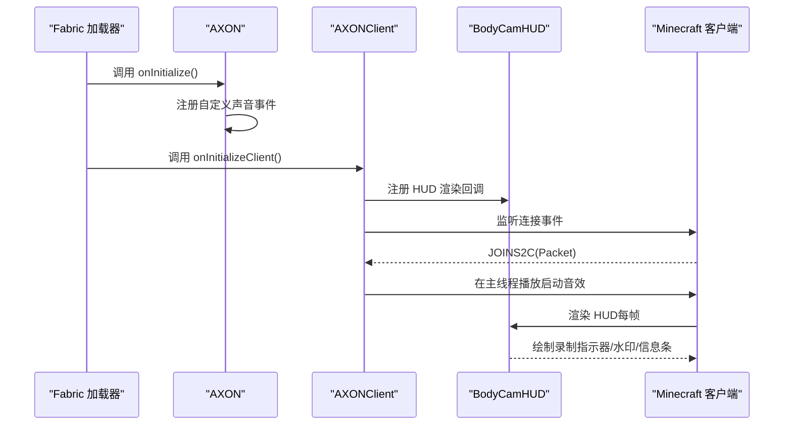
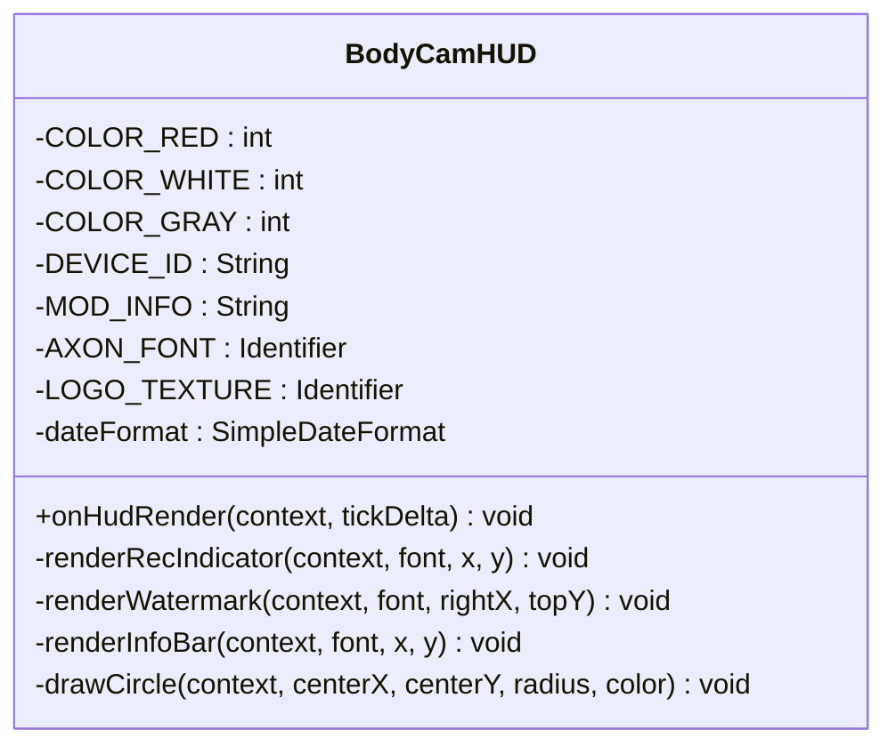
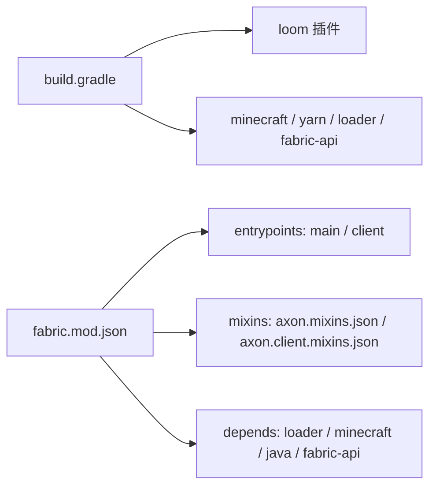

# 开发者指南

<cite>
**本文引用的文件**
- [README.md](file://README.md)
- [build.gradle](file://build.gradle)
- [settings.gradle](file://settings.gradle)
- [gradle.properties](file://gradle.properties)
- [fabric.mod.json](file://src/main/resources/fabric.mod.json)
- [axon.mixins.json](file://src/main/resources/axon.mixins.json)
- [axon.client.mixins.json](file://src/client/resources/axon.client.mixins.json)
- [AXON.java](file://src/main/java/cn/pr0xy/AXON.java)
- [AXONClient.java](file://src/client/java/cn/pr0xy/client/AXONClient.java)
- [BodyCamHUD.java](file://src/client/java/cn/pr0xy/client/BodyCamHUD.java)
- [ExampleMixin.java](file://src/main/java/cn/pr0xy/mixin/ExampleMixin.java)
- [ExampleClientMixin.java](file://src/client/java/cn/pr0xy/client/mixin/ExampleClientMixin.java)
- [preview.html](file://preview.html)
</cite>

## 目录
1. [简介](#简介)
2. [项目结构](#项目结构)
3. [核心组件](#核心组件)
4. [架构总览](#架构总览)
5. [详细组件分析](#详细组件分析)
6. [依赖关系分析](#依赖关系分析)
7. [性能考虑](#性能考虑)
8. [故障排查指南](#故障排查指南)
9. [结论](#结论)
10. [附录](#附录)

## 简介
本指南面向新加入的开发者，帮助您快速搭建开发环境、理解项目结构与职责划分、掌握资源文件管理与使用方法，并提供调试、测试与质量保障的最佳实践。BodyCam 是基于 Fabric 的 Minecraft 模组，通过客户端 HUD 展示录制状态、设备信息与时间戳等水印元素，并在进入世界时播放启动音效。

## 项目结构
项目采用 Fabric Loom 的多环境源集布局，区分通用模块与客户端模块，便于在服务端与客户端分别注入行为与渲染逻辑。

图表来源
- [build.gradle:17-27](file://build.gradle#L17-L27)
- [settings.gradle:12-14](file://settings.gradle#L12-L14)
- [gradle.properties:10-17](file://gradle.properties#L10-L17)
- [fabric.mod.json:17-31](file://src/main/resources/fabric.mod.json#L17-L31)
- [axon.mixins.json:1-14](file://src/main/resources/axon.mixins.json#L1-14)
- [axon.client.mixins.json:1-14](file://src/client/resources/axon.client.mixins.json#L1-L14)

章节来源
- [build.gradle:17-27](file://build.gradle#L17-L27)
- [settings.gradle:12-14](file://settings.gradle#L12-L14)
- [gradle.properties:10-17](file://gradle.properties#L10-L17)
- [fabric.mod.json:17-31](file://src/main/resources/fabric.mod.json#L17-L31)

## 核心组件
- AXON：模组入口，负责注册自定义声音事件并在初始化时输出日志。
- AXONClient：客户端入口，注册 HUD 渲染回调与连接事件，在玩家进入世界时播放启动音效。
- BodyCamHUD：HUD 渲染器，绘制右上角水印（时间戳与设备号）、左上角录制指示器（闪烁红点）与左下角信息条。
- Mixin：服务端与客户端示例注入点，用于在关键生命周期方法中插入逻辑。

章节来源
- [AXON.java:11-25](file://src/main/java/cn/pr0xy/AXON.java#L11-L25)
- [AXONClient.java:12-31](file://src/client/java/cn/pr0xy/client/AXONClient.java#L12-L31)
- [BodyCamHUD.java:14-60](file://src/client/java/cn/pr0xy/client/BodyCamHUD.java#L14-L60)
- [ExampleMixin.java:9-15](file://src/main/java/cn/pr0xy/mixin/ExampleMixin.java#L9-L15)
- [ExampleClientMixin.java:9-15](file://src/client/java/cn/pr0xy/client/mixin/ExampleClientMixin.java#L9-L15)

## 架构总览
下图展示了模组从加载到渲染的关键交互路径，包括入口注册、客户端 HUD 注册、连接事件触发与 HUD 渲染。

图表来源
- [fabric.mod.json:17-24](file://src/main/resources/fabric.mod.json#L17-L24)
- [AXON.java:19-24](file://src/main/java/cn/pr0xy/AXON.java#L19-L24)
- [AXONClient.java:14-30](file://src/client/java/cn/pr0xy/client/AXONClient.java#L14-L30)
- [BodyCamHUD.java:39-60](file://src/client/java/cn/pr0xy/client/BodyCamHUD.java#L39-L60)

## 详细组件分析

### AXON（服务端入口）
- 职责：声明模组标识、记录日志、注册自定义声音事件。
- 关键点：使用注册表注册声音事件，确保在运行时可用。

章节来源
- [AXON.java:11-25](file://src/main/java/cn/pr0xy/AXON.java#L11-L25)

### AXONClient（客户端入口）
- 职责：注册 HUD 渲染回调；在连接事件发生时播放启动音效。
- 关键点：使用客户端连接事件监听；在渲染线程中播放音效，避免线程安全问题。

章节来源
- [AXONClient.java:12-31](file://src/client/java/cn/pr0xy/client/AXONClient.java#L12-L31)

### BodyCamHUD（HUD 渲染器）
- 职责：在屏幕特定区域绘制录制指示器、水印与信息条。
- 布局要点：
  - 左上角：闪烁红点“REC”指示录制状态。
  - 右上角：时间戳与设备号文本块，右侧附带品牌图标。
  - 左下角：模组信息文字。
- 渲染细节：使用自定义字体标识；根据窗口尺寸动态定位；圆形指示器通过像素填充近似实现。

图表来源
- [BodyCamHUD.java:14-139](file://src/client/java/cn/pr0xy/client/BodyCamHUD.java#L14-L139)

章节来源
- [BodyCamHUD.java:14-139](file://src/client/java/cn/pr0xy/client/BodyCamHUD.java#L14-L139)

### Mixin 示例（服务端与客户端）
- 作用：在目标类的方法头部注入示例逻辑，便于扩展或观察生命周期。
- 注意：当前示例仅占位，实际业务逻辑需按需求扩展。

章节来源
- [ExampleMixin.java:9-15](file://src/main/java/cn/pr0xy/mixin/ExampleMixin.java#L9-L15)
- [ExampleClientMixin.java:9-15](file://src/client/java/cn/pr0xy/client/mixin/ExampleClientMixin.java#L9-L15)

### HTML 预览页面（preview.html）
- 功能：在浏览器中展示与游戏中一致的水印样式、录制指示器与十字准星效果，便于 UI 设计与前端联调。
- 使用建议：打开页面即可看到实时时间戳更新；可直接在浏览器中调整样式验证布局。

章节来源
- [preview.html:177-201](file://preview.html#L177-L201)

## 依赖关系分析
- 构建工具链：使用 Fabric Loom 插件进行多环境源集拆分与 remap。
- 运行时依赖：Minecraft 版本、Yarn 映射、Fabric Loader、Fabric API。
- 模组元数据：通过 fabric.mod.json 声明入口、混入配置与依赖约束。

图表来源
- [build.gradle:29-38](file://build.gradle#L29-L38)
- [fabric.mod.json:17-37](file://src/main/resources/fabric.mod.json#L17-L37)

章节来源
- [build.gradle:29-38](file://build.gradle#L29-L38)
- [fabric.mod.json:17-37](file://src/main/resources/fabric.mod.json#L17-L37)

## 性能考虑
- HUD 渲染频率：每帧调用一次渲染回调，应尽量减少复杂计算与频繁对象分配。
- 字体与纹理：使用已存在的字体与图标资源，避免在渲染循环中重复加载。
- 线程模型：音效播放必须在客户端主线程执行，避免跨线程访问导致异常。
- 时间格式化：使用本地 SimpleDateFormat，注意线程安全与性能开销。

## 故障排查指南
- 启动失败或找不到入口
  - 检查 fabric.mod.json 中的 entrypoints 是否正确指向主类与客户端类。
  - 确认 Gradle 同步与 Loom 插件版本匹配。
- HUD 不显示
  - 确认 AXONClient 已成功注册 BodyCamHUD。
  - 检查是否处于 HUD 隐藏模式（如按 F1）。
- 水印样式异常
  - 确认自定义字体与图标资源路径正确。
  - 对照 preview.html 验证样式一致性。
- 录制指示器不闪烁
  - 检查时间计算与 alpha 计算逻辑是否被修改。
- 启动音效未播放
  - 确认声音事件已在服务端注册且客户端连接事件触发。
  - 检查客户端主线程调度是否生效。

章节来源
- [fabric.mod.json:17-24](file://src/main/resources/fabric.mod.json#L17-L24)
- [AXONClient.java:14-30](file://src/client/java/cn/pr0xy/client/AXONClient.java#L14-L30)
- [BodyCamHUD.java:39-60](file://src/client/java/cn/pr0xy/client/BodyCamHUD.java#L39-L60)

## 结论
BodyCam 项目以清晰的多环境源集与简洁的 HUD 渲染为核心，结合 Mixin 扩展点与 Fabric 生态，提供了良好的可维护性与扩展空间。遵循本文档的开发与调试建议，可快速完成功能迭代与质量保障。

## 附录

### 开发环境配置
- IDE 设置与调试
  - 参考 Fabric 文档进行 IDE 初始化与运行配置。
  - 使用 Gradle Tasks 启动游戏与生成源码 JAR。
- 热重载支持
  - 利用 Loom 的开发工作流与资源重载能力，修改资源后重新打包测试。
- 版本与依赖
  - 版本号与依赖在 gradle.properties 中集中管理，构建脚本自动处理资源替换与发布配置。

章节来源
- [README.md:3-5](file://README.md#L3-L5)
- [gradle.properties:10-17](file://gradle.properties#L10-L17)
- [build.gradle:40-47](file://build.gradle#L40-L47)

### 代码组织与命名约定
- 包结构
  - 服务端与客户端分别位于不同源集，入口类与渲染器按环境拆分。
  - Mixin 放置于对应包内，保持职责单一。
- 类职责
  - 入口类仅做初始化与注册；渲染器专注 UI 布局与绘制；Mixin 仅承担注入逻辑。
- 命名规范
  - 使用语义化名称（如 AXON、AXONClient、BodyCamHUD），常量使用全大写并以下划线分隔。

章节来源
- [AXON.java:11-25](file://src/main/java/cn/pr0xy/AXON.java#L11-L25)
- [AXONClient.java:12-31](file://src/client/java/cn/pr0xy/client/AXONClient.java#L12-L31)
- [BodyCamHUD.java:14-139](file://src/client/java/cn/pr0xy/client/BodyCamHUD.java#L14-L139)

### 资源文件管理
- 存放位置
  - 图标与 GUI 纹理位于 assets/axon 与 assets/axon/textures/gui。
- 命名规范
  - 使用小写字母与下划线，避免空格与特殊字符。
- 使用方法
  - 通过 Identifier 指定资源路径，确保与资源包结构一致。
- 混入配置
  - 服务端与客户端混入配置分别在 axon.mixins.json 与 axon.client.mixins.json 中声明。

章节来源
- [fabric.mod.json:15](file://src/main/resources/fabric.mod.json#L15)
- [axon.mixins.json:1-14](file://src/main/resources/axon.mixins.json#L1-14)
- [axon.client.mixins.json:1-14](file://src/client/resources/axon.client.mixins.json#L1-L14)

### HTML 预览页面使用说明
- 打开 preview.html 查看与游戏中一致的 UI 布局。
- 页面包含录制指示器、右上角水印与底部信息条，时间戳每秒刷新。
- 可直接在浏览器中微调样式，验证布局与配色。

章节来源
- [preview.html:177-201](file://preview.html#L177-L201)

### 代码审查与质量保证
- 代码审查清单
  - 入口类只做初始化与注册，避免在构造阶段执行耗时操作。
  - HUD 渲染逻辑保持幂等，避免重复绘制与状态错乱。
  - Mixin 注入点明确，注释说明注入目的与时机。
- 测试策略
  - 单元测试：对纯函数与工具方法进行单元测试。
  - 集成测试：通过 Fabric 测试框架或手动回归测试关键 UI 与事件。
  - 端到端测试：在不同分辨率与 HUD 隐藏状态下验证渲染结果。
- 质量保障流程
  - 提交前运行 Lint 与格式化工具，确保风格一致。
  - 通过 CI 构建与测试，确保兼容目标 Minecraft 版本。

### 常见问题与调试技巧
- HUD 不显示
  - 检查是否处于 HUD 隐藏模式；确认注册回调是否生效。
- 字体与图标缺失
  - 核对 Identifier 与资源路径；确保资源随构建产物打包。
- 性能问题
  - 减少每帧对象分配；合并绘制调用；避免在渲染循环中进行 IO。
- 调试技巧
  - 使用日志输出关键状态；在客户端主线程中执行与 UI 相关的操作；利用 preview.html 快速验证样式。