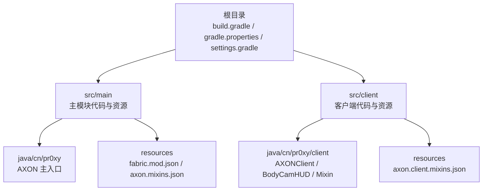
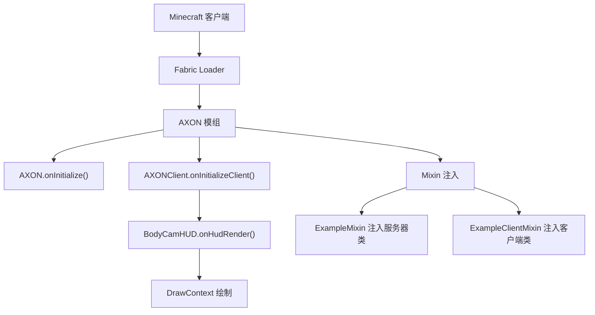
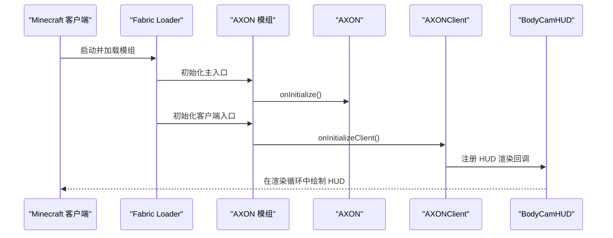
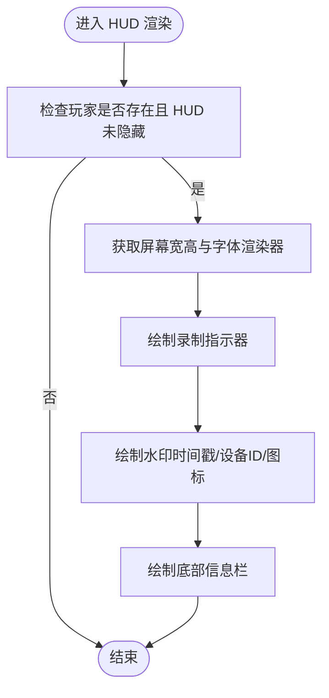
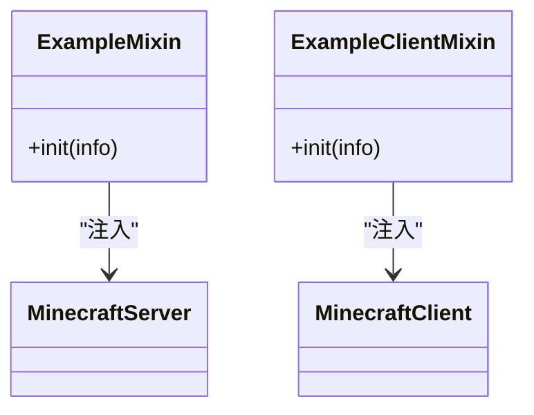
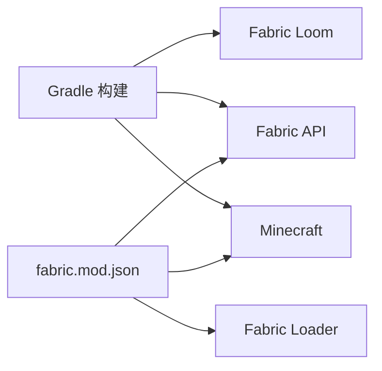

# 快速开始

<cite>
**本文引用的文件**
- [README.md](file://README.md)
- [build.gradle](file://build.gradle)
- [gradle.properties](file://gradle.properties)
- [settings.gradle](file://settings.gradle)
- [gradle-wrapper.properties](file://gradle/wrapper/gradle-wrapper.properties)
- [fabric.mod.json](file://src/main/resources/fabric.mod.json)
- [AXON.java](file://src/main/java/cn/pr0xy/AXON.java)
- [AXONClient.java](file://src/client/java/cn/pr0xy/client/AXONClient.java)
- [BodyCamHUD.java](file://src/client/java/cn/pr0xy/client/BodyCamHUD.java)
- [ExampleMixin.java](file://src/main/java/cn/pr0xy/mixin/ExampleMixin.java)
- [ExampleClientMixin.java](file://src/client/java/cn/pr0xy/client/mixin/ExampleClientMixin.java)
- [axon.mixins.json](file://src/main/resources/axon.mixins.json)
- [axon.client.mixins.json](file://src/client/resources/axon.client.mixins.json)
- [build.yml](file://.github/workflows/build.yml)
</cite>

## 目录
1. [简介](#简介)
2. [项目结构](#项目结构)
3. [核心组件](#核心组件)
4. [架构总览](#架构总览)
5. [详细组件分析](#详细组件分析)
6. [依赖关系分析](#依赖关系分析)
7. [性能考虑](#性能考虑)
8. [故障排除指南](#故障排除指南)
9. [结论](#结论)
10. [附录](#附录)

## 简介
本指南面向希望快速上手 BodyCam（AXON）模组开发的开发者，涵盖从环境准备、项目克隆与构建、运行调试，到模组安装与验证的完整流程。BodyCam 是基于 Fabric 模组框架的 Minecraft 客户端模组，提供 HUD 水印与录制指示器等可视化功能，并通过 Mixin 注入扩展游戏行为。

## 项目结构
该项目采用标准的 Fabric 模组工程布局，按“主模块 + 客户端模块 + 资源与 Mixin 配置”的方式组织。关键目录与文件如下：
- 根目录：构建脚本、版本属性、包装器配置、工作流定义
- src/main：服务端/通用逻辑与资源
- src/client：客户端逻辑与资源
- src/main/resources 与 src/client/resources：模组元数据、Mixin 配置与资产

图表来源
- [build.gradle](file://build.gradle)
- [settings.gradle](file://settings.gradle)
- [fabric.mod.json](file://src/main/resources/fabric.mod.json)
- [axon.mixins.json](file://src/main/resources/axon.mixins.json)
- [axon.client.mixins.json](file://src/client/resources/axon.client.mixins.json)

章节来源
- [build.gradle](file://build.gradle)
- [settings.gradle](file://settings.gradle)
- [gradle.properties](file://gradle.properties)

## 核心组件
- 模组入口与初始化
  - 服务端入口：在主模块中实现 ModInitializer，负责模组启动时的日志输出与初始化逻辑。
  - 客户端入口：在客户端模块中实现 ClientModInitializer，注册 HUD 渲染回调。
- HUD 渲染器
  - 提供录制指示器、时间戳水印、设备标识与模组信息条的绘制逻辑。
- Mixin 扩展
  - 在服务端与客户端分别注入示例方法，展示如何通过 Mixin 扩展原版类的行为。

章节来源
- [AXON.java](file://src/main/java/cn/pr0xy/AXON.java)
- [AXONClient.java](file://src/client/java/cn/pr0xy/client/AXONClient.java)
- [BodyCamHUD.java](file://src/client/java/cn/pr0xy/client/BodyCamHUD.java)
- [ExampleMixin.java](file://src/main/java/cn/pr0xy/mixin/ExampleMixin.java)
- [ExampleClientMixin.java](file://src/client/java/cn/pr0xy/client/mixin/ExampleClientMixin.java)

## 架构总览
下图展示了模组从初始化到渲染的关键交互路径，以及与 Fabric API 的集成关系。

图表来源
- [AXON.java](file://src/main/java/cn/pr0xy/AXON.java)
- [AXONClient.java](file://src/client/java/cn/pr0xy/client/AXONClient.java)
- [BodyCamHUD.java](file://src/client/java/cn/pr0xy/client/BodyCamHUD.java)
- [ExampleMixin.java](file://src/main/java/cn/pr0xy/mixin/ExampleMixin.java)
- [ExampleClientMixin.java](file://src/client/java/cn/pr0xy/client/mixin/ExampleClientMixin.java)

## 详细组件分析

### 模组入口与初始化
- AXON 主入口
  - 实现 ModInitializer，在模组初始化阶段记录日志，提示模组已加载。
- AXONClient 客户端入口
  - 实现 ClientModInitializer，在客户端初始化时注册 HUD 渲染回调，使 BodyCamHUD 参与 HUD 渲染。

图表来源
- [AXON.java](file://src/main/java/cn/pr0xy/AXON.java)
- [AXONClient.java](file://src/client/java/cn/pr0xy/client/AXONClient.java)
- [BodyCamHUD.java](file://src/client/java/cn/pr0xy/client/BodyCamHUD.java)

章节来源
- [AXON.java](file://src/main/java/cn/pr0xy/AXON.java)
- [AXONClient.java](file://src/client/java/cn/pr0xy/client/AXONClient.java)

### HUD 渲染器
- 功能概览
  - 录制指示器：在左上角显示闪烁的红色圆点与“REC”文本。
  - 水印区域：右上角显示时间戳、设备 ID 与模组图标。
  - 底部信息栏：左下角显示模组信息。
- 渲染流程
  - 获取屏幕尺寸与字体渲染器。
  - 根据 HUD 隐藏状态决定是否渲染。
  - 计算各元素位置并调用 DrawContext 进行绘制。

图表来源
- [BodyCamHUD.java](file://src/client/java/cn/pr0xy/client/BodyCamHUD.java)

章节来源
- [BodyCamHUD.java](file://src/client/java/cn/pr0xy/client/BodyCamHUD.java)

### Mixin 扩展
- 作用域
  - 服务端 Mixin：对服务器类进行注入，演示在服务端生命周期中插入逻辑。
  - 客户端 Mixin：对客户端类进行注入，演示在客户端生命周期中插入逻辑。
- 配置
  - 通过 axon.mixins.json 与 axon.client.mixins.json 声明 Mixin 包、兼容级别与注入器设置。

图表来源
- [ExampleMixin.java](file://src/main/java/cn/pr0xy/mixin/ExampleMixin.java)
- [ExampleClientMixin.java](file://src/client/java/cn/pr0xy/client/mixin/ExampleClientMixin.java)

章节来源
- [ExampleMixin.java](file://src/main/java/cn/pr0xy/mixin/ExampleMixin.java)
- [ExampleClientMixin.java](file://src/client/java/cn/pr0xy/client/mixin/ExampleClientMixin.java)
- [axon.mixins.json](file://src/main/resources/axon.mixins.json)
- [axon.client.mixins.json](file://src/client/resources/axon.client.mixins.json)

## 依赖关系分析
- 构建工具与版本
  - Gradle Wrapper：固定分发版本，便于跨平台一致性。
  - Fabric Loom：用于 Fabric 模组的构建与 remap。
  - Fabric API：模组运行时依赖。
- 运行时依赖
  - Minecraft 版本与 Yarn 映射版本。
  - Fabric Loader 版本。
- 模组元数据
  - fabric.mod.json 中声明了模组 ID、版本、入口点、Mixins 配置与依赖约束。

图表来源
- [build.gradle](file://build.gradle)
- [gradle.properties](file://gradle.properties)
- [fabric.mod.json](file://src/main/resources/fabric.mod.json)

章节来源
- [build.gradle](file://build.gradle)
- [gradle.properties](file://gradle.properties)
- [settings.gradle](file://settings.gradle)
- [gradle-wrapper.properties](file://gradle/wrapper/gradle-wrapper.properties)
- [fabric.mod.json](file://src/main/resources/fabric.mod.json)

## 性能考虑
- Java 版本与编译参数
  - 构建脚本强制使用 Java 17 编译，确保与 Fabric 生态兼容。
- 并行构建
  - 开启 Gradle 并行构建以提升构建速度。
- 资源与渲染
  - HUD 绘制仅在必要时执行，避免不必要的计算；使用像素级绘制时注意批量填充策略。

章节来源
- [build.gradle](file://build.gradle)
- [gradle.properties](file://gradle.properties)

## 故障排除指南
- 构建失败（JDK 版本不匹配）
  - 现象：构建报错，提示 Java 版本不满足要求。
  - 处理：确保本地 JDK 版本为 17 或以上，清理缓存后重试构建。
- 依赖解析失败
  - 现象：无法下载 Fabric API 或 Minecraft 依赖。
  - 处理：检查网络连通性与代理设置；确认 gradle.properties 中版本号正确。
- Mixin 注入异常
  - 现象：运行时报错，提示 Mixin 注入失败。
  - 处理：核对 axon.mixins.json 与 axon.client.mixins.json 的包名与类名；确保 Fabric API 已正确引入。
- HUD 不显示
  - 现象：游戏内无 HUD。
  - 处理：确认 AXONClient 已注册 HUD 回调；检查 HUD 隐藏设置（F1）；验证 fabric.mod.json 中的 entrypoints 与 mixins 配置。
- CI/CD 构建差异
  - 现象：本地构建成功但 CI 报错。
  - 处理：参考 GitHub Actions 工作流，确保使用与工作流一致的 JDK 版本与 Gradle Wrapper。

章节来源
- [build.yml](file://.github/workflows/build.yml)
- [build.gradle](file://build.gradle)
- [gradle.properties](file://gradle.properties)
- [fabric.mod.json](file://src/main/resources/fabric.mod.json)

## 结论
通过本指南，您可以在本地完成 BodyCam 模组的环境搭建、项目构建与运行，并将模组安装到 Minecraft 客户端进行验证。建议在开发过程中关注 Mixin 配置与 HUD 渲染逻辑，确保与目标 Minecraft 版本及 Fabric API 兼容。

## 附录

### 开发环境搭建
- JDK 17+
  - 确保系统已安装 JDK 17 或更高版本，构建脚本强制使用 Java 17。
- 构建工具
  - 使用 Gradle Wrapper（已内置），无需手动安装 Gradle。
  - 若需使用本地 Gradle，请确保版本与包装器分发版本一致。

章节来源
- [build.gradle](file://build.gradle)
- [gradle-wrapper.properties](file://gradle/wrapper/gradle-wrapper.properties)

### 项目克隆、构建与运行
- 克隆仓库
  - 使用 Git 克隆仓库至本地目录。
- 初次构建
  - 在项目根目录执行构建命令，生成可运行的模组 JAR。
- 运行与测试
  - 使用 IDE 或 Gradle 命令运行游戏，验证模组加载与 HUD 渲染。
- 测试命令
  - 可使用 Gradle 的测试任务进行单元测试（若存在）。

章节来源
- [README.md](file://README.md)
- [build.gradle](file://build.gradle)

### 目录结构与关键配置文件
- 目录结构
  - src/main：主模块代码与资源（入口、Mixin 示例、资源清单）。
  - src/client：客户端代码与资源（客户端入口、HUD、客户端 Mixin 配置）。
- 关键配置文件
  - build.gradle：插件、依赖、Java 版本、发布配置。
  - gradle.properties：版本号、JVM 参数、并行构建开关。
  - settings.gradle：插件仓库与根项目名称。
  - gradle-wrapper.properties：Gradle Wrapper 分发版本。
  - fabric.mod.json：模组元数据、入口点、Mixins 与依赖。
  - axon.mixins.json / axon.client.mixins.json：Mixin 配置文件。

章节来源
- [build.gradle](file://build.gradle)
- [gradle.properties](file://gradle.properties)
- [settings.gradle](file://settings.gradle)
- [gradle-wrapper.properties](file://gradle/wrapper/gradle-wrapper.properties)
- [fabric.mod.json](file://src/main/resources/fabric.mod.json)
- [axon.mixins.json](file://src/main/resources/axon.mixins.json)
- [axon.client.mixins.json](file://src/client/resources/axon.client.mixins.json)

### 模组安装到 Minecraft 客户端
- 安装位置
  - 将构建产物（位于 build/libs 下）复制到 Minecraft 客户端的 mods 文件夹中。
- 验证安装
  - 启动游戏，确认日志中出现模组初始化信息；检查 HUD 是否正常显示。
- 注意事项
  - 确保 Minecraft 版本与 fabric.mod.json 中声明的版本范围兼容。
  - 若使用自定义资源包，请确保资源路径与 fabric.mod.json 中的声明一致。

章节来源
- [fabric.mod.json](file://src/main/resources/fabric.mod.json)
- [build.gradle](file://build.gradle)