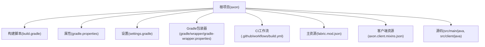
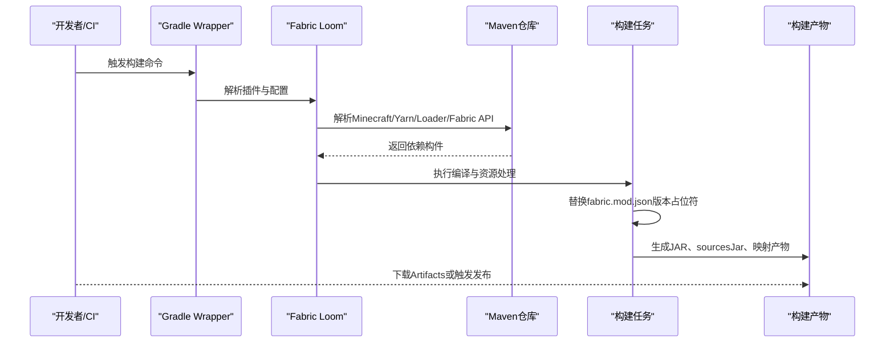
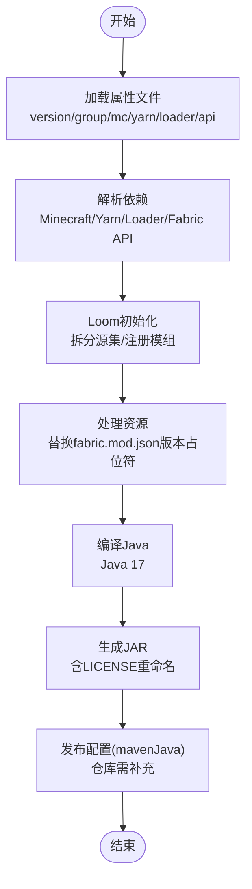
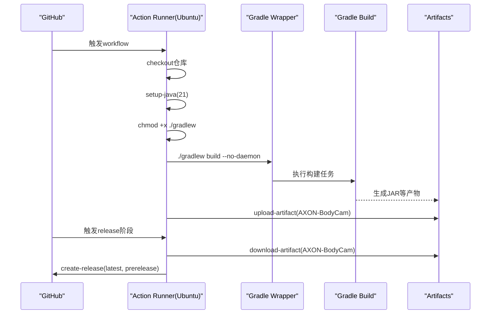
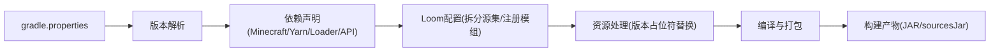

# 构建与部署

<cite>
**本文引用的文件**
- [build.gradle](file://build.gradle)
- [gradle.properties](file://gradle.properties)
- [.github/workflows/build.yml](file://.github/workflows/build.yml)
- [settings.gradle](file://settings.gradle)
- [gradle/wrapper/gradle-wrapper.properties](file://gradle/wrapper/gradle-wrapper.properties)
- [src/main/resources/fabric.mod.json](file://src/main/resources/fabric.mod.json)
- [src/client/resources/axon.client.mixins.json](file://src/client/resources/axon.client.mixins.json)
- [README.md](file://README.md)
- [src/main/java/cn/pr0xy/AXON.java](file://src/main/java/cn/pr0xy/AXON.java)
- [src/client/java/cn/pr0xy/client/AXONClient.java](file://src/client/java/cn/pr0xy/client/AXONClient.java)
</cite>

## 更新摘要
**变更内容**
- 更新GitHub Actions工作流配置，使用JDK 21和新的权限模型
- 重构构建脚本，采用新的Fabric Loom插件语法
- 优化Java版本配置，统一使用Java 17
- 新增完整的CI/CD发布流程，包括构建和发布两个阶段
- 改进发布配置，支持自动生成发布说明

## 目录
1. [简介](#简介)
2. [项目结构](#项目结构)
3. [核心组件](#核心组件)
4. [架构总览](#架构总览)
5. [详细组件分析](#详细组件分析)
6. [依赖关系分析](#依赖关系分析)
7. [性能考虑](#性能考虑)
8. [故障排查指南](#故障排查指南)
9. [结论](#结论)
10. [附录](#附录)

## 简介
本指南面向BodyCam（模组名：axon）项目的构建与部署，覆盖以下主题：
- Gradle构建脚本的配置项与作用，包括依赖管理、任务定义、输出配置与发布配置
- gradle.properties中的项目属性设置，如版本号、模组ID、Fabric相关版本等
- GitHub Actions自动化构建流程的配置与执行过程，包括JDK 21设置和权限配置
- 本地构建、测试与打包的完整步骤，包括JAR生成与签名验证要点
- 发布流程与版本管理策略，包括标签创建与发布说明编写
- 构建优化技巧与性能调优建议

本指南力求让具备基础Gradle知识的开发者快速上手，并为有经验的开发者提供深入的技术细节与最佳实践。

## 项目结构
该项目采用标准的Minecraft Fabric模组工程布局，包含客户端与通用代码、资源文件以及CI配置。根目录下主要文件与目录如下：
- 根级构建与配置：build.gradle、gradle.properties、settings.gradle、gradle/wrapper/gradle-wrapper.properties
- CI配置：.github/workflows/build.yml
- 源码与资源：src/main、src/client、src/main/resources、src/client/resources
- 文档与说明：README.md

**图表来源**
- [build.gradle](file://build.gradle)
- [gradle.properties](file://gradle.properties)
- [settings.gradle](file://settings.gradle)
- [gradle/wrapper/gradle-wrapper.properties](file://gradle/wrapper/gradle-wrapper.properties)
- [.github/workflows/build.yml](file://.github/workflows/build.yml)
- [src/main/resources/fabric.mod.json](file://src/main/resources/fabric.mod.json)
- [src/client/resources/axon.client.mixins.json](file://src/client/resources/axon.client.mixins.json)

**章节来源**
- [build.gradle](file://build.gradle)
- [gradle.properties](file://gradle.properties)
- [settings.gradle](file://settings.gradle)
- [gradle/wrapper/gradle-wrapper.properties](file://gradle/wrapper/gradle-wrapper.properties)
- [.github/workflows/build.yml](file://.github/workflows/build.yml)
- [src/main/resources/fabric.mod.json](file://src/main/resources/fabric.mod.json)
- [src/client/resources/axon.client.mixins.json](file://src/client/resources/axon.client.mixins.json)

## 核心组件
本节聚焦于构建系统的核心配置与职责划分，帮助你理解各文件在构建链路中的作用。

- **构建脚本（build.gradle）**
  - 插件：应用Fabric Loom-Remap插件与Maven发布插件，启用Remap任务链
  - 版本与分组：从属性文件读取mod_version与maven_group
  - 仓库：保留扩展仓库声明位置（默认由Loom自动添加Minecraft与Fabric仓库）
  - Loom配置：拆分环境源集（common/client），注册"axon"模组并绑定main与client源集
  - 依赖：声明Minecraft、Yarn、Fabric Loader与Fabric API版本
  - 资源处理：对fabric.mod.json进行版本占位符替换
  - Java编译：统一使用Java 17，生成sourcesJar
  - 自定义JAR：复制LICENSE并在JAR中重命名附加项目名后缀
  - 发布：配置mavenJava发布，目标仓库需在实际环境中补充

- **属性文件（gradle.properties）**
  - JVM与并行：设置最大堆与并行构建；禁用配置缓存以兼容Fabric Loom
  - Fabric版本：声明Minecraft、Yarn、Loader、Loom快照版本
  - 模组元数据：mod_version与maven_group
  - 依赖版本：Fabric API版本

- **设置文件（settings.gradle）**
  - 插件仓库：优先使用Fabric Maven，其次Maven Central与Gradle插件门户
  - 根项目名：与模组ID一致

- **包装器（gradle-wrapper.properties）**
  - 指定Gradle发行版版本，确保团队一致性

- **模组描述（fabric.mod.json）**
  - 模组ID、版本占位符、入口点、Mixins配置与依赖声明

- **客户端Mixins描述（axon.client.mixins.json）**
  - Mixins包路径、兼容级别、注入器默认值与覆写要求

**章节来源**
- [build.gradle](file://build.gradle)
- [gradle.properties](file://gradle.properties)
- [settings.gradle](file://settings.gradle)
- [gradle/wrapper/gradle-wrapper.properties](file://gradle/wrapper/gradle-wrapper.properties)
- [src/main/resources/fabric.mod.json](file://src/main/resources/fabric.mod.json)
- [src/client/resources/axon.client.mixins.json](file://src/client/resources/axon.client.mixins.json)

## 架构总览
下图展示了从本地或CI触发到产出构建产物的整体流程，涵盖版本解析、依赖解析、编译、资源处理、打包与发布。

**图表来源**
- [build.gradle](file://build.gradle)
- [gradle.properties](file://gradle.properties)
- [settings.gradle](file://settings.gradle)
- [.github/workflows/build.yml](file://.github/workflows/build.yml)

## 详细组件分析

### 构建脚本（build.gradle）深度解析
- **插件与版本**
  - 应用Fabric Loom-Remap插件与Maven发布插件，版本来自属性文件
  - 项目版本与分组均来源于属性文件，便于集中管理
- **仓库与依赖**
  - 仓库块保留扩展位置，但默认由Loom自动添加必要仓库
  - 依赖块声明Minecraft、Yarn、Fabric Loader与Fabric API版本，版本同样来自属性文件
- **Loom配置**
  - 拆分环境源集，使common与client源集分别参与构建
  - 注册"axon"模组并绑定main与client源集，确保客户端与通用代码共同参与构建
- **资源处理**
  - processResources阶段对fabric.mod.json进行版本占位符替换，保证产物中版本正确
- **Java与编译**
  - 统一Java 17编译与运行目标，生成sourcesJar
- **自定义JAR**
  - 将LICENSE复制到JAR并重命名，附带项目名后缀，便于识别与合规
- **发布配置**
  - 配置mavenJava发布，实际发布仓库需在CI或本地补充

**图表来源**
- [build.gradle](file://build.gradle)
- [gradle.properties](file://gradle.properties)

**章节来源**
- [build.gradle](file://build.gradle)
- [gradle.properties](file://gradle.properties)

### 属性文件（gradle.properties）详解
- **JVM与并行**
  - 设置最大堆内存与并行构建，提升多模块与多任务场景下的吞吐
  - 禁用配置缓存以避免与Fabric Loom的兼容性问题
- **Fabric版本**
  - Minecraft版本、Yarn映射、Fabric Loader版本与Loom快照版本
- **模组元数据**
  - mod_version与maven_group，用于构建版本与Maven坐标
- **依赖版本**
  - Fabric API版本，与Minecraft版本匹配

**章节来源**
- [gradle.properties](file://gradle.properties)

### 设置文件（settings.gradle）与包装器（gradle-wrapper.properties）
- **插件仓库**
  - 优先使用Fabric Maven，其次Maven Central与Gradle插件门户，确保Loom与Fabric插件可用
- **根项目名**
  - 与模组ID保持一致，利于IDE与构建工具识别
- **包装器**
  - 固定Gradle发行版本，确保团队与CI环境一致

**章节来源**
- [settings.gradle](file://settings.gradle)
- [gradle/wrapper/gradle-wrapper.properties](file://gradle/wrapper/gradle-wrapper.properties)

### GitHub Actions自动化构建流程
- **触发条件**
  - 对main分支推送和版本标签（v*）触发
- **运行环境**
  - Ubuntu Latest，使用Temurin JDK 21
- **权限配置**
  - 具备contents: write权限，支持发布操作
- **步骤**
  - 检出仓库
  - 设置JDK 21并赋予可执行权限
  - 执行构建命令（禁用daemon模式）
  - 上传构建产物（build/libs）
  - 发布阶段：下载产物并创建预发布版本

**图表来源**
- [.github/workflows/build.yml](file://.github/workflows/build.yml)

**章节来源**
- [.github/workflows/build.yml](file://.github/workflows/build.yml)

### 模组描述与Mixins配置
- **fabric.mod.json**
  - 模组ID与版本占位符、入口点（main/client）、Mixins配置与依赖声明
- **axon.client.mixins.json**
  - 客户端Mixins包路径、兼容级别、注入器默认值与覆写要求

**章节来源**
- [src/main/resources/fabric.mod.json](file://src/main/resources/fabric.mod.json)
- [src/client/resources/axon.client.mixins.json](file://src/client/resources/axon.client.mixins.json)

### 源码入口点（示例）
- **AXON（主入口）**：实现ModInitializer，记录日志
- **AXONClient（客户端入口）**：注册HUD渲染回调

**章节来源**
- [src/main/java/cn/pr0xy/AXON.java](file://src/main/java/cn/pr0xy/AXON.java)
- [src/client/java/cn/pr0xy/client/AXONClient.java](file://src/client/java/cn/pr0xy/client/AXONClient.java)

## 依赖关系分析
- **版本耦合**
  - Minecraft版本与Yarn映射版本需严格匹配
  - Fabric Loader与Fabric API版本需与Minecraft版本兼容
- **仓库与插件**
  - settings.gradle中声明的插件仓库影响Loom与Fabric插件的可用性
- **构建产物**
  - build.gradle中声明的依赖决定最终产物的运行时依赖集合

**图表来源**
- [gradle.properties](file://gradle.properties)
- [build.gradle](file://build.gradle)

**章节来源**
- [gradle.properties](file://gradle.properties)
- [build.gradle](file://build.gradle)
- [settings.gradle](file://settings.gradle)

## 性能考虑
- **并行与缓存**
  - 启用并行构建可显著缩短多模块任务时间
  - 禁用配置缓存以避免与Fabric Loom的兼容性问题
- **编译与打包**
  - 使用Java 17统一编译与运行目标，减少跨版本差异
  - 仅在需要时生成sourcesJar，平衡产物体积与调试便利性
- **依赖解析**
  - 优先使用Fabric Maven与Maven Central，确保依赖解析稳定
  - 在CI中复用Gradle Wrapper，避免下载开销
- **CI优化**
  - 固定JDK 21版本与Ubuntu镜像，减少环境差异
  - 分阶段构建和发布，提高CI效率
  - 使用artifact缓存避免重复构建

## 故障排查指南
- **构建失败（版本不匹配）**
  - 现象：依赖解析失败或运行时报错
  - 排查：检查gradle.properties中的Minecraft、Yarn、Loader与Fabric API版本是否匹配
  - 参考：[gradle.properties](file://gradle.properties)
- **Loom相关错误**
  - 现象：Loom任务异常或找不到依赖
  - 排查：确认settings.gradle中的插件仓库可用，且Loom版本与Fabric API版本兼容
  - 参考：[settings.gradle](file://settings.gradle)
- **CI构建失败**
  - 现象：Action Runner无法执行构建
  - 排查：确认JDK 21版本、Gradle Wrapper校验通过、可执行权限已赋予
  - 参考：[build.yml](file://.github/workflows/build.yml)
- **权限相关问题**
  - 现象：发布阶段权限不足
  - 排查：确认workflow具有contents: write权限
  - 参考：[build.yml](file://.github/workflows/build.yml)
- **产物缺失或版本不正确**
  - 现象：生成的JAR缺少sources或版本未替换
  - 排查：检查build.gradle中的processResources与withSourcesJar配置
  - 参考：[build.gradle](file://build.gradle)
- **发布配置未生效**
  - 现象：发布任务无输出或报仓库未配置
  - 排查：在publishing.repositories中补充实际仓库地址
  - 参考：[build.gradle](file://build.gradle)

**章节来源**
- [gradle.properties](file://gradle.properties)
- [settings.gradle](file://settings.gradle)
- [.github/workflows/build.yml](file://.github/workflows/build.yml)
- [build.gradle](file://build.gradle)

## 结论
本指南系统梳理了BodyCam项目的构建与部署配置，从Gradle脚本、属性文件、设置与包装器，到CI自动化流程与产物管理。最新的变更引入了JDK 21支持、新的Fabric Loom插件语法和完整的CI/CD发布流程，为项目提供了更稳定和高效的构建体验。遵循本文建议，可在本地与CI环境中高效完成构建、测试与打包，并为后续发布与版本管理打下坚实基础。

## 附录

### 本地构建、测试与打包步骤
- **准备**
  - 安装JDK 17或更高版本
  - 确保网络可访问Maven仓库与Fabric插件仓库
- **构建**
  - 在项目根目录执行构建命令，等待Loom完成依赖解析与编译
  - 参考：[build.gradle](file://build.gradle)
- **测试**
  - 在IDE中运行Minecraft客户端或服务器，验证模组加载与功能
  - 参考：[AXON.java](file://src/main/java/cn/pr0xy/AXON.java)、[AXONClient.java](file://src/client/java/cn/pr0xy/client/AXONClient.java)
- **打包**
  - 生成的JAR位于build/libs目录，包含主JAR与sourcesJar
  - 参考：[build.gradle](file://build.gradle)
- **签名验证**
  - 若需签名，请在发布前对JAR进行签名，并在发布说明中注明签名信息
  - 参考：[README.md](file://README.md)

**章节来源**
- [build.gradle](file://build.gradle)
- [README.md](file://README.md)
- [src/main/java/cn/pr0xy/AXON.java](file://src/main/java/cn/pr0xy/AXON.java)
- [src/client/java/cn/pr0xy/client/AXONClient.java](file://src/client/java/cn/pr0xy/client/AXONClient.java)

### 发布流程与版本管理策略
- **版本管理**
  - 在gradle.properties中维护mod_version与maven_group
  - 参考：[gradle.properties](file://gradle.properties)
- **标签创建**
  - 建议在发布前创建对应版本标签（v1.0.0格式），便于追溯
  - 参考：[fabric.mod.json](file://src/main/resources/fabric.mod.json)
- **发布说明**
  - GitHub Actions会自动生成发布说明，也可手动编辑
  - 参考：[build.yml](file://.github/workflows/build.yml)
- **发布配置**
  - 在build.gradle的publishing.repositories中配置实际仓库
  - 参考：[build.gradle](file://build.gradle)

**章节来源**
- [gradle.properties](file://gradle.properties)
- [fabric.mod.json](file://src/main/resources/fabric.mod.json)
- [README.md](file://README.md)
- [build.gradle](file://build.gradle)
- [.github/workflows/build.yml](file://.github/workflows/build.yml)