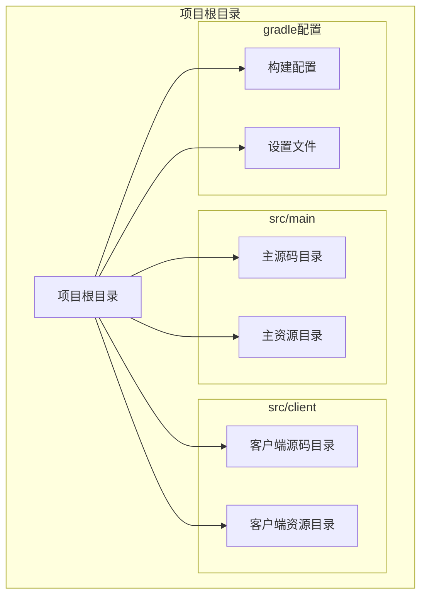
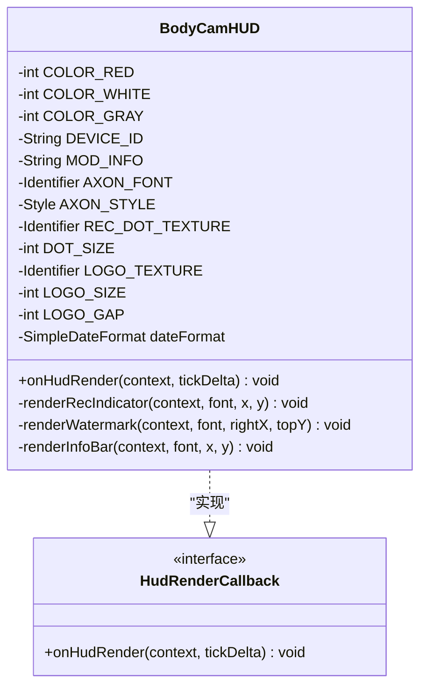
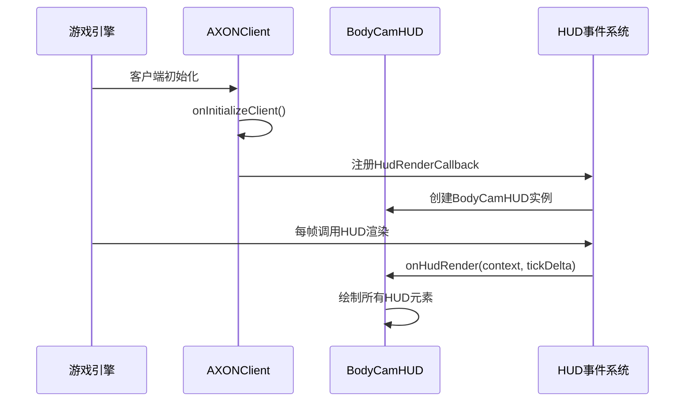
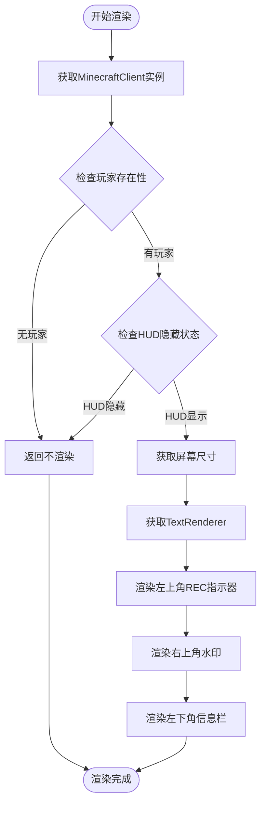
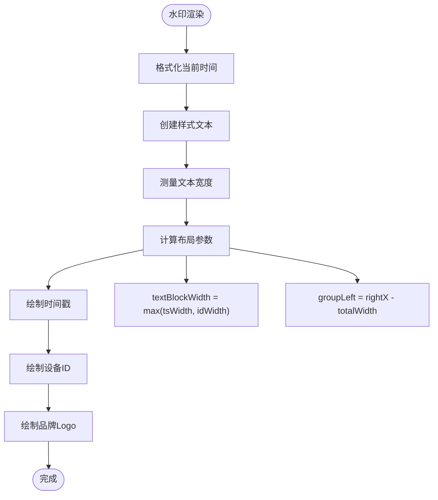
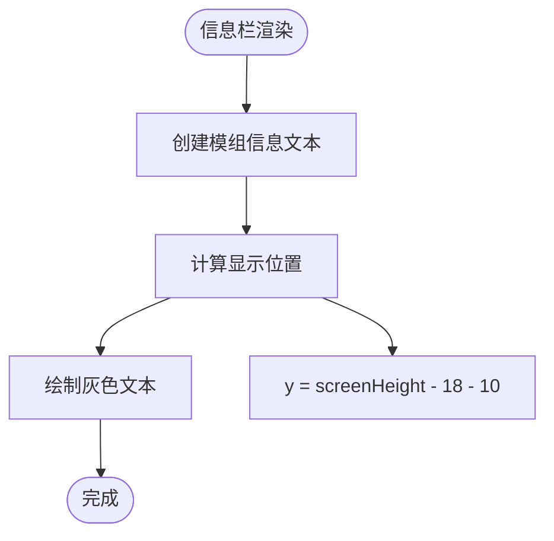
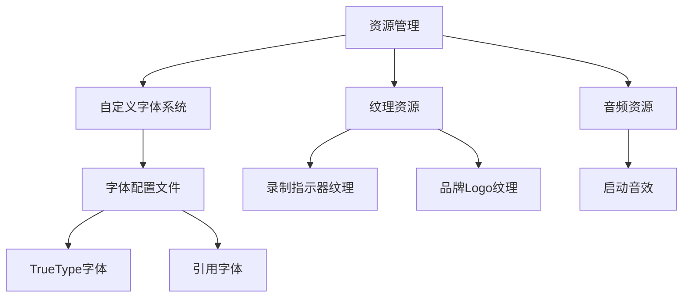
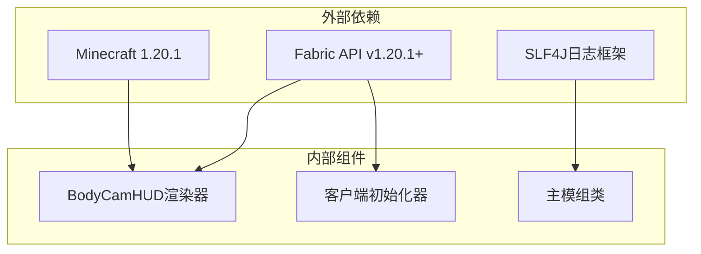
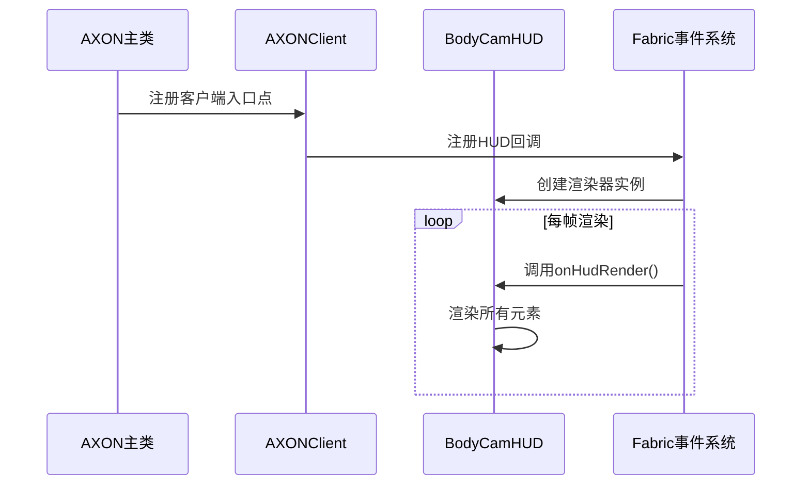

# HUD渲染系统

<cite>
**本文档引用的文件**
- [BodyCamHUD.java](file://src/client/java/cn/pr0xy/client/BodyCamHUD.java)
- [AXONClient.java](file://src/client/java/cn/pr0xy/client/AXONClient.java)
- [AXON.java](file://src/main/java/cn/pr0xy/AXON.java)
- [axon_body.json](file://src/main/resources/assets/axon/font/axon_body.json)
- [fabric.mod.json](file://src/main/resources/fabric.mod.json)
- [build.gradle](file://build.gradle)
- [axon.client.mixins.json](file://src/client/resources/axon.client.mixins.json)
- [axon.mixins.json](file://src/main/resources/axon.mixins.json)
</cite>

## 更新摘要
**所做更改**
- 更新了alpha混合录制指示器的实现细节
- 新增了脉冲动画效果的数学原理说明
- 增强了精确文本对齐计算的算法描述
- 优化了资源管理系统和自定义字体系统的架构分析
- 完善了DrawContext渲染上下文的使用说明

## 目录
1. [简介](#简介)
2. [项目结构](#项目结构)
3. [核心组件](#核心组件)
4. [架构概览](#架构概览)
5. [详细组件分析](#详细组件分析)
6. [依赖关系分析](#依赖关系分析)
7. [性能考虑](#性能考虑)
8. [故障排除指南](#故障排除指南)
9. [结论](#结论)

## 简介

BodyCam是一个基于Fabric API开发的Minecraft模组，专注于提供专业的HUD（Head-Up Display）渲染功能。该系统通过实现HudRenderCallback接口，在游戏界面中显示录制指示器、时间戳水印和设备信息等关键信息。系统采用模块化设计，支持自定义字体渲染、纹理绘制和动画效果，为用户提供直观的设备状态反馈。

**更新** 系统现已实现alpha混合录制指示器，采用脉冲动画效果，通过精确的文本对齐计算和优化的资源管理系统，提供更加流畅和美观的用户界面体验。

## 项目结构

该项目遵循标准的Fabric模组项目结构，采用分层组织方式：



**图表来源**
- [build.gradle:17-27](file://build.gradle#L17-L27)
- [fabric.mod.json:17-31](file://src/main/resources/fabric.mod.json#L17-L31)

**章节来源**
- [build.gradle:17-27](file://build.gradle#L17-L27)
- [fabric.mod.json:17-31](file://src/main/resources/fabric.mod.json#L17-L31)

## 核心组件

### BodyCamHUD类架构

BodyCamHUD是整个HUD渲染系统的核心组件，实现了HudRenderCallback接口，负责处理所有HUD元素的绘制逻辑。



**图表来源**
- [BodyCamHUD.java:14-93](file://src/client/java/cn/pr0xy/client/BodyCamHUD.java#L14-L93)

### 初始化与注册机制

系统通过AXONClient类在客户端启动时自动注册HUD渲染器：



**图表来源**
- [AXONClient.java:12-20](file://src/client/java/cn/pr0xy/client/AXONClient.java#L12-L20)
- [BodyCamHUD.java:39-60](file://src/client/java/cn/pr0xy/client/BodyCamHUD.java#L39-L53)

**章节来源**
- [BodyCamHUD.java:14-93](file://src/client/java/cn/pr0xy/client/BodyCamHUD.java#L14-L93)
- [AXONClient.java:12-31](file://src/client/java/cn/pr0xy/client/AXONClient.java#L12-L31)

## 架构概览

### 整体渲染流程

HUD渲染系统采用分层设计理念，每个HUD元素都有独立的渲染方法：



**图表来源**
- [BodyCamHUD.java:39-53](file://src/client/java/cn/pr0xy/client/BodyCamHUD.java#L39-L53)

### 渲染元素布局

系统采用绝对定位策略，每个元素都有精确的坐标计算：

| 元素位置 | 坐标计算方式 | 内容描述 |
|---------|-------------|----------|
| 左上角REC指示器 | 固定坐标(18, 14) | 录制状态指示器，包含alpha混合红点和"REC"文本 |
| 右上角水印 | 屏幕右侧对齐 | 时间戳和设备ID，右侧附带品牌Logo |
| 左下角信息栏 | 底部左侧固定坐标 | 模组名称显示，灰色文本 |

**章节来源**
- [BodyCamHUD.java:48-53](file://src/client/java/cn/pr0xy/client/BodyCamHUD.java#L48-L53)

## 详细组件分析

### REC指示器组件

REC指示器是系统最重要的视觉反馈组件，采用alpha混合脉冲动画效果：

```mermaid
flowchart TD
Start([REC指示器渲染]) --> CalcTime[计算当前时间毫秒数]
CalcTime --> CalcPhase[计算相位值(0-1)]
CalcPhase --> CalcAlpha[计算透明度系数]
CalcAlpha --> SetShader[设置着色器颜色]
SetShader --> DrawTexture[绘制alpha混合纹理]
DrawTexture --> ResetShader[重置着色器颜色]
ResetShader --> DrawText[绘制"REC"文本]
DrawText --> End([完成])
CalcAlpha --> AlphaCalc["alpha = 0.2 + 0.8 * max(0, cos(phase * 2π))"]
```

**图表来源**
- [BodyCamHUD.java:56-66](file://src/client/java/cn/pr0xy/client/BodyCamHUD.java#L56-L66)

#### 动画实现原理

脉冲效果通过alpha混合和余弦函数实现平滑的亮度变化：
- 基础alpha：0.2 (20%不透明度)
- 波动范围：0.8 (80%透明度变化)
- 周期：1秒
- 计算公式：`alpha = 0.2 + 0.8 * max(0, cos(phase * 2π))`

**更新** 新增了RenderSystem.setShaderColor()调用来实现alpha混合效果，确保纹理和文本的透明度一致。

**章节来源**
- [BodyCamHUD.java:56-66](file://src/client/java/cn/pr0xy/client/BodyCamHUD.java#L56-L66)

### 水印组件

水印组件位于屏幕右上角，包含动态时间戳和静态设备信息：



**图表来源**
- [BodyCamHUD.java:69-85](file://src/client/java/cn/pr0xy/client/BodyCamHUD.java#L69-L85)

#### 文本布局算法

水印组件采用精确的自适应布局算法，确保文本块和Logo的正确对齐：

1. **文本测量**：分别测量时间戳和设备ID的宽度
2. **宽度计算**：取两个文本的最大宽度作为文本块宽度
3. **总宽度**：文本块宽度 + 间距 + Logo尺寸
4. **位置计算**：从屏幕右侧边缘向左偏移总宽度

**更新** 优化了文本对齐计算，使用精确的坐标系统确保在不同分辨率下的稳定表现。

**章节来源**
- [BodyCamHUD.java:69-85](file://src/client/java/cn/pr0xy/client/BodyCamHUD.java#L69-L85)

### 信息栏组件

信息栏位于屏幕左下角，显示模组的基本信息：



**图表来源**
- [BodyCamHUD.java:87-90](file://src/client/java/cn/pr0xy/client/BodyCamHUD.java#L87-L90)

**章节来源**
- [BodyCamHUD.java:87-90](file://src/client/java/cn/pr0xy/client/BodyCamHUD.java#L87-L90)

### 资源管理系统

系统实现了完整的资源管理架构，包括字体、纹理和音频资源：



**图表来源**
- [axon_body.json:1-16](file://src/main/resources/assets/axon/font/axon_body.json#L1-L16)
- [AXON.java:17-19](file://src/main/java/cn/pr0xy/AXON.java#L17-L19)

**更新** 新增了完整的资源管理系统，包括自定义字体配置和纹理资源管理。

**章节来源**
- [axon_body.json:1-16](file://src/main/resources/assets/axon/font/axon_body.json#L1-L16)
- [AXON.java:17-19](file://src/main/java/cn/pr0xy/AXON.java#L17-L19)

## 依赖关系分析

### 外部依赖关系

系统主要依赖于Fabric API和Minecraft客户端库：



**图表来源**
- [build.gradle:29-36](file://build.gradle#L29-L36)
- [fabric.mod.json:32-37](file://src/main/resources/fabric.mod.json#L32-L37)

### 模块间交互



**图表来源**
- [fabric.mod.json:17-23](file://src/main/resources/fabric.mod.json#L17-L23)
- [AXONClient.java:14-20](file://src/client/java/cn/pr0xy/client/AXONClient.java#L14-L20)

**章节来源**
- [build.gradle:29-36](file://build.gradle#L29-L36)
- [fabric.mod.json:17-37](file://src/main/resources/fabric.mod.json#L17-L37)

## 性能考虑

### 渲染性能优化

1. **条件渲染优化**
   - 在没有玩家或HUD隐藏时直接返回
   - 避免不必要的计算和绘制操作

2. **alpha混合优化**
   - 使用RenderSystem.setShaderColor()统一管理透明度
   - 减少重复的颜色设置调用

3. **文本测量缓存**
   - 使用静态字体标识符避免重复创建
   - 合理利用Minecraft的文本测量缓存机制

4. **纹理资源优化**
   - 预加载纹理资源到内存
   - 使用合适的纹理尺寸避免过度缩放

### 内存管理

- 使用静态常量存储颜色值和字符串
- 避免在渲染循环中创建临时对象
- 合理使用SimpleDateFormat实例

### 最佳实践建议

1. **坐标系统选择**
   - 使用相对坐标系统便于适配不同分辨率
   - 预留足够的边距避免遮挡重要UI元素

2. **颜色管理**
   - 使用ARGB格式确保正确的透明度混合
   - 考虑色盲友好的颜色搭配

3. **字体渲染**
   - 优先使用Minecraft内置字体保证兼容性
   - 自定义字体需要考虑性能影响

4. **资源管理**
   - 合理组织资源文件结构
   - 使用适当的资源压缩和优化

## 故障排除指南

### 常见问题诊断

1. **HUD不显示**
   - 检查是否正确注册了HudRenderCallback
   - 确认MinecraftClient实例可用性
   - 验证HUD隐藏设置

2. **alpha混合效果异常**
   - 检查RenderSystem.setShaderColor()调用时机
   - 确认纹理文件格式支持透明度
   - 验证着色器状态重置

3. **文本渲染异常**
   - 检查字体标识符是否正确注册
   - 验证文本样式配置
   - 确认颜色值格式正确

4. **纹理加载失败**
   - 检查资源路径是否正确
   - 验证纹理文件是否存在
   - 确认纹理尺寸符合要求

### 调试技巧

1. **日志记录**
   - 在关键渲染步骤添加日志输出
   - 监控帧率和内存使用情况

2. **坐标调试**
   - 使用简单的颜色方块验证坐标计算
   - 逐步注释渲染方法定位问题

3. **性能监控**
   - 使用Minecraft内置性能监控工具
   - 分析渲染时间分布

**章节来源**
- [BodyCamHUD.java:40-41](file://src/client/java/cn/pr0xy/client/BodyCamHUD.java#L40-L41)
- [AXON.java:20-24](file://src/main/java/cn/pr0xy/AXON.java#L20-L24)

## 结论

BodyCam的HUD渲染系统展现了现代Minecraft模组开发的最佳实践。通过清晰的模块化设计、高效的渲染算法和完善的错误处理机制，系统能够在保持高性能的同时提供丰富的视觉反馈。

**更新** 系统现已实现alpha混合录制指示器、脉冲动画效果、精确文本对齐计算、资源管理系统优化和自定义字体系统的增强，为用户提供了更加专业和流畅的用户体验。

### 主要优势

1. **架构清晰**：采用单一职责原则，每个组件负责特定的渲染任务
2. **性能优秀**：优化的渲染算法和条件渲染机制
3. **扩展性强**：模块化设计便于功能扩展和维护
4. **兼容性好**：严格遵循Fabric API规范，确保跨版本兼容
5. **视觉效果佳**：alpha混合和脉冲动画提供专业的视觉反馈

### 技术亮点

- **alpha混合动画**：通过RenderSystem实现平滑的透明度变化
- **脉冲效果**：数学函数生成的自然闪烁动画
- **精确对齐**：自适应布局算法确保稳定的UI表现
- **资源管理**：完整的字体和纹理资源管理体系
- **自定义字体**：支持TTF字体和引用字体的混合配置

该系统为其他Minecraft模组开发者提供了优秀的参考模板，展示了如何在保持性能的同时实现复杂的UI渲染功能，并且体现了现代模组开发中对视觉质量和用户体验的重视。