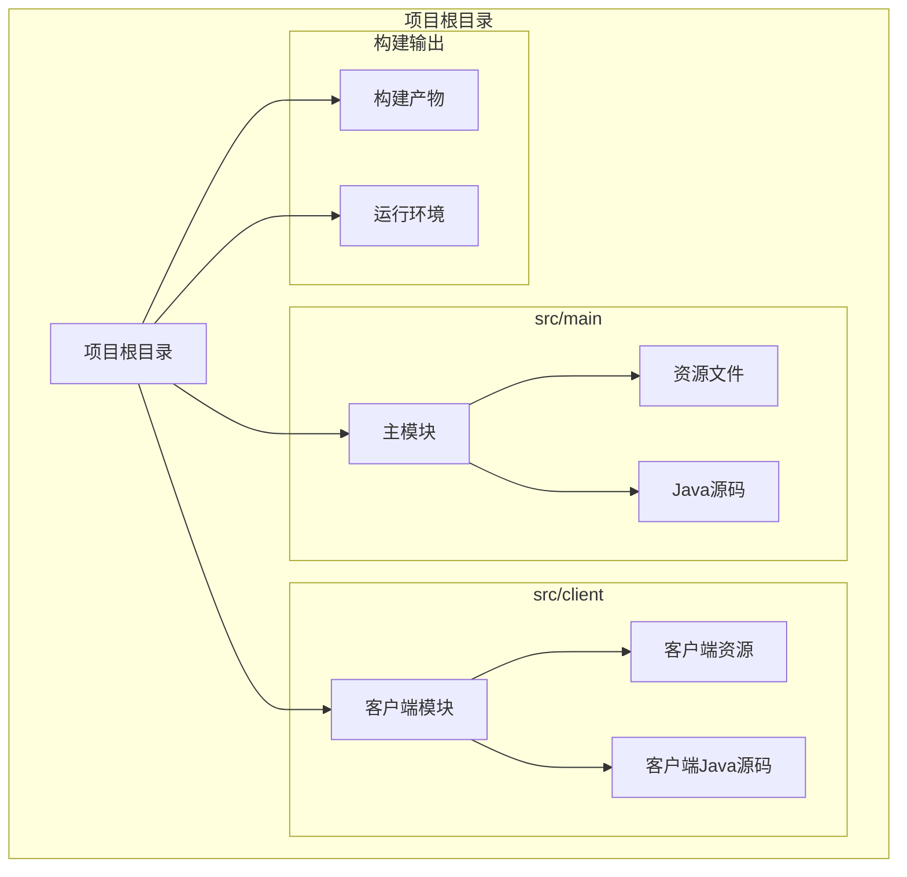
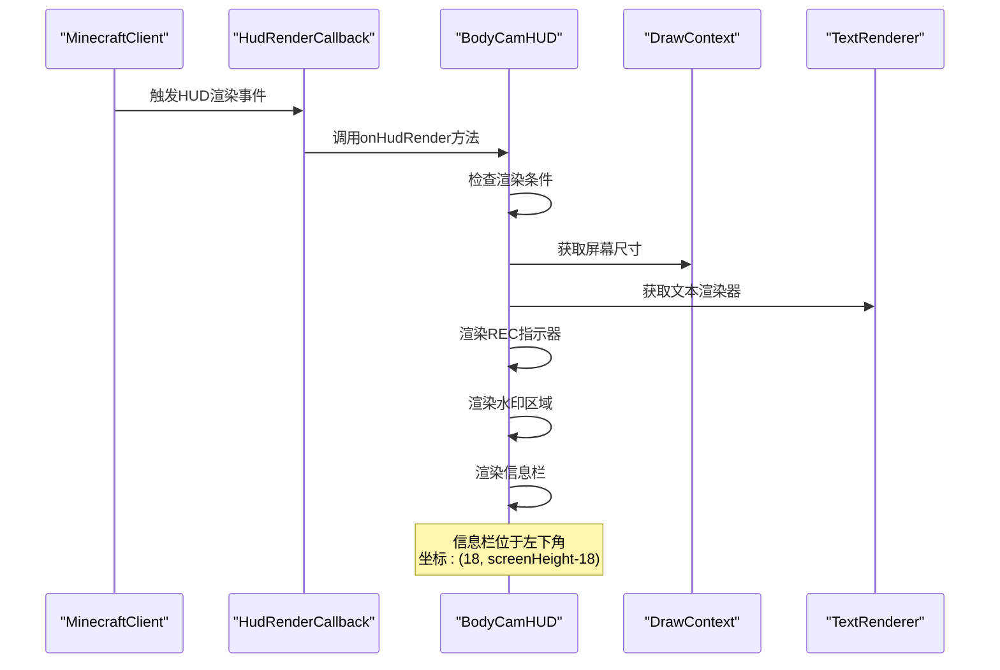
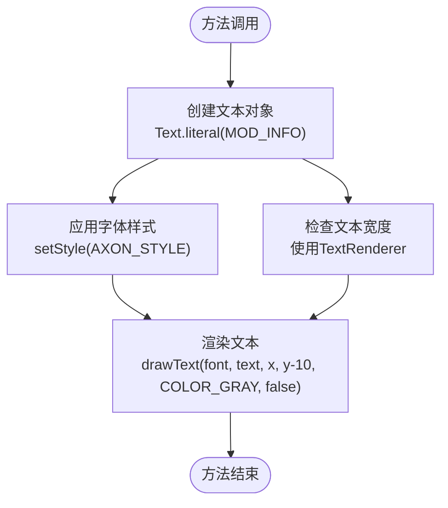
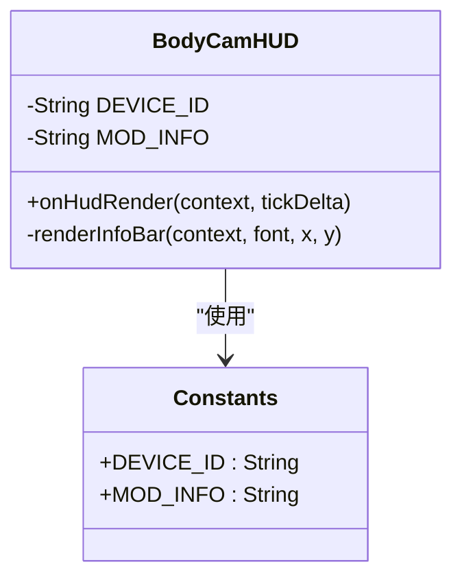
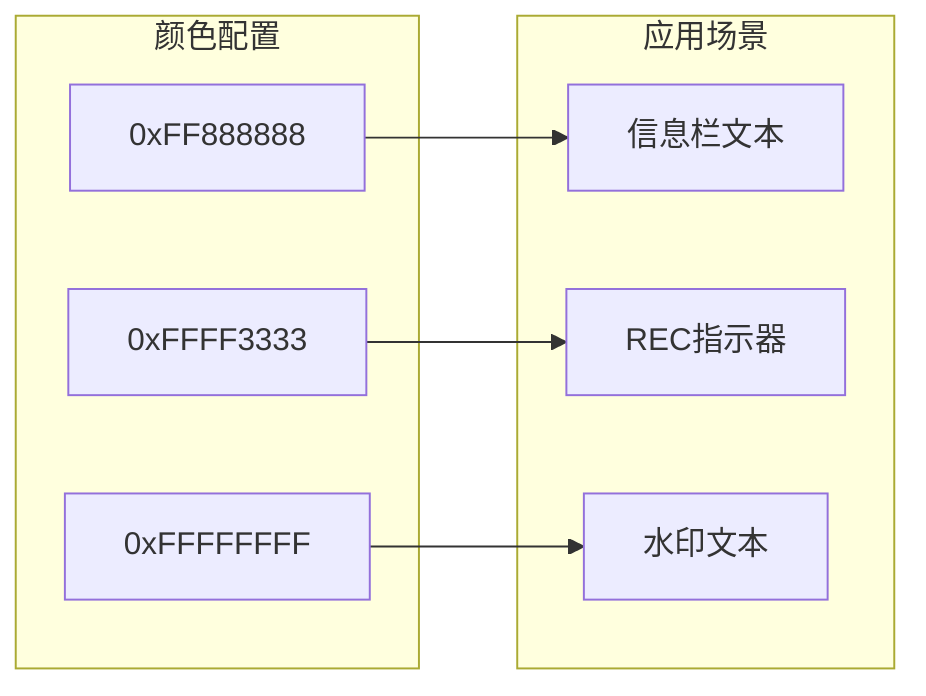
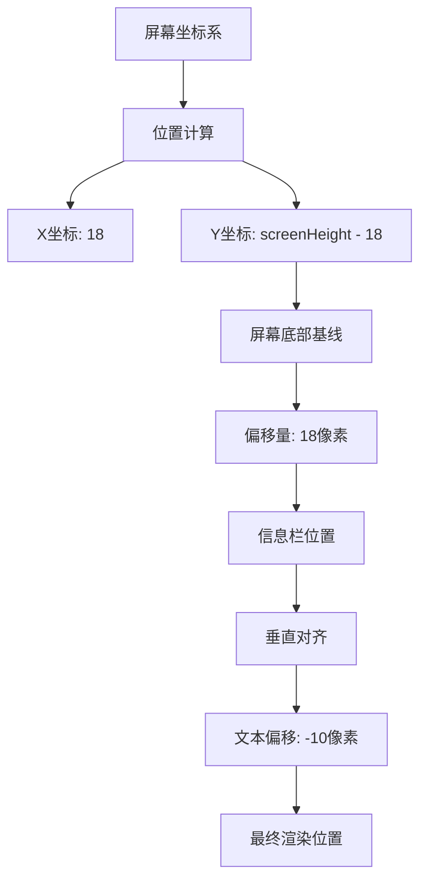
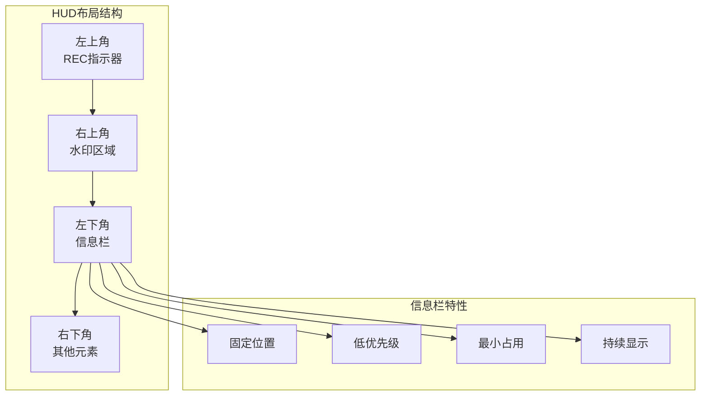
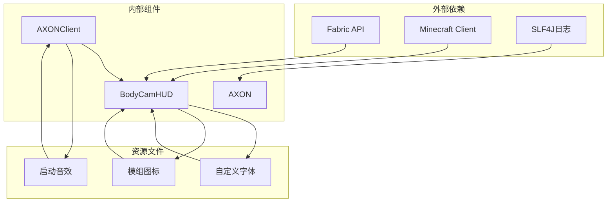

# 信息栏功能

<cite>
**本文档引用的文件**
- [BodyCamHUD.java](file://src/client/java/cn/pr0xy/client/BodyCamHUD.java)
- [AXONClient.java](file://src/client/java/cn/pr0xy/client/AXONClient.java)
- [AXON.java](file://src/main/java/cn/pr0xy/AXON.java)
- [fabric.mod.json](file://src/main/resources/fabric.mod.json)
- [axon.client.mixins.json](file://src/client/resources/axon.client.mixins.json)
- [axon_body.json](file://src/main/resources/assets/axon/font/axon_body.json)
- [sounds.json](file://src/main/resources/assets/axon/sounds.json)
</cite>

## 更新摘要
**所做更改**
- 更新了字体系统支持部分，反映新的字体配置优化
- 增强了资源管理优化的相关说明
- 完善了字体渲染质量和性能改进的描述
- 更新了相关的代码示例和配置说明

## 目录
1. [简介](#简介)
2. [项目结构](#项目结构)
3. [核心组件](#核心组件)
4. [架构概览](#架构概览)
5. [详细组件分析](#详细组件分析)
6. [依赖关系分析](#依赖关系分析)
7. [性能考虑](#性能考虑)
8. [故障排除指南](#故障排除指南)
9. [结论](#结论)

## 简介

本文档深入分析了BodyCam模组中的信息栏（Info Bar）功能实现机制。信息栏位于游戏界面的左下角，显示模组标识信息，是整个HUD布局的重要组成部分。本文将详细解析renderInfoBar方法的设计与实现，说明MOD_INFO字符串常量的使用方式，解释信息栏的颜色配置和位置计算逻辑，并阐述其在整个HUD系统中的作用和重要性。

**更新** 本次更新重点关注字体系统的优化支持和资源管理的改进，提升了信息栏的整体显示质量和渲染性能。

## 项目结构

BodyCam项目采用标准的Fabric模组结构，主要包含客户端和服务器端两个部分：

**图表来源**
- [BodyCamHUD.java:1-93](file://src/client/java/cn/pr0xy/client/BodyCamHUD.java#L1-L93)
- [AXONClient.java:1-31](file://src/client/java/cn/pr0xy/client/AXONClient.java#L1-L31)

**章节来源**
- [BodyCamHUD.java:1-93](file://src/client/java/cn/pr0xy/client/BodyCamHUD.java#L1-L93)
- [fabric.mod.json:1-38](file://src/main/resources/fabric.mod.json#L1-L38)

## 核心组件

信息栏功能由以下核心组件构成：

### 颜色配置系统
- **红色（REC指示器）**: `0xFFFF3333` - 用于录制状态指示
- **白色（水印文本）**: `0xFFFFFFFF` - 用于时间戳和设备ID显示
- **灰色（信息栏文本）**: `0xFF888888` - 用于模组标识信息

### 字体系统优化
- **自定义字体**: `axon_body` - 使用TTF字体文件，支持优化渲染
- **字体配置**: 包含oversample和shift参数提升显示质量
- **字体大小**: 10.5像素，配合4倍oversample获得平滑效果
- **字体样式**: 通过`Style.EMPTY.withFont()`应用自定义字体

### 文本内容管理
- **设备ID**: `"AXON BODY 2 X81237971"`
- **模组信息**: `"AXON BodyCam Mod"`
- **时间格式**: `"yyyy-MM-dd HH:mm:ss Z"`

**更新** 字体系统现在包含更精细的渲染参数配置，通过oversample和shift优化确保在各种分辨率下都有良好的显示效果。

**章节来源**
- [BodyCamHUD.java:17-37](file://src/client/java/cn/pr0xy/client/BodyCamHUD.java#L17-L37)
- [axon_body.json:1-16](file://src/main/resources/assets/axon/font/axon_body.json#L1-L16)

## 架构概览

信息栏功能在整个HUD渲染系统中扮演着重要角色，通过Fabric API的HudRenderCallback接口实现：

**图表来源**
- [BodyCamHUD.java:38-53](file://src/client/java/cn/pr0xy/client/BodyCamHUD.java#L38-L53)
- [AXONClient.java:14-20](file://src/client/java/cn/pr0xy/client/AXONClient.java#L14-L20)

**章节来源**
- [BodyCamHUD.java:38-53](file://src/client/java/cn/pr0xy/client/BodyCamHUD.java#L38-L53)
- [AXONClient.java:14-20](file://src/client/java/cn/pr0xy/client/AXONClient.java#L14-L20)

## 详细组件分析

### renderInfoBar方法深度解析

renderInfoBar方法是信息栏功能的核心实现，负责在指定位置渲染模组标识信息：

**图表来源**
- [BodyCamHUD.java:87-90](file://src/client/java/cn/pr0xy/client/BodyCamHUD.java#L87-L90)

#### 方法参数详解
- **context**: DrawContext实例，用于绘制图形和文本
- **font**: TextRenderer实例，负责文本渲染
- **x**: 文本左上角的X坐标（固定为18）
- **y**: 文本左上角的Y坐标（基于屏幕高度计算）

#### 渲染逻辑分析
1. **文本创建**: 使用`Text.literal()`创建模组信息文本
2. **样式应用**: 通过`setStyle()`应用自定义字体样式
3. **颜色配置**: 使用灰色（`COLOR_GRAY`）进行文本渲染
4. **位置计算**: Y坐标设置为`y - 10`，实现垂直居中效果

**更新** 新的字体系统通过优化的渲染参数提供了更好的字符边缘平滑度，减少了锯齿现象。

**章节来源**
- [BodyCamHUD.java:87-90](file://src/client/java/cn/pr0xy/client/BodyCamHUD.java#L87-L90)

### MOD_INFO字符串常量使用机制

MOD_INFO常量定义了信息栏显示的核心文本内容：

**图表来源**
- [BodyCamHUD.java:23-24](file://src/client/java/cn/pr0xy/client/BodyCamHUD.java#L23-L24)

#### 常量管理优势
- **集中管理**: 所有文本内容集中在类中定义
- **易于维护**: 修改显示内容只需更改常量值
- **类型安全**: 编译时检查确保字符串正确性

**章节来源**
- [BodyCamHUD.java:23-24](file://src/client/java/cn/pr0xy/client/BodyCamHUD.java#L23-L24)

### 灰色文字颜色配置

信息栏使用特定的灰色配置实现视觉层次：

**图表来源**
- [BodyCamHUD.java:19-21](file://src/client/java/cn/pr0xy/client/BodyCamHUD.java#L19-L21)

#### 颜色配置细节
- **ARGB格式**: 0xAARRGGBB
- **透明度**: 0xFF（完全不透明）
- **红色分量**: 0x88
- **绿色分量**: 0x88  
- **蓝色分量**: 0x88

**章节来源**
- [BodyCamHUD.java:19-21](file://src/client/java/cn/pr0xy/client/BodyCamHUD.java#L19-L21)

### 信息栏位置计算逻辑

信息栏的位置计算遵循严格的屏幕坐标系统：

**图表来源**
- [BodyCamHUD.java:52](file://src/client/java/cn/pr0xy/client/BodyCamHUD.java#L52)
- [BodyCamHUD.java:89](file://src/client/java/cn/pr0xy/client/BodyCamHUD.java#L89)

#### 坐标系统说明
- **X坐标**: 固定为18像素，距离屏幕左侧边缘18像素
- **Y坐标**: 基于屏幕高度计算，距离屏幕底部18像素
- **垂直对齐**: 通过`y - 10`实现文本的垂直居中效果

**章节来源**
- [BodyCamHUD.java:52](file://src/client/java/cn/pr0xy/client/BodyCamHUD.java#L52)
- [BodyCamHUD.java:89](file://src/client/java/cn/pr0xy/client/BodyCamHUD.java#L89)

### HUD布局中的作用和重要性

信息栏在整个HUD布局中承担着多重重要职责：

**图表来源**
- [BodyCamHUD.java:47-53](file://src/client/java/cn/pr0xy/client/BodyCamHUD.java#L47-L53)

#### 设计原则
- **最小侵入**: 占用空间最小化
- **视觉层次**: 采用灰色降低视觉权重
- **稳定性**: 固定位置确保一致性
- **可读性**: 合适的对比度保证清晰度

**章节来源**
- [BodyCamHUD.java:47-53](file://src/client/java/cn/pr0xy/client/BodyCamHUD.java#L47-L53)

## 依赖关系分析

信息栏功能依赖于多个系统组件：

**图表来源**
- [BodyCamHUD.java:5-12](file://src/client/java/cn/pr0xy/client/BodyCamHUD.java#L5-L12)
- [AXONClient.java:4-10](file://src/client/java/cn/pr0xy/client/AXONClient.java#L4-L10)

### 关键依赖关系
- **Fabric API**: 提供HudRenderCallback接口支持
- **Minecraft Client**: 提供渲染上下文和屏幕信息
- **自定义字体**: 通过资源包加载字体文件，支持优化渲染
- **模组图标**: 作为视觉标识元素

**更新** 字体系统现在包含更完善的资源管理，通过优化的配置参数提升渲染质量和性能。

**章节来源**
- [BodyCamHUD.java:5-12](file://src/client/java/cn/pr0xy/client/BodyCamHUD.java#L5-L12)
- [AXONClient.java:4-10](file://src/client/java/cn/pr0xy/client/AXONClient.java#L4-L10)

## 性能考虑

信息栏渲染具有以下性能特征：

### 渲染效率
- **简单操作**: 仅涉及一次文本渲染操作
- **无复杂计算**: 位置计算为常量时间复杂度
- **内存友好**: 使用静态常量避免重复分配
- **字体优化**: 通过oversample参数提升渲染质量

### 优化建议
- **批量渲染**: 可以考虑将多个HUD元素合并到单次渲染调用中
- **缓存策略**: 对频繁使用的文本测量结果进行缓存
- **条件渲染**: 在HUD隐藏模式下完全跳过渲染
- **字体复用**: 利用现有的字体样式避免重复创建

**更新** 新的字体系统通过优化的渲染参数，在保持高质量显示的同时减少了不必要的计算开销。

## 故障排除指南

### 常见问题及解决方案

#### 信息栏不显示
**可能原因**:
- HUD被隐藏（按F1键）
- 客户端未正确初始化
- 屏幕尺寸获取失败

**解决方法**:
1. 检查`client.player != null`条件
2. 确认`client.options.hudHidden`为false
3. 验证`client.getWindow()`返回有效对象

#### 文本显示异常
**可能原因**:
- 自定义字体未正确加载
- 字体样式应用失败
- 颜色配置错误

**解决方法**:
1. 检查`axon_body.json`资源配置
2. 验证字体文件路径正确性
3. 确认颜色值格式为ARGB
4. 验证字体文件存在且可访问

#### 位置计算错误
**可能原因**:
- 屏幕尺寸获取不准确
- 坐标系统理解错误
- 分辨率变化影响

**解决方法**:
1. 使用`getScaledWidth()`和`getScaledHeight()`
2. 确认坐标系原点位置
3. 测试不同分辨率下的表现

#### 字体渲染质量问题
**可能原因**:
- oversample参数配置不当
- shift参数设置错误
- 字体文件损坏

**解决方法**:
1. 检查`axon_body.json`中的oversample和shift配置
2. 验证字体文件完整性
3. 确认字体文件路径正确

**更新** 新增了字体渲染质量相关的故障排除指导。

**章节来源**
- [BodyCamHUD.java:39-46](file://src/client/java/cn/pr0xy/client/BodyCamHUD.java#L39-L46)
- [BodyCamHUD.java:87-90](file://src/client/java/cn/pr0xy/client/BodyCamHUD.java#L87-L90)

## 结论

BodyCam信息栏功能展现了简洁而高效的HUD设计原则。通过精心设计的渲染流程、合理的颜色配置和精确的位置计算，实现了既不影响游戏体验又具有良好识别度的信息显示。

### 主要成就
- **简洁性**: 最小化的代码实现达到预期功能
- **可维护性**: 清晰的常量管理和模块化设计
- **扩展性**: 易于修改显示内容和外观属性
- **兼容性**: 充分利用Fabric API确保跨版本兼容
- **字体优化**: 通过优化的字体配置提升显示质量

**更新** 本次更新显著提升了字体系统的支持和资源管理的优化，为信息栏功能提供了更好的显示质量和性能保障。

### 改进建议
1. **动态内容**: 可考虑添加动态信息如录制状态、电池电量等
2. **主题支持**: 实现多套配色方案以适应不同需求
3. **国际化**: 添加多语言支持以扩大用户群体
4. **配置选项**: 提供用户自定义显示内容的选项
5. **字体定制**: 允许用户选择不同的字体样式和大小

信息栏功能作为BodyCam模组的重要组成部分，为用户提供了一个清晰、稳定且美观的信息显示界面，体现了现代游戏模组开发的最佳实践。新的字体系统优化进一步增强了用户体验，确保在各种环境下都能获得优质的显示效果。