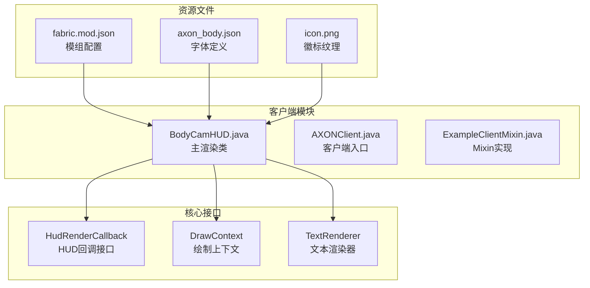
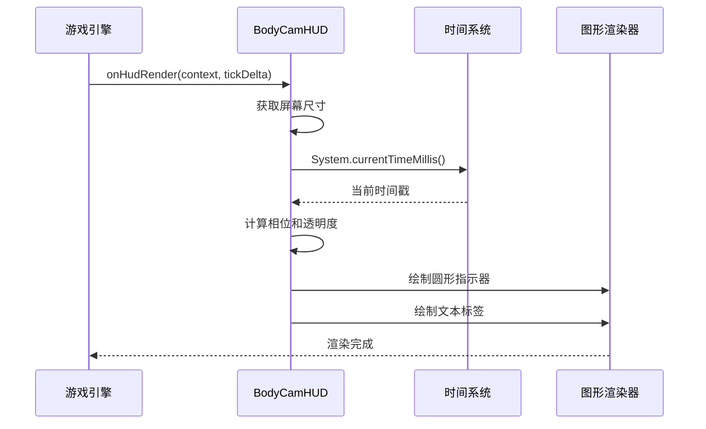
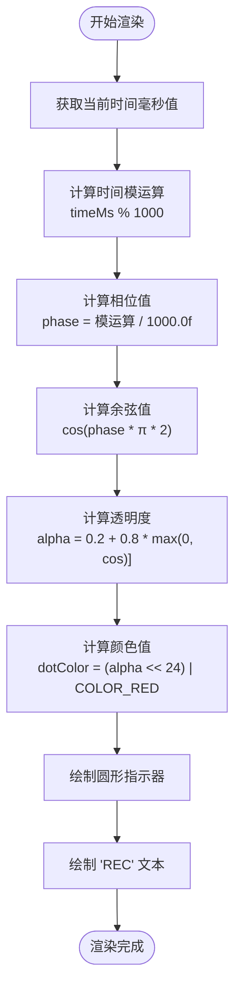
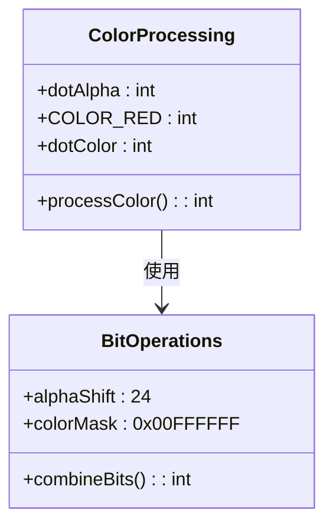
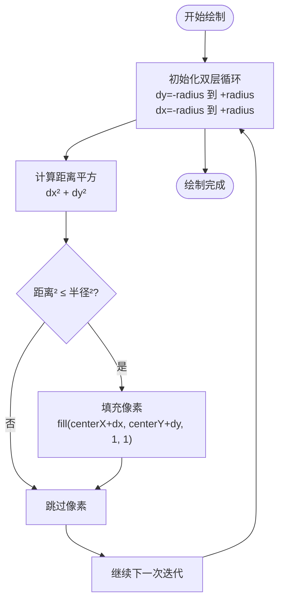
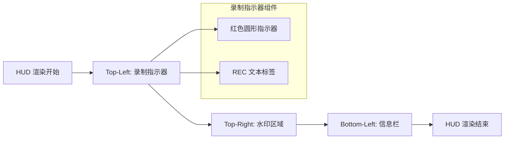
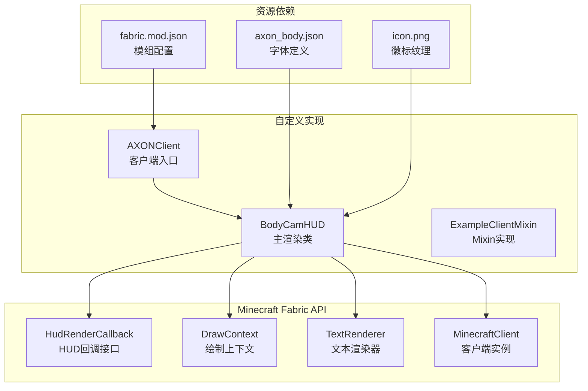

# 录制指示器功能

<cite>
**本文档引用的文件**
- [BodyCamHUD.java](file://src/client/java/cn/pr0xy/client/BodyCamHUD.java)
- [preview.html](file://preview.html)
- [axon_body.json](file://src/main/resources/assets/axon/font/axon_body.json)
- [fabric.mod.json](file://src/main/resources/fabric.mod.json)
</cite>

## 目录
1. [简介](#简介)
2. [项目结构](#项目结构)
3. [核心组件](#核心组件)
4. [架构概览](#架构概览)
5. [详细组件分析](#详细组件分析)
6. [依赖关系分析](#依赖关系分析)
7. [性能考虑](#性能考虑)
8. [故障排除指南](#故障排除指南)
9. [结论](#结论)

## 简介

BodyCam 是一个基于 Fabric API 的 Minecraft 模组，专门用于增强摄像头录制功能。本文档专注于录制指示器功能的技术实现，特别是闪烁红点指示器的完整实现机制。

录制指示器是模组的核心视觉反馈组件，为用户提供实时的录制状态指示。该功能通过精确的时间计算、相位转换算法和透明度控制算法，实现了平滑的闪烁动画效果。

## 项目结构

BodyCam 项目采用标准的 Fabric 模组结构，主要包含客户端渲染逻辑和资源文件：



**图表来源**
- [BodyCamHUD.java:1-138](file://src/client/java/cn/pr0xy/client/BodyCamHUD.java#L1-L138)
- [fabric.mod.json:1-38](file://src/main/resources/fabric.mod.json#L1-L38)

**章节来源**
- [BodyCamHUD.java:1-138](file://src/client/java/cn/pr0xy/client/BodyCamHUD.java#L1-L138)
- [fabric.mod.json:1-38](file://src/main/resources/fabric.mod.json#L1-L38)

## 核心组件

### 录制指示器渲染器

录制指示器功能的核心实现位于 `BodyCamHUD` 类中，该类实现了 `HudRenderCallback` 接口，负责在游戏界面顶部左侧渲染录制状态指示器。

#### 主要特性
- **闪烁动画**: 基于余弦函数的平滑闪烁效果
- **精确控制**: 1秒周期的精确时间控制
- **颜色管理**: 支持自定义颜色和透明度
- **文本渲染**: 集成的 "REC" 文本显示

#### 关键常量定义

| 常量名称 | 值 | 描述 |
|---------|-----|------|
| COLOR_RED | 0xFFFF3333 | 红色 ARGB 值 |
| COLOR_WHITE | 0xFFFFFFFF | 白色 ARGB 值 |
| COLOR_GRAY | 0xFF888888 | 灰色 ARGB 值 |
| LOGO_SIZE | 18 | 徽标尺寸 |
| LOGO_GAP | 6 | 文本块与徽标间距 |

**章节来源**
- [BodyCamHUD.java:16-35](file://src/client/java/cn/pr0xy/client/BodyCamHUD.java#L16-L35)

## 架构概览

录制指示器功能的架构设计遵循 Minecraft Fabric API 的最佳实践，通过事件驱动的方式实现非侵入式渲染。



**图表来源**
- [BodyCamHUD.java:40-80](file://src/client/java/cn/pr0xy/client/BodyCamHUD.java#L40-L80)

## 详细组件分析

### renderRecIndicator 方法实现原理

`renderRecIndicator` 方法是录制指示器功能的核心实现，负责完整的闪烁动画渲染流程。

#### 时间计算逻辑



**图表来源**
- [BodyCamHUD.java:65-80](file://src/client/java/cn/pr0xy/client/BodyCamHUD.java#L65-L80)

#### 相位转换算法详解

相位转换算法确保了1秒周期的精确闪烁效果：

1. **时间采样**: 使用 `System.currentTimeMillis()` 获取高精度时间戳
2. **模运算**: 对1000取模确保相位在[0,1)范围内
3. **归一化**: 除以1000.0f转换为0-1之间的浮点数
4. **角度映射**: 乘以2π将相位映射到完整圆周

#### 透明度控制算法

透明度控制算法实现了从20%到100%的平滑过渡：

- **最小透明度**: 0.2（20%不透明度）
- **振幅**: 0.8（80%透明度变化范围）
- **偏移**: 0.2（确保始终为正值）

透明度计算公式：`alpha = 0.2 + 0.8 * max(0, cos(2π * phase))`

#### 颜色值位运算处理

颜色值的位运算确保了正确的 ARGB 格式：



**图表来源**
- [BodyCamHUD.java:69-71](file://src/client/java/cn/pr0xy/client/BodyCamHUD.java#L69-L71)

**章节来源**
- [BodyCamHUD.java:65-80](file://src/client/java/cn/pr0xy/client/BodyCamHUD.java#L65-L80)

### drawCircle 方法实现原理

`drawCircle` 方法实现了基于矩形填充的圆形绘制算法，提供了像素级精确控制。

#### 圆形绘制算法



**图表来源**
- [BodyCamHUD.java:129-137](file://src/client/java/cn/pr0xy/client/BodyCamHUD.java#L129-L137)

#### 矩形填充技术

该算法使用了高效的矩形填充技术：

- **像素精确**: 每个像素都是1x1的矩形
- **边界检测**: 使用距离公式精确判断像素是否在圆内
- **内存效率**: 无额外数据结构开销
- **性能优化**: 基于循环的简单实现

**章节来源**
- [BodyCamHUD.java:129-137](file://src/client/java/cn/pr0xy/client/BodyCamHUD.java#L129-L137)

### HUD 渲染集成

录制指示器作为 HUD 组件的一部分，与其他界面元素协同工作。

#### 渲染顺序



**图表来源**
- [BodyCamHUD.java:40-60](file://src/client/java/cn/pr0xy/client/BodyCamHUD.java#L40-L60)

**章节来源**
- [BodyCamHUD.java:40-60](file://src/client/java/cn/pr0xy/client/BodyCamHUD.java#L40-L60)

## 依赖关系分析

### 外部依赖

录制指示器功能依赖于多个 Fabric API 组件：



**图表来源**
- [BodyCamHUD.java:3-14](file://src/client/java/cn/pr0xy/client/BodyCamHUD.java#L3-L14)
- [fabric.mod.json:17-31](file://src/main/resources/fabric.mod.json#L17-L31)

### 内部耦合关系

录制指示器功能内部具有良好的模块化设计：

- **低耦合**: 各方法职责单一，相互独立
- **高内聚**: 相关功能集中在单个类中
- **可扩展性**: 易于修改参数和添加新功能

**章节来源**
- [BodyCamHUD.java:1-138](file://src/client/java/cn/pr0xy/client/BodyCamHUD.java#L1-L138)
- [fabric.mod.json:17-31](file://src/main/resources/fabric.mod.json#L17-L31)

## 性能考虑

### 时间计算优化

录制指示器使用了高效的毫秒级时间计算：

- **System.currentTimeMillis()**: 提供纳秒级精度的时间戳
- **模运算优化**: 避免了复杂的日期对象创建
- **浮点运算**: 简化的相位计算避免了三角函数开销

### 渲染性能分析

```mermaid
graph LR
subgraph "CPU性能"
A[时间计算: O(1)]
B[相位转换: O(1)]
C[透明度计算: O(1)]
D[颜色处理: O(1)]
E[圆形绘制: O(r²)]
end
subgraph "GPU性能"
F[矩形填充: O(r²)]
G[文本渲染: O(n)]
end
A --> H[总复杂度: O(r² + n)]
B --> H
C --> H
D --> H
E --> H
F --> H
G --> H
```

### 视觉体验优化

#### 动画流畅性

- **1秒周期**: 符合用户预期的闪烁节奏
- **余弦曲线**: 提供自然的亮度变化
- **20%-100%范围**: 确保足够的对比度和可见性

#### 用户界面适配

- **位置固定**: 左上角18x14像素的固定位置
- **颜色对比**: 红色与背景的高对比度
- **文本对齐**: "REC"文本与圆形指示器完美对齐

## 故障排除指南

### 常见问题及解决方案

#### 指示器不显示

**可能原因**:
- HUD 被隐藏（F1模式）
- 玩家实例为空
- 屏幕尺寸获取失败

**解决方法**:
- 检查 `hudHidden` 状态
- 确认玩家实例存在
- 验证屏幕尺寸获取

#### 闪烁异常

**可能原因**:
- 时间计算错误
- 相位值超出范围
- 透明度计算溢出

**解决方法**:
- 验证 `System.currentTimeMillis()` 返回值
- 检查模运算结果
- 确保透明度在0-1范围内

#### 圆形绘制失真

**可能原因**:
- 半径计算错误
- 距离公式不准确
- 像素坐标偏移

**解决方法**:
- 验证半径值计算
- 检查距离平方比较
- 确认坐标系统

**章节来源**
- [BodyCamHUD.java:43-46](file://src/client/java/cn/pr0xy/client/BodyCamHUD.java#L43-L46)
- [BodyCamHUD.java:129-137](file://src/client/java/cn/pr0xy/client/BodyCamHUD.java#L129-L137)

## 结论

BodyCam 的录制指示器功能展现了优秀的工程实践，通过精心设计的时间计算、相位转换和透明度控制算法，实现了精确而美观的视觉效果。

### 技术亮点

1. **算法精确性**: 基于数学公式的精确时间控制
2. **性能优化**: 高效的像素级渲染算法
3. **用户体验**: 自然流畅的动画效果
4. **代码质量**: 清晰的模块化设计和注释

### 扩展建议

- **参数化配置**: 将动画周期、颜色等参数化
- **多状态支持**: 添加不同录制状态的视觉区分
- **性能监控**: 添加帧率和渲染时间统计
- **主题适配**: 支持不同的UI主题和颜色方案

该实现为类似HUD组件的开发提供了优秀的参考模板，展示了如何在保持高性能的同时实现高质量的视觉效果。