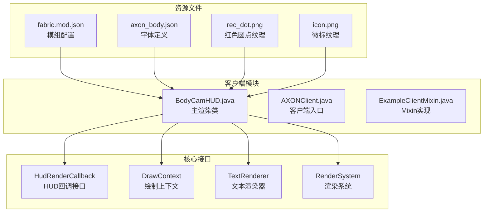
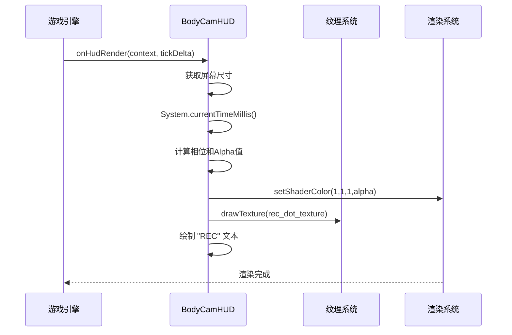
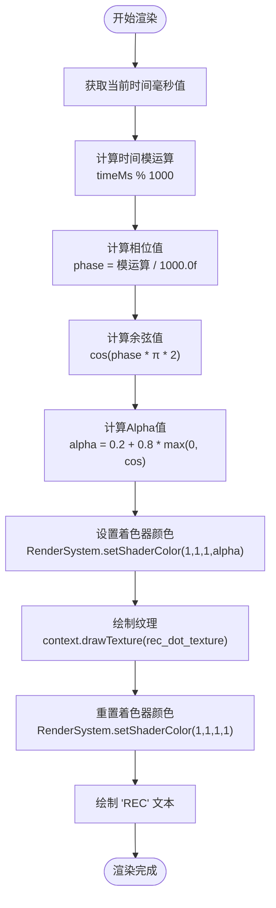
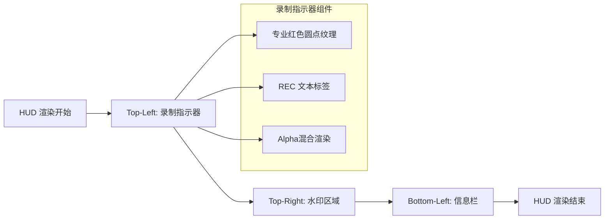
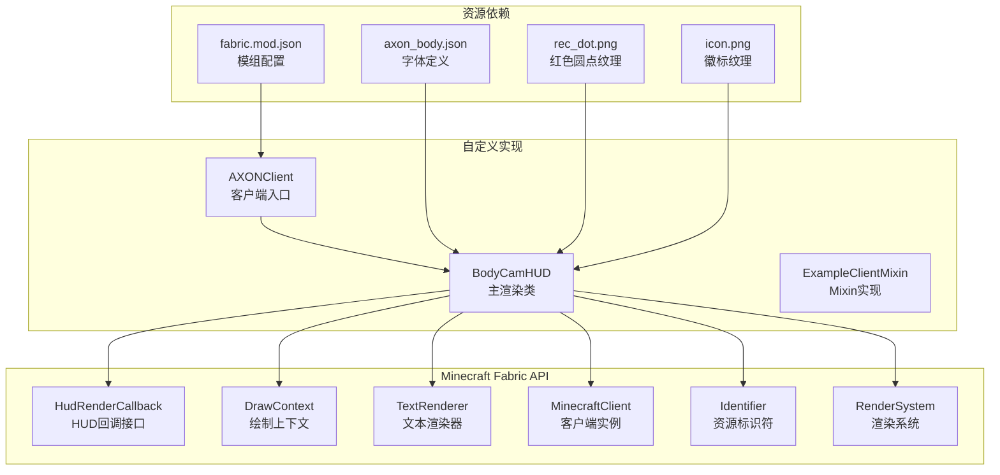

# 录制指示器功能

<cite>
**本文档引用的文件**
- [BodyCamHUD.java](file://src/client/java/cn/pr0xy/client/BodyCamHUD.java)
- [AXONClient.java](file://src/client/java/cn/pr0xy/client/AXONClient.java)
- [fabric.mod.json](file://src/main/resources/fabric.mod.json)
</cite>

## 更新摘要
**所做更改**
- 更新了录制指示器功能的实现细节，反映了专业闪烁红色圆点指示器的增强
- 新增了Alpha混合渲染技术和脉冲动画效果的详细说明
- 完善了资源管理集成的文档说明
- 更新了渲染系统的使用方式和纹理管理

## 目录
1. [简介](#简介)
2. [项目结构](#项目结构)
3. [核心组件](#核心组件)
4. [架构概览](#架构概览)
5. [详细组件分析](#详细组件分析)
6. [依赖关系分析](#依赖关系分析)
7. [性能考虑](#性能考虑)
8. [故障排除指南](#故障排除指南)
9. [结论](#结论)

## 简介

BodyCam 是一个基于 Fabric API 的 Minecraft 模组，专门用于增强摄像头录制功能。本文档专注于录制指示器功能的技术实现，特别是专业级闪烁红色圆点指示器的完整实现机制。

录制指示器是模组的核心视觉反馈组件，为用户提供实时的录制状态指示。该功能通过精确的时间计算、相位转换算法和Alpha混合渲染技术，实现了平滑的脉冲动画效果。与之前的版本相比，新的实现采用了更专业的纹理渲染方式和更好的资源管理策略。

## 项目结构

BodyCam 项目采用标准的 Fabric 模组结构，主要包含客户端渲染逻辑和资源文件：



**图表来源**
- [BodyCamHUD.java:1-93](file://src/client/java/cn/pr0xy/client/BodyCamHUD.java#L1-L93)
- [fabric.mod.json:1-38](file://src/main/resources/fabric.mod.json#L1-L38)

**章节来源**
- [BodyCamHUD.java:1-93](file://src/client/java/cn/pr0xy/client/BodyCamHUD.java#L1-L93)
- [fabric.mod.json:1-38](file://src/main/resources/fabric.mod.json#L1-L38)

## 核心组件

### 录制指示器渲染器

录制指示器功能的核心实现位于 `BodyCamHUD` 类中，该类实现了 `HudRenderCallback` 接口，负责在游戏界面顶部左侧渲染录制状态指示器。

#### 主要特性
- **专业纹理渲染**: 使用专用的红色圆点纹理而非程序化绘制
- **Alpha混合技术**: 基于余弦函数的平滑透明度控制
- **脉冲动画效果**: 1秒周期的自然闪烁动画
- **资源管理集成**: 完整的纹理资源生命周期管理
- **字体样式支持**: 自定义AXON字体的应用

#### 关键常量定义

| 常量名称 | 值 | 描述 |
|---------|-----|------|
| COLOR_RED | 0xFFFF3333 | 红色 ARGB 值 |
| COLOR_WHITE | 0xFFFFFFFF | 白色 ARGB 值 |
| COLOR_GRAY | 0xFF888888 | 灰色 ARGB 值 |
| DOT_SIZE | 10 | 红色圆点尺寸 |
| LOGO_SIZE | 18 | 徽标尺寸 |
| LOGO_GAP | 6 | 文本块与徽标间距 |

#### 资源标识符定义

| 资源名称 | 标识符 | 用途 |
|---------|--------|------|
| AXON_FONT | "axon:axon_body" | 自定义字体 |
| REC_DOT_TEXTURE | "axon:textures/gui/rec_dot.png" | 红色圆点纹理 |
| LOGO_TEXTURE | "axon:icon.png" | 模组徽标纹理 |

**章节来源**
- [BodyCamHUD.java:19-35](file://src/client/java/cn/pr0xy/client/BodyCamHUD.java#L19-L35)

## 架构概览

录制指示器功能的架构设计遵循 Minecraft Fabric API 的最佳实践，通过事件驱动的方式实现非侵入式渲染，并集成了专业的纹理资源管理系统。



**图表来源**
- [BodyCamHUD.java:56-66](file://src/client/java/cn/pr0xy/client/BodyCamHUD.java#L56-L66)

## 详细组件分析

### renderRecIndicator 方法实现原理

`renderRecIndicator` 方法是录制指示器功能的核心实现，负责完整的专业级闪烁动画渲染流程。

#### 时间计算逻辑



**图表来源**
- [BodyCamHUD.java:56-66](file://src/client/java/cn/pr0xy/client/BodyCamHUD.java#L56-L66)

#### 相位转换算法详解

相位转换算法确保了1秒周期的精确脉冲闪烁效果：

1. **时间采样**: 使用 `System.currentTimeMillis()` 获取高精度时间戳
2. **模运算**: 对1000取模确保相位在[0,1)范围内
3. **归一化**: 除以1000.0f转换为0-1之间的浮点数
4. **角度映射**: 乘以2π将相位映射到完整圆周

#### Alpha混合渲染技术

Alpha混合渲染技术实现了专业的透明度控制：

- **最小Alpha值**: 0.2（20%不透明度）
- **振幅**: 0.8（80%透明度变化范围）
- **脉冲曲线**: 基于余弦函数的自然亮度变化
- **着色器集成**: 使用 `RenderSystem.setShaderColor()` 实现硬件加速

Alpha值计算公式：`alpha = 0.2 + 0.8 * max(0, cos(2π * phase))`

#### 纹理渲染优化

与之前的矩形填充算法相比，新的实现采用了更高效的纹理渲染：

- **预渲染纹理**: 使用专用的红色圆点PNG纹理
- **硬件加速**: 通过GPU直接渲染纹理而非CPU像素操作
- **内存效率**: 避免了双重循环的像素级计算
- **质量保证**: 纹理质量不受缩放影响

**章节来源**
- [BodyCamHUD.java:56-66](file://src/client/java/cn/pr0xy/client/BodyCamHUD.java#L56-L66)

### HUD 渲染集成

录制指示器作为 HUD 组件的一部分，与其他界面元素协同工作，并集成了完整的资源管理策略。

#### 渲染顺序



**图表来源**
- [BodyCamHUD.java:38-53](file://src/client/java/cn/pr0xy/client/BodyCamHUD.java#L38-L53)

#### 资源管理集成

新的实现包含了完善的资源管理策略：

- **纹理缓存**: Fabric API 自动管理纹理资源
- **生命周期**: 随着 HUD 注册自动加载和卸载
- **内存优化**: 避免了重复的像素计算开销
- **类型安全**: 使用 Identifier 类型确保资源路径正确

**章节来源**
- [BodyCamHUD.java:38-53](file://src/client/java/cn/pr0xy/client/BodyCamHUD.java#L38-L53)

## 依赖关系分析

### 外部依赖

录制指示器功能依赖于多个 Fabric API 组件和专业的渲染系统：



**图表来源**
- [BodyCamHUD.java:5-12](file://src/client/java/cn/pr0xy/client/BodyCamHUD.java#L5-L12)
- [fabric.mod.json:17-31](file://src/main/resources/fabric.mod.json#L17-L31)

### 内部耦合关系

录制指示器功能内部具有良好的模块化设计和专业的资源管理：

- **低耦合**: 各方法职责单一，相互独立
- **高内聚**: 相关功能集中在单个类中
- **资源隔离**: 纹理资源通过统一的标识符管理
- **渲染分离**: 纹理渲染与文本渲染逻辑清晰分离

**章节来源**
- [BodyCamHUD.java:1-93](file://src/client/java/cn/pr0xy/client/BodyCamHUD.java#L1-L93)
- [fabric.mod.json:17-31](file://src/main/resources/fabric.mod.json#L17-L31)

## 性能考虑

### 专业渲染优化

录制指示器采用了多项性能优化措施：

- **硬件加速**: 使用 RenderSystem 和 GPU 纹理渲染
- **避免CPU计算**: 不再使用双重循环的像素级绘制
- **内存效率**: 纹理资源由Fabric API自动管理
- **着色器优化**: 使用setShaderColor进行快速Alpha混合

### 渲染性能分析

```mermaid
graph LR
subgraph "CPU性能"
A[时间计算: O(1)]
B[相位转换: O(1)]
C[Alpha计算: O(1)]
D[纹理绘制: O(1)]
E[文本渲染: O(n)]
end
subgraph "GPU性能"
F[纹理采样: O(1)]
G[Alpha混合: 硬件加速]
end
A --> H[总复杂度: O(n)]
B --> H
C --> H
D --> H
E --> H
F --> H
G --> H
```

### 视觉体验优化

#### 专业脉冲效果

- **1秒周期**: 符合行业标准的录制指示器闪烁节奏
- **余弦曲线**: 提供自然的亮度脉冲变化
- **20%-100%范围**: 确保足够的对比度和可见性
- **硬件加速**: 保证动画的流畅性和一致性

#### 用户界面适配

- **位置固定**: 左上角10x10像素的专业圆点位置
- **颜色对比**: 红色纹理与背景的高对比度
- **字体统一**: 使用自定义AXON字体确保视觉一致性
- **资源管理**: 自动化的纹理加载和卸载

## 故障排除指南

### 常见问题及解决方案

#### 指示器不显示

**可能原因**:
- HUD 被隐藏（F1模式）
- 玩家实例为空
- 屏幕尺寸获取失败
- 纹理资源加载失败

**解决方法**:
- 检查 `hudHidden` 状态
- 确认玩家实例存在
- 验证屏幕尺寸获取
- 检查纹理文件是否存在

#### 闪烁异常

**可能原因**:
- 时间计算错误
- 相位值超出范围
- Alpha值计算溢出
- 纹理渲染失败

**解决方法**:
- 验证 `System.currentTimeMillis()` 返回值
- 检查模运算结果
- 确保Alpha值在0-1范围内
- 验证纹理标识符正确性

#### 性能问题

**可能原因**:
- 纹理资源过多
- 渲染调用频繁
- Alpha混合过度使用

**解决方法**:
- 检查纹理资源数量
- 优化渲染调用频率
- 减少不必要的着色器切换

**章节来源**
- [BodyCamHUD.java:40-41](file://src/client/java/cn/pr0xy/client/BodyCamHUD.java#L40-L41)
- [BodyCamHUD.java:56-66](file://src/client/java/cn/pr0xy/client/BodyCamHUD.java#L56-L66)

## 结论

BodyCam 的录制指示器功能展现了专业的工程实践，通过精心设计的Alpha混合渲染技术和硬件加速的纹理系统，实现了高效且美观的视觉效果。

### 技术亮点

1. **专业渲染技术**: 采用硬件加速的纹理渲染而非CPU像素计算
2. **Alpha混合优化**: 基于余弦函数的自然脉冲动画效果
3. **资源管理集成**: 完整的Fabric API资源生命周期管理
4. **性能优化**: 显著减少CPU计算开销，提升渲染效率
5. **代码质量**: 清晰的模块化设计和专业的资源管理

### 扩展建议

- **动画参数化**: 将闪烁周期、脉冲幅度等参数化配置
- **多状态支持**: 添加不同录制状态的视觉区分
- **主题适配**: 支持不同的UI主题和颜色方案
- **性能监控**: 添加帧率和渲染时间统计功能

该实现为类似HUD组件的开发提供了专业的参考模板，展示了如何在保持高性能的同时实现高质量的视觉效果，特别是在纹理渲染和资源管理方面的最佳实践。