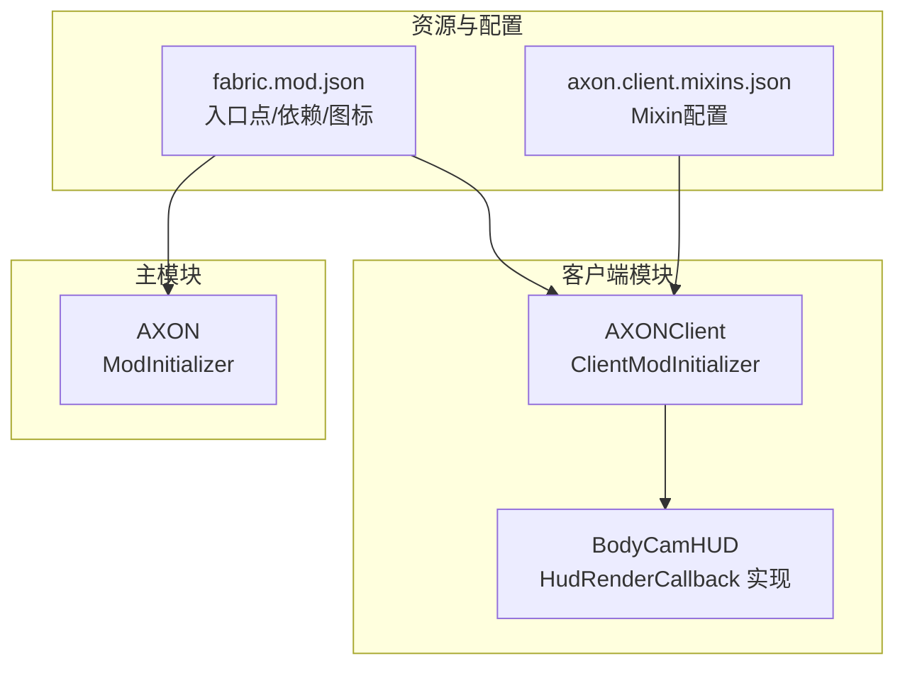
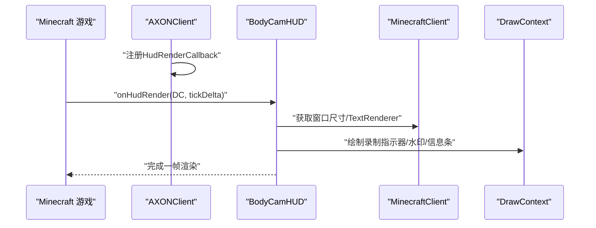
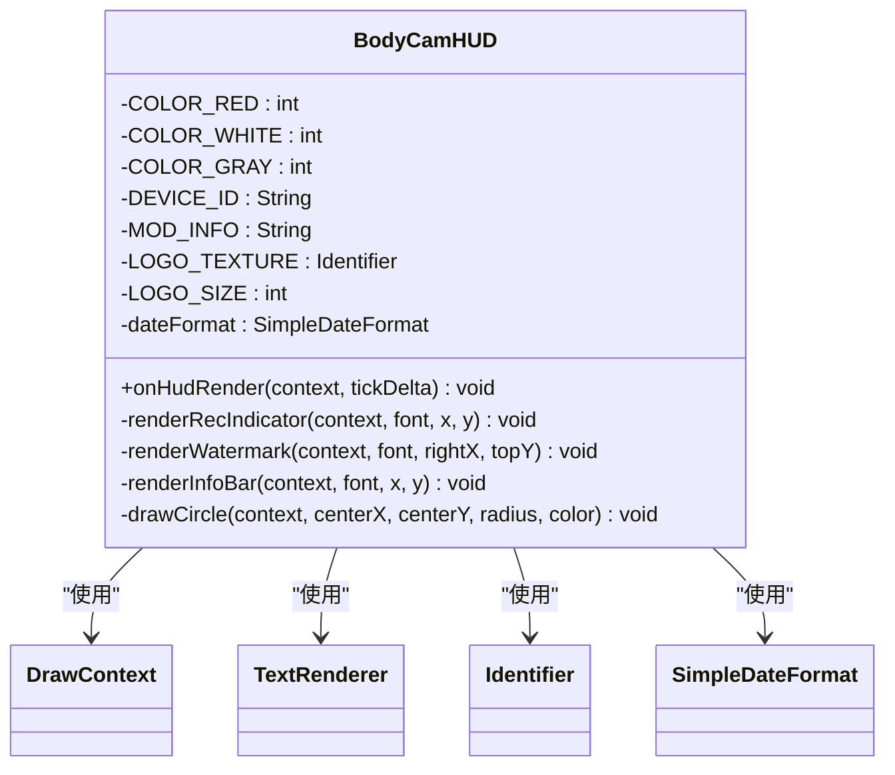
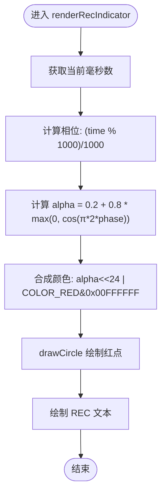
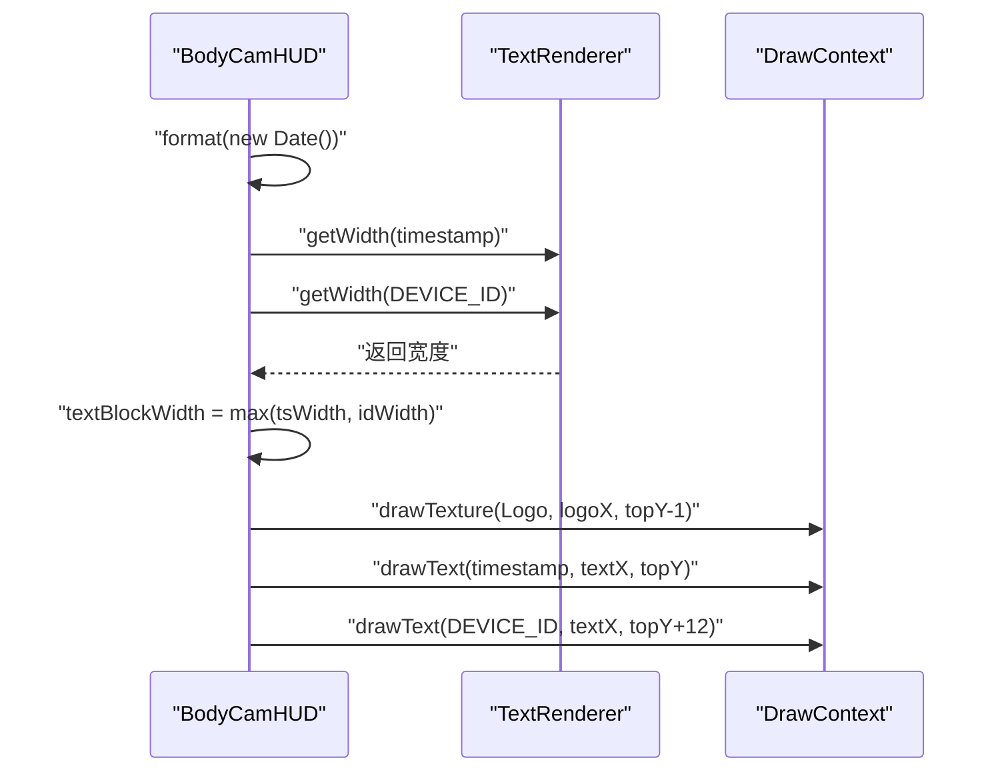
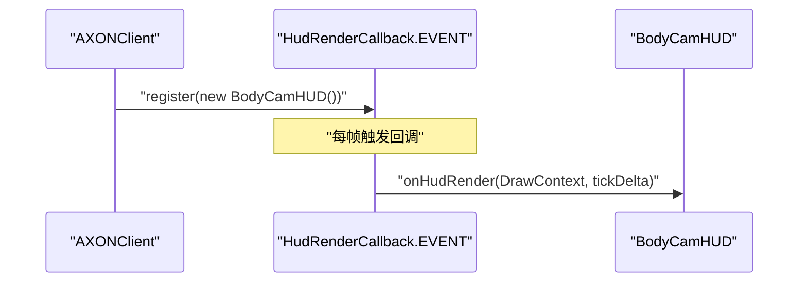
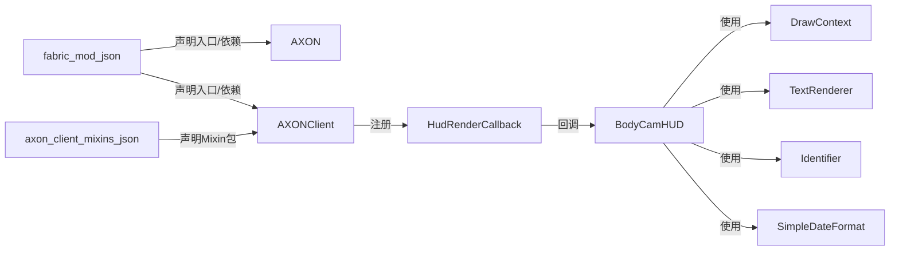

# 核心功能

<cite>
**本文引用的文件**
- [BodyCamHUD.java](file://src/client/java/cn/pr0xy/client/BodyCamHUD.java)
- [AXONClient.java](file://src/client/java/cn/pr0xy/client/AXONClient.java)
- [AXON.java](file://src/main/java/cn/pr0xy/AXON.java)
- [fabric.mod.json](file://src/main/resources/fabric.mod.json)
- [axon.client.mixins.json](file://src/client/resources/axon.client.mixins.json)
- [ExampleClientMixin.java](file://src/client/java/cn/pr0xy/client/mixin/ExampleClientMixin.java)
- [README.md](file://README.md)
</cite>

## 目录
1. [简介](#简介)
2. [项目结构](#项目结构)
3. [核心组件](#核心组件)
4. [架构总览](#架构总览)
5. [详细组件分析](#详细组件分析)
6. [依赖关系分析](#依赖关系分析)
7. [性能考量](#性能考量)
8. [故障排查指南](#故障排查指南)
9. [结论](#结论)
10. [附录](#附录)

## 简介
本文件聚焦于BodyCam的核心功能模块，尤其是HUD渲染系统的设计与实现。内容涵盖：
- BodyCamHUD类的架构与职责划分
- HudRenderCallback接口的注册与回调机制
- DrawContext渲染上下文的使用方式
- 录制指示器的闪烁动画时间计算与透明度控制
- 时间戳水印的格式化、实时更新与文本渲染
- 设备信息显示与Logo纹理处理
- 扩展建议与最佳实践

## 项目结构
该项目基于Fabric模组框架，采用客户端与主模块分离的组织方式：
- 主模块入口：AXON（服务端/通用初始化）
- 客户端模块入口：AXONClient（注册HUD渲染回调）
- HUD渲染实现：BodyCamHUD（实现HudRenderCallback）
- 资源与配置：fabric.mod.json声明入口点与依赖；axon.client.mixins.json声明Mixin包

图表来源
- [AXON.java:17-23](file://src/main/java/cn/pr0xy/AXON.java#L17-L23)
- [AXONClient.java:8-11](file://src/client/java/cn/pr0xy/client/AXONClient.java#L8-L11)
- [BodyCamHUD.java:35-55](file://src/client/java/cn/pr0xy/client/BodyCamHUD.java#L35-L55)
- [fabric.mod.json:17-24](file://src/main/resources/fabric.mod.json#L17-L24)
- [axon.client.mixins.json:1-14](file://src/client/resources/axon.client.mixins.json#L1-L14)

章节来源
- [fabric.mod.json:1-38](file://src/main/resources/fabric.mod.json#L1-L38)
- [AXON.java:8-23](file://src/main/java/cn/pr0xy/AXON.java#L8-L23)
- [AXONClient.java:6-12](file://src/client/java/cn/pr0xy/client/AXONClient.java#L6-L12)
- [BodyCamHUD.java:13-55](file://src/client/java/cn/pr0xy/client/BodyCamHUD.java#L13-L55)

## 核心组件
- BodyCamHUD：实现HUD渲染的主类，负责在屏幕不同区域绘制录制指示器、时间戳水印与底部信息条，并通过DrawContext进行像素级绘制。
- AXONClient：在客户端初始化阶段注册BodyCamHUD到HudRenderCallback事件中，使渲染逻辑随游戏帧循环被调用。
- AXON：主模组初始化入口，用于日志输出与通用初始化。
- fabric.mod.json：声明客户端入口点、主入口点、依赖版本以及Mixin配置，确保运行时正确加载。
- axon.client.mixins.json：声明客户端Mixin包，当前包含一个示例Mixin类。
- ExampleClientMixin：示例Mixin，演示如何在MinecraftClient生命周期中注入代码。

章节来源
- [BodyCamHUD.java:13-123](file://src/client/java/cn/pr0xy/client/BodyCamHUD.java#L13-L123)
- [AXONClient.java:6-12](file://src/client/java/cn/pr0xy/client/AXONClient.java#L6-L12)
- [AXON.java:8-23](file://src/main/java/cn/pr0xy/AXON.java#L8-L23)
- [fabric.mod.json:17-31](file://src/main/resources/fabric.mod.json#L17-L31)
- [axon.client.mixins.json:1-14](file://src/client/resources/axon.client.mixins.json#L1-L14)
- [ExampleClientMixin.java:9-15](file://src/client/java/cn/pr0xy/client/mixin/ExampleClientMixin.java#L9-L15)

## 架构总览
BodyCam的HUD渲染遵循Fabric的客户端渲染回调机制：
- 客户端初始化时，AXONClient向HudRenderCallback.EVENT注册BodyCamHUD实例。
- 每帧渲染时，Minecraft调用BodyCamHUD.onHudRender(DrawContext, tickDelta)，在DrawContext提供的上下文中完成绘制。
- BodyCamHUD根据屏幕尺寸与字体度量，分别在左上、右上、左下三个区域绘制内容。

图表来源
- [AXONClient.java:8-11](file://src/client/java/cn/pr0xy/client/AXONClient.java#L8-L11)
- [BodyCamHUD.java:35-55](file://src/client/java/cn/pr0xy/client/BodyCamHUD.java#L35-L55)

## 详细组件分析

### BodyCamHUD类架构与职责
- 接口实现：实现HudRenderCallback，覆盖onHudRender方法以响应每帧HUD渲染。
- 颜色常量：定义红色、白色、灰色等ARGB颜色值，用于指示器与文本渲染。
- 文本内容：包含设备ID与模组信息字符串，作为底部信息条与水印中的静态文本。
- Logo纹理：使用Identifier("axon", "icon.png")加载资源纹理，尺寸固定为18像素。
- 时间戳格式：使用SimpleDateFormat("yyyy-MM-dd HH:mm:ss Z")格式化当前时间。
- 绘制区域：
  - 左上角：录制指示器（红点+REC文字）
  - 右上角：时间戳水印（时间戳+设备ID+Logo）
  - 左下角：模组信息条

图表来源
- [BodyCamHUD.java:13-123](file://src/client/java/cn/pr0xy/client/BodyCamHUD.java#L13-L123)

章节来源
- [BodyCamHUD.java:13-123](file://src/client/java/cn/pr0xy/client/BodyCamHUD.java#L13-L123)

### 录制指示器：闪烁动画与透明度控制
- 动画周期：约1秒周期，通过System.currentTimeMillis()取模1000得到相位，再映射到余弦函数以获得0.2~1.0的透明度范围。
- 颜色合成：将计算出的透明度与预设红色颜色组合，形成带Alpha通道的颜色值。
- 圆形绘制：使用drawCircle方法以矩形像素填充近似圆形，圆心位于指定坐标，半径为4像素。
- 文本渲染：在圆点右侧绘制“REC”文字，使用红色并启用阴影效果。

图表来源
- [BodyCamHUD.java:60-76](file://src/client/java/cn/pr0xy/client/BodyCamHUD.java#L60-L76)
- [BodyCamHUD.java:114-122](file://src/client/java/cn/pr0xy/client/BodyCamHUD.java#L114-L122)

章节来源
- [BodyCamHUD.java:60-76](file://src/client/java/cn/pr0xy/client/BodyCamHUD.java#L60-L76)
- [BodyCamHUD.java:114-122](file://src/client/java/cn/pr0xy/client/BodyCamHUD.java#L114-L122)

### 时间戳水印：格式化、对齐与渲染
- 实时更新：每帧重新格式化当前时间，保证时间戳实时性。
- 文本测量：使用TextRenderer.getWidth测量时间戳与设备ID宽度，取最大值作为文本块宽度，实现右对齐布局。
- 布局计算：根据右上角参考点rightX与textBlockWidth计算文本起始X坐标；Logo位于文本左侧并预留间距。
- 纹理绘制：使用context.drawTexture绘制AXON Logo纹理，尺寸为18x18像素。
- 文本渲染：先绘制时间戳（白色），再在其下方绘制设备ID（白色），均启用阴影效果。

图表来源
- [BodyCamHUD.java:81-102](file://src/client/java/cn/pr0xy/client/BodyCamHUD.java#L81-L102)

章节来源
- [BodyCamHUD.java:81-102](file://src/client/java/cn/pr0xy/client/BodyCamHUD.java#L81-L102)

### 底部信息条：设备信息显示
- 内容：显示模组信息字符串（灰色，无阴影）。
- 位置：左下角，基于屏幕高度动态定位。

章节来源
- [BodyCamHUD.java:107-109](file://src/client/java/cn/pr0xy/client/BodyCamHUD.java#L107-L109)

### Logo纹理处理
- 资源标识符：Identifier("axon", "icon.png")，指向资源路径assets/axon/textures/gui/icon.png。
- 绘制尺寸：固定18x18像素，与文本块对齐，实现视觉统一。
- 资源声明：fabric.mod.json中声明了模组图标路径，确保资源可用。

章节来源
- [BodyCamHUD.java:25-29](file://src/client/java/cn/pr0xy/client/BodyCamHUD.java#L25-L29)
- [BodyCamHUD.java:94-95](file://src/client/java/cn/pr0xy/client/BodyCamHUD.java#L94-L95)
- [fabric.mod.json:15](file://src/main/resources/fabric.mod.json#L15)

### DrawContext渲染上下文操作
- 获取上下文：onHudRender接收DrawContext与tickDelta参数。
- 文本绘制：使用context.drawText(TextRenderer, Text, x, y, color, withShadow)。
- 纹理绘制：使用context.drawTexture(Identifier, x, y, u, v, width, height, texWidth, texHeight)。
- 区域填充：使用context.fill(x, y, x+1, y+1, color)实现像素级绘制（用于圆形近似）。

章节来源
- [BodyCamHUD.java:35-55](file://src/client/java/cn/pr0xy/client/BodyCamHUD.java#L35-L55)
- [BodyCamHUD.java:74-75](file://src/client/java/cn/pr0xy/client/BodyCamHUD.java#L74-L75)
- [BodyCamHUD.java:97-101](file://src/client/java/cn/pr0xy/client/BodyCamHUD.java#L97-L101)
- [BodyCamHUD.java:117-118](file://src/client/java/cn/pr0xy/client/BodyCamHUD.java#L117-L118)

### HudRenderCallback注册流程
- 客户端初始化：AXONClient在onInitializeClient中向HudRenderCallback.EVENT注册BodyCamHUD实例。
- 回调触发：Minecraft在每帧渲染HUD时调用BodyCamHUD.onHudRender。

图表来源
- [AXONClient.java:8-11](file://src/client/java/cn/pr0xy/client/AXONClient.java#L8-L11)
- [BodyCamHUD.java:35-55](file://src/client/java/cn/pr0xy/client/BodyCamHUD.java#L35-L55)

章节来源
- [AXONClient.java:8-11](file://src/client/java/cn/pr0xy/client/AXONClient.java#L8-L11)
- [BodyCamHUD.java:35-55](file://src/client/java/cn/pr0xy/client/BodyCamHUD.java#L35-L55)

## 依赖关系分析
- Fabric API：使用HudRenderCallback事件与DrawContext等客户端渲染API。
- Minecraft：依赖MinecraftClient、TextRenderer、Identifier等核心类。
- 资源管理：通过fabric.mod.json声明资源路径与图标，确保Logo纹理可加载。
- Mixin：客户端Mixin配置存在，当前示例Mixin未与HUD直接耦合。

图表来源
- [AXONClient.java:8-11](file://src/client/java/cn/pr0xy/client/AXONClient.java#L8-L11)
- [BodyCamHUD.java:3-11](file://src/client/java/cn/pr0xy/client/BodyCamHUD.java#L3-L11)
- [fabric.mod.json:17-31](file://src/main/resources/fabric.mod.json#L17-L31)
- [axon.client.mixins.json:1-14](file://src/client/resources/axon.client.mixins.json#L1-L14)

章节来源
- [BodyCamHUD.java:3-11](file://src/client/java/cn/pr0xy/client/BodyCamHUD.java#L3-L11)
- [fabric.mod.json:17-31](file://src/main/resources/fabric.mod.json#L17-L31)
- [axon.client.mixins.json:1-14](file://src/client/resources/axon.client.mixins.json#L1-L14)

## 性能考量
- 绘制频率：每帧调用，需避免高复杂度计算。当前实现仅进行简单时间取模与三角函数计算，开销极低。
- 文本测量：每帧测量两次文本宽度，属于轻量操作；若需要进一步优化，可在分辨率或字体变化时缓存测量结果。
- 纹理绘制：drawTexture按像素级绘制，成本较低；Logo尺寸固定，避免缩放开销。
- 条件渲染：当HUD隐藏或无玩家时提前返回，减少无效绘制。

## 故障排查指南
- HUD不显示
  - 检查是否在客户端初始化中正确注册BodyCamHUD。
  - 确认MinecraftClient.player非空且hudHidden为false。
- Logo未显示
  - 确认资源路径assets/axon/textures/gui/icon.png存在。
  - 检查Identifier("axon", "icon.png")是否正确。
- 时间戳不更新
  - 确认SimpleDateFormat格式字符串正确，且每帧都会重新format(new Date())。
- 录制指示器不闪烁
  - 检查System.currentTimeMillis()取模与相位计算逻辑。
  - 确认透明度计算后颜色合成正确。

章节来源
- [AXONClient.java:8-11](file://src/client/java/cn/pr0xy/client/AXONClient.java#L8-L11)
- [BodyCamHUD.java:38-41](file://src/client/java/cn/pr0xy/client/BodyCamHUD.java#L38-L41)
- [BodyCamHUD.java:82-83](file://src/client/java/cn/pr0xy/client/BodyCamHUD.java#L82-L83)
- [BodyCamHUD.java:62-66](file://src/client/java/cn/pr0xy/client/BodyCamHUD.java#L62-L66)

## 结论
BodyCam的HUD渲染系统以简洁高效为核心设计目标：通过HudRenderCallback事件驱动，结合DrawContext完成三区域绘制；录制指示器采用余弦函数实现平滑闪烁；时间戳水印支持右对齐与Logo叠加；底部信息条提供品牌展示。整体架构清晰、扩展性强，便于后续增加更多HUD元素或调整样式。

## 附录
- 代码示例路径（不展示具体代码内容，仅提供定位）
  - 录制指示器闪烁逻辑：[BodyCamHUD.java:60-76](file://src/client/java/cn/pr0xy/client/BodyCamHUD.java#L60-L76)
  - 时间戳水印绘制：[BodyCamHUD.java:81-102](file://src/client/java/cn/pr0xy/client/BodyCamHUD.java#L81-L102)
  - 底部信息条绘制：[BodyCamHUD.java:107-109](file://src/client/java/cn/pr0xy/client/BodyCamHUD.java#L107-L109)
  - 圆形绘制辅助：[BodyCamHUD.java:114-122](file://src/client/java/cn/pr0xy/client/BodyCamHUD.java#L114-L122)
  - HUD注册流程：[AXONClient.java:8-11](file://src/client/java/cn/pr0xy/client/AXONClient.java#L8-L11)
  - 模组入口与依赖：[fabric.mod.json:17-31](file://src/main/resources/fabric.mod.json#L17-L31)
  - 示例Mixin：[ExampleClientMixin.java:9-15](file://src/client/java/cn/pr0xy/client/mixin/ExampleClientMixin.java#L9-L15)