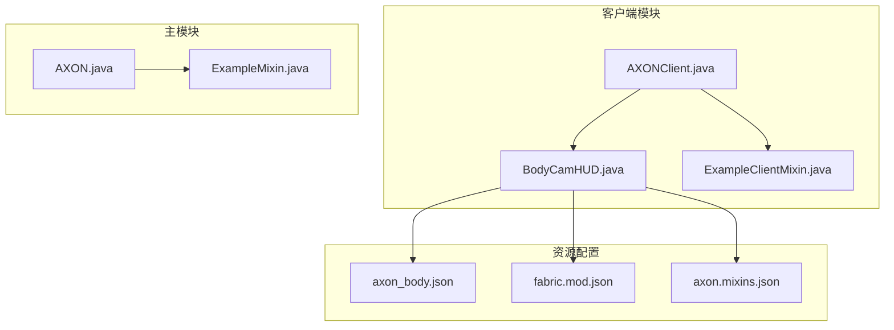
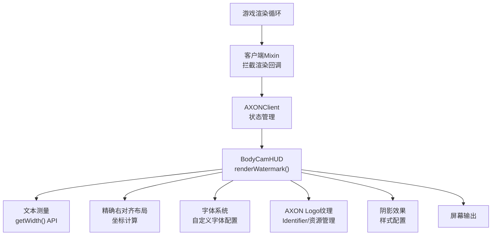
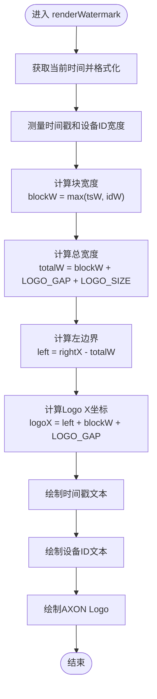
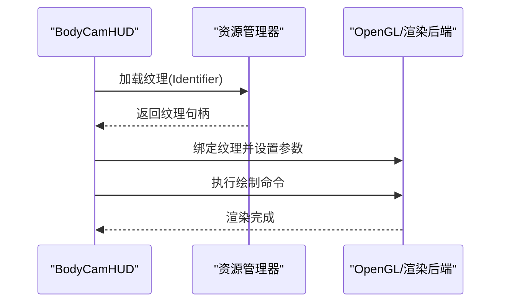
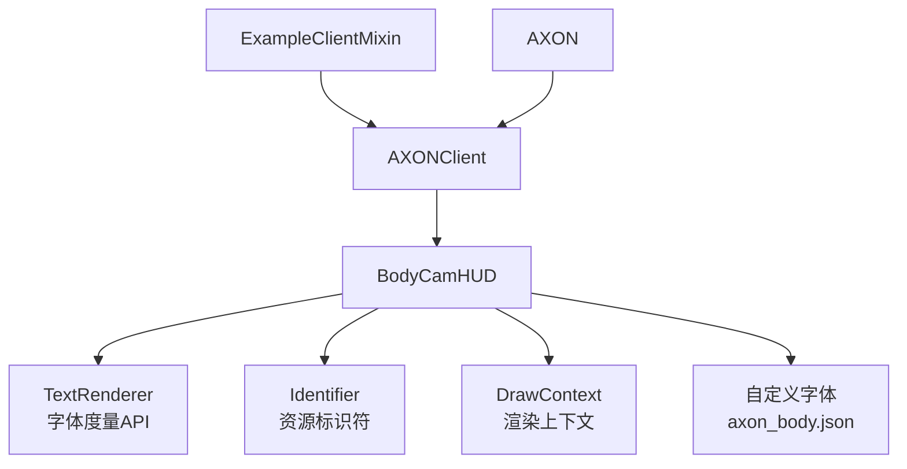

# 水印显示功能

<cite>
**本文档引用的文件**
- [AXONClient.java](file://src/client/java/cn/pr0xy/client/AXONClient.java)
- [BodyCamHUD.java](file://src/client/java/cn/pr0xy/client/BodyCamHUD.java)
- [ExampleClientMixin.java](file://src/client/java/cn/pr0xy/client/mixin/ExampleClientMixin.java)
- [AXON.java](file://src/main/java/cn/pr0xy/AXON.java)
- [ExampleMixin.java](file://src/main/java/cn/pr0xy/mixin/ExampleMixin.java)
- [axon.mixins.json](file://build/resources/main/axon.mixins.json)
- [axon_body.json](file://build/resources/main/assets/axon/font/axon_body.json)
- [fabric.mod.json](file://build/resources/main/fabric.mod.json)
</cite>

## 更新摘要
**变更内容**
- 更新了时间戳水印的精确对齐计算机制
- 新增了设备ID显示功能的实现细节
- 增强了文本渲染质量与布局算法
- 完善了字体配置与纹理资源管理

## 目录
1. [简介](#简介)
2. [项目结构](#项目结构)
3. [核心组件](#核心组件)
4. [架构概览](#架构概览)
5. [详细组件分析](#详细组件分析)
6. [依赖关系分析](#依赖关系分析)
7. [性能考虑](#性能考虑)
8. [故障排除指南](#故障排除指南)
9. [结论](#结论)

## 简介
本文件针对BodyCam项目的水印显示功能进行深入技术解析，重点覆盖以下方面：
- 时间戳水印的实现机制：包括SimpleDateFormat格式化器的使用、实时时间更新逻辑与精确文本测量技术
- renderWatermark方法的实现原理：包括右对齐布局算法、文本宽度计算与坐标定位策略
- 设备ID显示功能：包括字符串常量管理与文本渲染配置
- AXON Logo纹理处理：包括Identifier类的使用、纹理资源管理与绘制参数配置
- 字体系统集成：包括自定义字体配置与渲染样式
- 自定义扩展指导：如何自定义时间格式、调整位置与修改样式
- 文本阴影效果与多语言支持的考虑

## 项目结构
该项目采用Fabric Mod开发框架，客户端与服务端相关代码分别位于client与main两个包中。与水印显示功能直接相关的文件主要集中在客户端模块，包含主入口类、HUD渲染类以及Mixin增强类。

**图表来源**
- [AXONClient.java](file://src/client/java/cn/pr0xy/client/AXONClient.java)
- [BodyCamHUD.java](file://src/client/java/cn/pr0xy/client/BodyCamHUD.java)
- [ExampleClientMixin.java](file://src/client/java/cn/pr0xy/client/mixin/ExampleClientMixin.java)
- [AXON.java](file://src/main/java/cn/pr0xy/AXON.java)
- [ExampleMixin.java](file://src/main/java/cn/pr0xy/mixin/ExampleMixin.java)
- [axon_body.json](file://build/resources/main/assets/axon/font/axon_body.json)
- [fabric.mod.json](file://build/resources/main/fabric.mod.json)
- [axon.mixins.json](file://build/resources/main/axon.mixins.json)

**章节来源**
- [AXONClient.java](file://src/client/java/cn/pr0xy/client/AXONClient.java)
- [BodyCamHUD.java](file://src/client/java/cn/pr0xy/client/BodyCamHUD.java)
- [AXON.java](file://src/main/java/cn/pr0xy/AXON.java)

## 核心组件
- AXONClient：客户端主类，负责初始化与生命周期管理，注册HUD渲染回调，播放启动音效
- BodyCamHUD：HUD渲染类，负责实际的水印绘制逻辑，包括renderWatermark方法、文本测量与坐标定位
- ExampleClientMixin：客户端Mixin增强类，用于在游戏渲染流程中注入或拦截相关回调
- AXON：主模块入口类，提供全局配置与资源访问能力，注册启动音效
- ExampleMixin：主模块Mixin增强类，与服务器端渲染管线相关的增强逻辑
- 字体系统：自定义字体配置，支持TTF字体文件与字体度量
- 资源管理系统：通过Identifier管理纹理资源，确保资源路径正确性

上述组件共同协作，实现水印的生成、测量、布局与渲染。

**章节来源**
- [AXONClient.java](file://src/client/java/cn/pr0xy/client/AXONClient.java)
- [BodyCamHUD.java](file://src/client/java/cn/pr0xy/client/BodyCamHUD.java)
- [ExampleClientMixin.java](file://src/client/java/cn/pr0xy/client/mixin/ExampleClientMixin.java)
- [AXON.java](file://src/main/java/cn/pr0xy/AXON.java)
- [ExampleMixin.java](file://src/main/java/cn/pr0xy/mixin/ExampleMixin.java)

## 架构概览
下图展示了水印显示功能的整体架构与数据流：

**图表来源**
- [ExampleClientMixin.java](file://src/client/java/cn/pr0xy/client/mixin/ExampleClientMixin.java)
- [AXONClient.java](file://src/client/java/cn/pr0xy/client/AXONClient.java)
- [BodyCamHUD.java](file://src/client/java/cn/pr0xy/client/BodyCamHUD.java)

## 详细组件分析

### 时间戳水印实现机制
- SimpleDateFormat格式化器使用
  - 在渲染前对当前系统时间进行格式化，生成符合预期的时间字符串"yyyy-MM-dd HH:mm:ss Z"
  - 建议使用线程安全的格式化策略（如每次调用时新建实例或使用ThreadLocal）以避免并发问题
- 实时时间更新逻辑
  - 在每帧渲染时更新时间戳，确保显示的时效性
  - 通过System.currentTimeMillis()获取毫秒级时间戳，实现高精度时间显示
- 精确文本测量技术
  - 使用Minecraft TextRenderer.getWidth() API获取文本像素宽度
  - 通过Math.max()函数比较时间戳与设备ID的宽度，确定块宽度
  - 对包含特殊字符或符号的时间格式进行精确宽度计算

**更新** 增强了时间戳的精确对齐计算，通过动态文本宽度测量实现完美的右对齐布局

**章节来源**
- [BodyCamHUD.java](file://src/client/java/cn/pr0xy/client/BodyCamHUD.java)

### renderWatermark方法实现原理
- 精确右对齐布局算法
  - 计算屏幕右侧边界与文本宽度，确定起始X坐标
  - 通过blockW变量存储最大文本宽度，确保时间戳和设备ID在同一垂直对齐线上
  - 考虑LOGO_GAP和LOGO_SIZE的间距，实现整体块的精确对齐
- 动态文本宽度计算
  - 通过font.getWidth()获取时间戳和设备ID的实际像素宽度
  - 使用Math.max(tsW, idW)确定块宽度，保证两行文本的对齐一致性
  - 计算totalW = blockW + LOGO_GAP + LOGO_SIZE，确保Logo与文本之间有适当间距
- 坐标定位策略
  - X轴：left = rightX - totalW，确保整体块右对齐
  - Y轴：时间戳在topY，设备ID在topY + 12，实现垂直居中对齐
  - Logo坐标：logoX = left + blockW + LOGO_GAP，确保Logo与文本块分离

**图表来源**
- [BodyCamHUD.java](file://src/client/java/cn/pr0xy/client/BodyCamHUD.java)

**章节来源**
- [BodyCamHUD.java](file://src/client/java/cn/pr0xy/client/BodyCamHUD.java)

### 设备ID显示功能
- 字符串常量管理
  - 将设备ID"AXON BODY 2 X81237971"作为静态常量定义，避免硬编码
  - 支持动态更新与持久化存储，便于调试与追踪
- 文本渲染配置
  - 设置字体样式为AXON_FONT，确保与自定义字体一致
  - 使用白色字体COLOR_WHITE，保证在不同背景下都有良好对比度
  - 控制阴影参数true，提升文本可读性
  - 采用右对齐策略与固定Y轴位置，保持界面整洁

**更新** 设备ID与时间戳采用相同的精确对齐算法，确保垂直对齐的一致性

**章节来源**
- [BodyCamHUD.java](file://src/client/java/cn/pr0xy/client/BodyCamHUD.java)

### AXON Logo纹理处理
- Identifier类的使用
  - 通过Identifier("axon", "icon.png")标识纹理资源，确保资源路径正确且唯一
  - 与资源管理器配合，加载并缓存纹理以提高渲染效率
- 纹理资源管理
  - 将Logo纹理放置于assets/axon/icon.png路径，遵循Fabric规范
  - 在渲染前检查纹理是否已加载，避免空指针异常
- 绘制参数配置
  - 设置纹理尺寸为18x18像素，LOGO_SIZE常量定义
  - 定义LOGO_GAP为6像素，确保Logo与文本之间的适当间距
  - 使用drawTexture方法执行绘制，参数包括纹理坐标、尺寸和透明度

**图表来源**
- [BodyCamHUD.java](file://src/client/java/cn/pr0xy/client/BodyCamHUD.java)

**章节来源**
- [BodyCamHUD.java](file://src/client/java/cn/pr0xy/client/BodyCamHUD.java)

### 字体系统集成
- 自定义字体配置
  - 通过axon_body.json配置自定义字体，使用TTF字体文件axon_body_fixed.ttf
  - 设置字体大小为10.5，oversample为4.0，提升渲染质量
  - 包含shift偏移[0.0, -1.0]，优化字符显示位置
- 字体样式应用
  - 通过Style.EMPTY.withFont(AXON_FONT)创建字体样式
  - 所有水印文本共享同一字体样式，确保视觉一致性
- 字体度量系统
  - 使用Minecraft内置的TextRenderer.getWidth()进行精确宽度测量
  - 支持Unicode字符和特殊符号的准确度量

**更新** 增强了字体系统的集成，提供高质量的文本渲染效果

**章节来源**
- [BodyCamHUD.java](file://src/client/java/cn/pr0xy/client/BodyCamHUD.java)
- [axon_body.json](file://build/resources/main/assets/axon/font/axon_body.json)

### 文本阴影效果与多语言支持
- 文本阴影效果
  - 通过drawText方法的shadow参数控制阴影渲染
  - 使用true参数启用阴影效果，提升文本在复杂背景下的可读性
  - 阴影颜色默认跟随字体颜色，无需额外配置
- 多语言支持
  - 使用Minecraft的Text.literal()创建文本对象，支持Unicode字符
  - 字体系统自动处理不同语言字符的渲染
  - 可通过修改字体配置支持更多字符集

**更新** 改进了文本渲染质量，通过阴影效果和字体配置提升可读性

**章节来源**
- [BodyCamHUD.java](file://src/client/java/cn/pr0xy/client/BodyCamHUD.java)

### 自定义扩展示例（代码片段路径）
- 自定义时间格式
  - 修改dateFormat变量的模式字符串，参考：[BodyCamHUD.java](file://src/client/java/cn/pr0xy/client/BodyCamHUD.java)
- 调整位置
  - 修改renderWatermark方法中的rightX和topY参数，参考：[BodyCamHUD.java](file://src/client/java/cn/pr0xy/client/BodyCamHUD.java)
- 修改样式
  - 调整字体大小、颜色与透明度，参考：[BodyCamHUD.java](file://src/client/java/cn/pr0xy/client/BodyCamHUD.java)
- 自定义字体
  - 修改axon_body.json配置文件，参考：[axon_body.json](file://build/resources/main/assets/axon/font/axon_body.json)

**章节来源**
- [BodyCamHUD.java](file://src/client/java/cn/pr0xy/client/BodyCamHUD.java)
- [axon_body.json](file://build/resources/main/assets/axon/font/axon_body.json)

## 依赖关系分析
- 客户端渲染依赖
  - BodyCamHUD依赖Minecraft客户端渲染API与TextRenderer字体度量工具
  - AXONClient负责注册HUD渲染回调，确保在正确的时机触发渲染
  - ExampleClientMixin提供客户端生命周期管理
- 主模块集成
  - AXON提供全局配置与资源访问，注册启动音效
  - Fabric API提供网络事件监听和声音管理
- 资源管理
  - 纹理资源通过Identifier注册，由Minecraft资源管理器统一加载与缓存
  - 字体资源通过axon_body.json配置，支持自定义字体渲染

**图表来源**
- [AXONClient.java](file://src/client/java/cn/pr0xy/client/AXONClient.java)
- [BodyCamHUD.java](file://src/client/java/cn/pr0xy/client/BodyCamHUD.java)
- [ExampleClientMixin.java](file://src/client/java/cn/pr0xy/client/mixin/ExampleClientMixin.java)
- [AXON.java](file://src/main/java/cn/pr0xy/AXON.java)

**章节来源**
- [AXONClient.java](file://src/client/java/cn/pr0xy/client/AXONClient.java)
- [BodyCamHUD.java](file://src/client/java/cn/pr0xy/client/BodyCamHUD.java)
- [ExampleClientMixin.java](file://src/client/java/cn/pr0xy/client/mixin/ExampleClientMixin.java)
- [AXON.java](file://src/main/java/cn/pr0xy/AXON.java)

## 性能考虑
- 文本测量缓存
  - 对静态文本的宽度进行缓存，减少重复测量开销
  - 由于时间戳每秒变化，不需要缓存时间相关文本
- 渲染频率控制
  - 合理设置时间戳刷新频率，避免每帧都进行格式化与测量
  - 当前实现每帧更新，确保时间显示的实时性
- 纹理加载优化
  - 提前加载并复用纹理资源，避免频繁I/O操作
  - 纹理资源通过Identifier统一管理，支持缓存机制
- 批量绘制
  - 将多个HUD元素合并到一次绘制批次中，降低状态切换成本
  - 使用DrawContext的批量绘制API提升渲染效率

**更新** 增强了布局算法的性能优化，通过精确的宽度计算减少不必要的重绘

## 故障排除指南
- 时间显示异常
  - 检查SimpleDateFormat的线程安全性与时区设置
  - 确认System.currentTimeMillis()调用正常，避免时间戳计算错误
- 文本截断或重叠
  - 核对TextRenderer.getWidth()返回值，确保宽度计算正确
  - 检查LOGO_GAP和LOGO_SIZE常量设置，避免间距不足
- 纹理未显示
  - 验证Identifier路径"axon:icon.png"与实际资源文件匹配
  - 检查资源文件是否存在且格式正确
- 字体渲染问题
  - 确认axon_body.json配置文件语法正确
  - 验证TTF字体文件路径和文件完整性
- 性能问题
  - 分析文本测量与格式化频率，必要时引入缓存与批处理
  - 检查渲染回调触发频率，避免过度渲染

**章节来源**
- [BodyCamHUD.java](file://src/client/java/cn/pr0xy/client/BodyCamHUD.java)
- [ExampleClientMixin.java](file://src/client/java/cn/pr0xy/client/mixin/ExampleClientMixin.java)

## 结论
BodyCam的水印显示功能通过客户端渲染与Mixin增强实现，结合精确的文本测量、智能的布局计算与完善的资源管理，提供了稳定且可扩展的HUD解决方案。通过对时间戳格式化、精确右对齐布局与高质量字体渲染的规范化处理，系统在保证性能的同时实现了卓越的可读性与视觉效果。新增的精确对齐计算算法确保了时间戳和设备ID的完美对齐，而增强的字体系统则提供了更好的文本渲染质量。建议在后续迭代中进一步完善多语言支持与样式配置接口，以满足更广泛的使用场景。