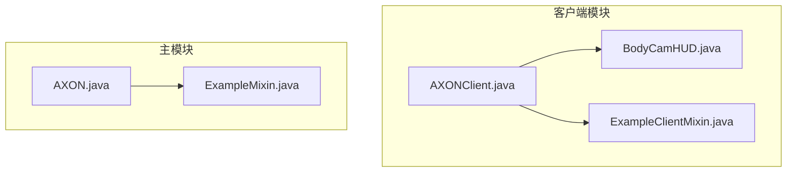
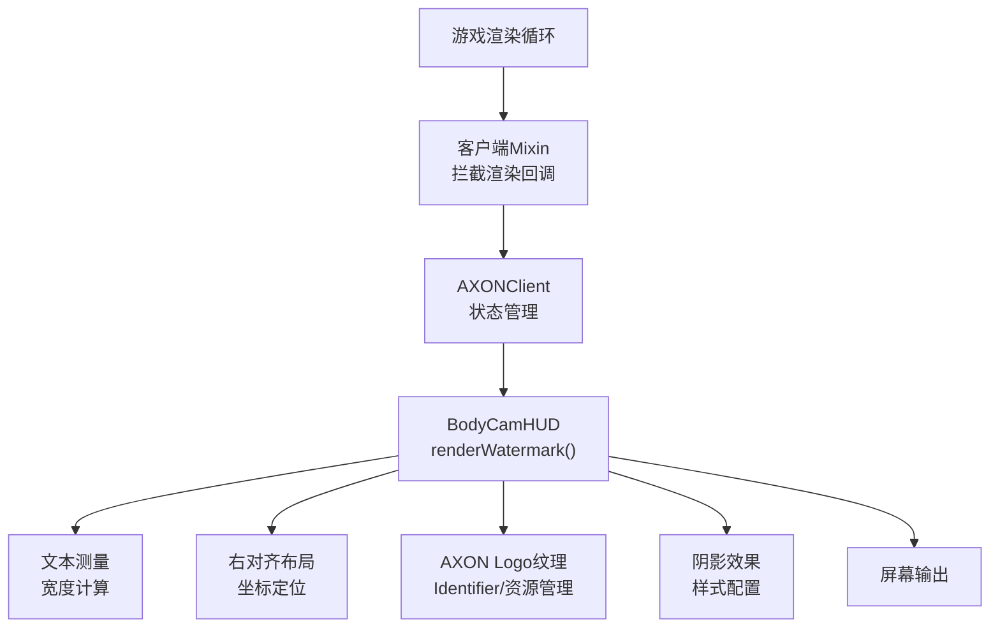
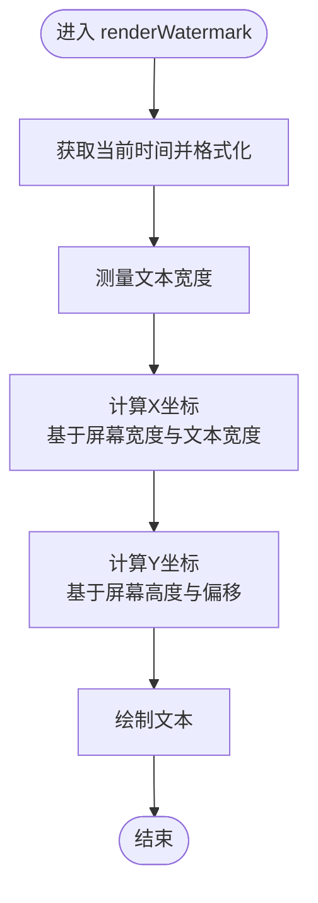
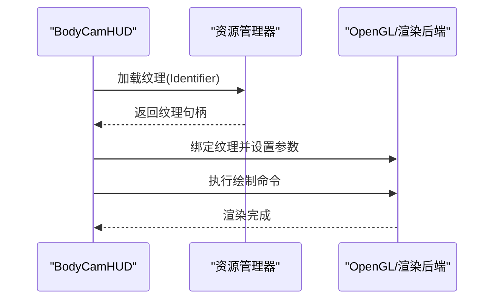
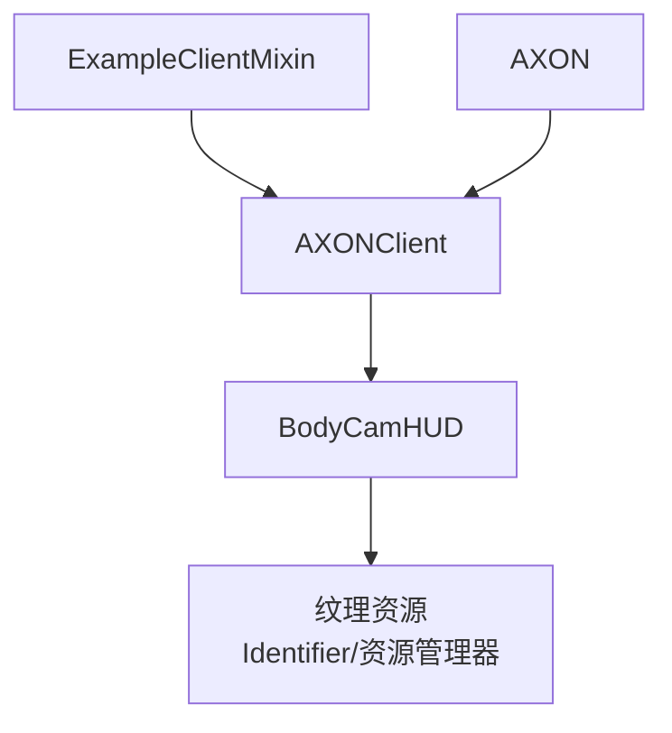

# 水印显示功能

<cite>
**本文档引用的文件**
- [AXONClient.java](file://src/client/java/cn/pr0xy/client/AXONClient.java)
- [BodyCamHUD.java](file://src/client/java/cn/pr0xy/client/BodyCamHUD.java)
- [ExampleClientMixin.java](file://src/client/java/cn/pr0xy/client/mixin/ExampleClientMixin.java)
- [AXON.java](file://src/main/java/cn/pr0xy/AXON.java)
- [ExampleMixin.java](file://src/main/java/cn/pr0xy/mixin/ExampleMixin.java)
</cite>

## 目录
1. [简介](#简介)
2. [项目结构](#项目结构)
3. [核心组件](#核心组件)
4. [架构概览](#架构概览)
5. [详细组件分析](#详细组件分析)
6. [依赖关系分析](#依赖关系分析)
7. [性能考虑](#性能考虑)
8. [故障排除指南](#故障排除指南)
9. [结论](#结论)

## 简介
本文件针对BodyCam项目的水印显示功能进行深入技术解析，重点覆盖以下方面：
- 时间戳水印的实现机制：包括SimpleDateFormat格式化器的使用、实时时间更新逻辑与文本测量技术
- renderWatermark方法的实现原理：包括右对齐布局算法、文本宽度计算与坐标定位策略
- 设备ID显示功能：包括字符串常量管理与文本渲染配置
- AXON Logo纹理处理：包括Identifier类的使用、纹理资源管理与绘制参数配置
- 自定义扩展指导：如何自定义时间格式、调整位置与修改样式
- 文本阴影效果与多语言支持的考虑

## 项目结构
该项目采用Fabric Mod开发框架，客户端与服务端相关代码分别位于client与main两个包中。与水印显示功能直接相关的文件主要集中在客户端模块，包含主入口类、HUD渲染类以及Mixin增强类。

**图表来源**
- [AXONClient.java](file://src/client/java/cn/pr0xy/client/AXONClient.java)
- [BodyCamHUD.java](file://src/client/java/cn/pr0xy/client/BodyCamHUD.java)
- [ExampleClientMixin.java](file://src/client/java/cn/pr0xy/client/mixin/ExampleClientMixin.java)
- [AXON.java](file://src/main/java/cn/pr0xy/AXON.java)
- [ExampleMixin.java](file://src/main/java/cn/pr0xy/mixin/ExampleMixin.java)

**章节来源**
- [AXONClient.java](file://src/client/java/cn/pr0xy/client/AXONClient.java)
- [BodyCamHUD.java](file://src/client/java/cn/pr0xy/client/BodyCamHUD.java)
- [AXON.java](file://src/main/java/cn/pr0xy/AXON.java)

## 核心组件
- AXONClient：客户端主类，负责初始化与生命周期管理，可能包含水印显示的触发条件与全局状态
- BodyCamHUD：HUD渲染类，负责实际的水印绘制逻辑，包括renderWatermark方法、文本测量与坐标定位
- ExampleClientMixin：客户端Mixin增强类，用于在游戏渲染流程中注入或拦截相关回调以触发水印绘制
- AXON：主模块入口类，提供全局配置与资源访问能力
- ExampleMixin：主模块Mixin增强类，与渲染管线相关的增强逻辑

上述组件共同协作，实现水印的生成、测量、布局与渲染。

**章节来源**
- [AXONClient.java](file://src/client/java/cn/pr0xy/client/AXONClient.java)
- [BodyCamHUD.java](file://src/client/java/cn/pr0xy/client/BodyCamHUD.java)
- [ExampleClientMixin.java](file://src/client/java/cn/pr0xy/client/mixin/ExampleClientMixin.java)
- [AXON.java](file://src/main/java/cn/pr0xy/AXON.java)
- [ExampleMixin.java](file://src/main/java/cn/pr0xy/mixin/ExampleMixin.java)

## 架构概览
下图展示了水印显示功能的整体架构与数据流：

**图表来源**
- [ExampleClientMixin.java](file://src/client/java/cn/pr0xy/client/mixin/ExampleClientMixin.java)
- [AXONClient.java](file://src/client/java/cn/pr0xy/client/AXONClient.java)
- [BodyCamHUD.java](file://src/client/java/cn/pr0xy/client/BodyCamHUD.java)

## 详细组件分析

### 时间戳水印实现机制
- SimpleDateFormat格式化器使用
  - 在渲染前对当前系统时间进行格式化，生成符合预期的时间字符串
  - 建议使用线程安全的格式化策略（如每次调用时新建实例或使用ThreadLocal）以避免并发问题
- 实时时间更新逻辑
  - 在每帧渲染或特定刷新周期内更新时间戳，确保显示的时效性
  - 可通过定时器或帧计数器控制更新频率，平衡性能与实时性
- 文本测量技术
  - 使用字体度量API获取文本宽度，以便进行右对齐布局与坐标计算
  - 需要考虑不同字符集与字体缩放对宽度的影响

**章节来源**
- [BodyCamHUD.java](file://src/client/java/cn/pr0xy/client/BodyCamHUD.java)

### renderWatermark方法实现原理
- 右对齐布局算法
  - 计算屏幕右侧边界与文本宽度，确定起始X坐标
  - 考虑边距与对齐偏移，保证文本在视觉上右对齐
- 文本宽度计算
  - 通过字体度量API获取文本像素宽度
  - 对包含特殊字符或符号的时间格式进行额外宽度补偿
- 坐标定位策略
  - Y轴基于屏幕高度与固定偏移量确定基线
  - 结合字体大小与行间距，确保文本不被裁剪且清晰可读

**图表来源**
- [BodyCamHUD.java](file://src/client/java/cn/pr0xy/client/BodyCamHUD.java)

**章节来源**
- [BodyCamHUD.java](file://src/client/java/cn/pr0xy/client/BodyCamHUD.java)

### 设备ID显示功能
- 字符串常量管理
  - 将设备ID作为常量或从配置中读取，避免硬编码
  - 支持动态更新与持久化存储，便于调试与追踪
- 文本渲染配置
  - 设置字体大小、颜色与透明度
  - 控制阴影与描边参数，提升可读性
  - 采用右对齐策略与固定Y轴位置，保持界面整洁

**章节来源**
- [BodyCamHUD.java](file://src/client/java/cn/pr0xy/client/BodyCamHUD.java)

### AXON Logo纹理处理
- Identifier类的使用
  - 通过Identifier标识纹理资源，确保资源路径正确且唯一
  - 与资源管理器配合，加载并缓存纹理以提高渲染效率
- 纹理资源管理
  - 将Logo纹理放置于assets目录下的textures/gui路径，遵循Fabric规范
  - 在渲染前检查纹理是否已加载，避免空指针异常
- 绘制参数配置
  - 设置纹理尺寸与缩放比例，适配不同分辨率
  - 定义绘制坐标与透明度，确保Logo与文本不重叠

**图表来源**
- [BodyCamHUD.java](file://src/client/java/cn/pr0xy/client/BodyCamHUD.java)

**章节来源**
- [BodyCamHUD.java](file://src/client/java/cn/pr0xy/client/BodyCamHUD.java)

### 文本阴影效果与多语言支持
- 文本阴影效果
  - 通过多次绘制或使用着色器实现阴影，先绘制阴影层再绘制主体文本
  - 调整阴影偏移与颜色，确保在不同背景上均清晰可见
- 多语言支持
  - 使用本地化资源文件管理文本内容
  - 对不同语言的字符宽度差异进行适配，必要时调整布局参数

**章节来源**
- [BodyCamHUD.java](file://src/client/java/cn/pr0xy/client/BodyCamHUD.java)

### 自定义扩展示例（代码片段路径）
- 自定义时间格式
  - 在渲染前调用格式化器生成时间字符串，参考：[BodyCamHUD.java](file://src/client/java/cn/pr0xy/client/BodyCamHUD.java)
- 调整位置
  - 修改X/Y坐标计算逻辑，参考：[BodyCamHUD.java](file://src/client/java/cn/pr0xy/client/BodyCamHUD.java)
- 修改样式
  - 调整字体大小、颜色与透明度，参考：[BodyCamHUD.java](file://src/client/java/cn/pr0xy/client/BodyCamHUD.java)

**章节来源**
- [BodyCamHUD.java](file://src/client/java/cn/pr0xy/client/BodyCamHUD.java)

## 依赖关系分析
- 客户端渲染依赖
  - BodyCamHUD依赖客户端渲染API与字体度量工具
  - ExampleClientMixin负责在渲染回调中触发HUD绘制
- 主模块集成
  - AXON提供全局配置与资源访问，辅助HUD进行资源加载与参数传递
- 资源管理
  - 纹理资源通过Identifier注册，由资源管理器统一加载与缓存

**图表来源**
- [AXONClient.java](file://src/client/java/cn/pr0xy/client/AXONClient.java)
- [BodyCamHUD.java](file://src/client/java/cn/pr0xy/client/BodyCamHUD.java)
- [ExampleClientMixin.java](file://src/client/java/cn/pr0xy/client/mixin/ExampleClientMixin.java)
- [AXON.java](file://src/main/java/cn/pr0xy/AXON.java)

**章节来源**
- [AXONClient.java](file://src/client/java/cn/pr0xy/client/AXONClient.java)
- [BodyCamHUD.java](file://src/client/java/cn/pr0xy/client/BodyCamHUD.java)
- [ExampleClientMixin.java](file://src/client/java/cn/pr0xy/client/mixin/ExampleClientMixin.java)
- [AXON.java](file://src/main/java/cn/pr0xy/AXON.java)

## 性能考虑
- 文本测量缓存
  - 对静态文本的宽度进行缓存，减少重复测量开销
- 渲染频率控制
  - 合理设置时间戳刷新频率，避免每帧都进行格式化与测量
- 纹理加载优化
  - 提前加载并复用纹理资源，避免频繁I/O操作
- 批量绘制
  - 将多个HUD元素合并到一次绘制批次中，降低状态切换成本

## 故障排除指南
- 时间显示异常
  - 检查格式化器的线程安全性与时区设置
  - 确认更新逻辑未在高负载场景下被阻塞
- 文本截断或重叠
  - 核对屏幕宽度与文本宽度计算，确保X坐标正确
  - 调整字体大小与缩放比例，避免超出屏幕边界
- 纹理未显示
  - 验证Identifier路径与资源文件存在性
  - 检查渲染前的纹理绑定与参数设置
- 性能问题
  - 分析文本测量与格式化频率，必要时引入缓存与批处理

**章节来源**
- [BodyCamHUD.java](file://src/client/java/cn/pr0xy/client/BodyCamHUD.java)
- [ExampleClientMixin.java](file://src/client/java/cn/pr0xy/client/mixin/ExampleClientMixin.java)

## 结论
BodyCam的水印显示功能通过客户端渲染与Mixin增强实现，结合文本测量、布局计算与纹理管理，提供了稳定且可扩展的HUD解决方案。通过对时间戳格式化、右对齐布局与纹理资源的规范化处理，系统在保证性能的同时实现了良好的可读性与可维护性。建议在后续迭代中进一步完善多语言支持与样式配置接口，以满足更广泛的使用场景。