# 主模组初始化

<cite>
**本文档引用的文件**
- [AXON.java](file://src/main/java/cn/pr0xy/AXON.java)
- [AXONClient.java](file://src/client/java/cn/pr0xy/client/AXONClient.java)
- [BodyCamHUD.java](file://src/client/java/cn/pr0xy/client/BodyCamHUD.java)
- [fabric.mod.json](file://src/main/resources/fabric.mod.json)
- [sounds.json](file://src/main/resources/assets/axon/sounds.json)
- [axon.mixins.json](file://src/main/resources/axon.mixins.json)
- [axon.client.mixins.json](file://src/client/resources/axon.client.mixins.json)
- [ExampleMixin.java](file://src/main/java/cn/pr0xy/mixin/ExampleMixin.java)
- [ExampleClientMixin.java](file://src/client/java/cn/pr0xy/client/mixin/ExampleClientMixin.java)
</cite>

## 更新摘要
**变更内容**
- 增强了日志记录系统，使用SLF4J框架进行结构化日志管理
- 完善了声音事件注册机制，使用Fabric API正确注册自定义声音事件
- 扩展了客户端功能，包括HUD渲染和启动音效播放
- 优化了模组初始化流程，确保正确的生命周期管理

## 目录
1. [简介](#简介)
2. [项目结构](#项目结构)
3. [核心组件](#核心组件)
4. [架构概览](#架构概览)
5. [详细组件分析](#详细组件分析)
6. [依赖关系分析](#依赖关系分析)
7. [性能考虑](#性能考虑)
8. [故障排除指南](#故障排除指南)
9. [最佳实践](#最佳实践)
10. [结论](#结论)

## 简介

本文档深入解析AXON主模组的初始化实现，重点分析其作为Fabric模组的核心架构设计。AXON是一个基于Minecraft 1.20.1版本开发的模组，实现了ModInitializer接口来管理模组的生命周期初始化过程。该模组通过标准的Fabric API生态系统集成，提供了自定义声音事件注册、客户端HUD渲染和启动音效播放等核心功能。

**更新** 新版本增强了日志记录能力和声音事件注册的完整性，确保了模组初始化的可靠性和用户体验。

## 项目结构

AXON项目采用标准的Fabric模组目录结构，分为服务端和客户端两个主要部分：

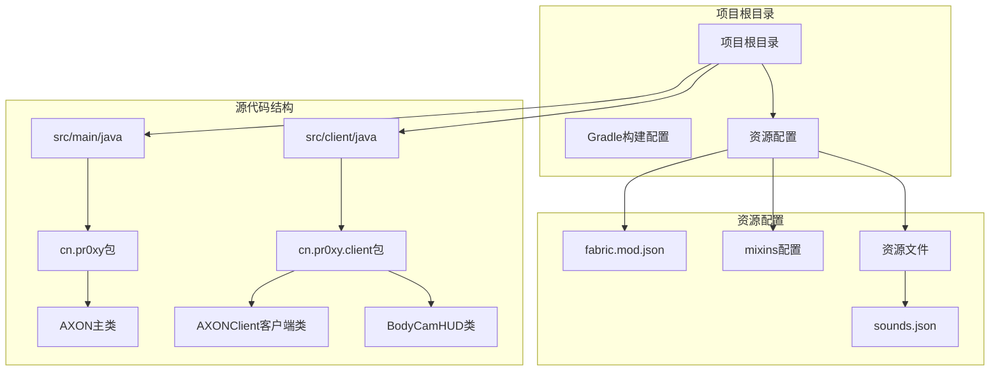

**图表来源**
- [AXON.java:1-27](file://src/main/java/cn/pr0xy/AXON.java#L1-L27)
- [AXONClient.java:1-32](file://src/client/java/cn/pr0xy/client/AXONClient.java#L1-L32)
- [BodyCamHUD.java:1-93](file://src/client/java/cn/pr0xy/client/BodyCamHUD.java#L1-L93)
- [fabric.mod.json:1-38](file://src/main/resources/fabric.mod.json#L1-L38)

**章节来源**
- [AXON.java:1-27](file://src/main/java/cn/pr0xy/AXON.java#L1-L27)
- [fabric.mod.json:1-38](file://src/main/resources/fabric.mod.json#L1-L38)

## 核心组件

### 主模组类AXON

AXON主类是整个模组的核心入口点，实现了Fabric的ModInitializer接口。该类包含了模组的基本配置和初始化逻辑。

#### 关键特性

1. **模组标识符定义**：通过静态常量定义模组ID为"axon"
2. **增强日志系统**：使用SLF4J框架进行结构化日志记录
3. **完善的声音事件注册**：注册自定义的声音事件用于启动音效
4. **完整的初始化流程**：在onInitialize()方法中执行模组的初始化任务

#### 初始化流程

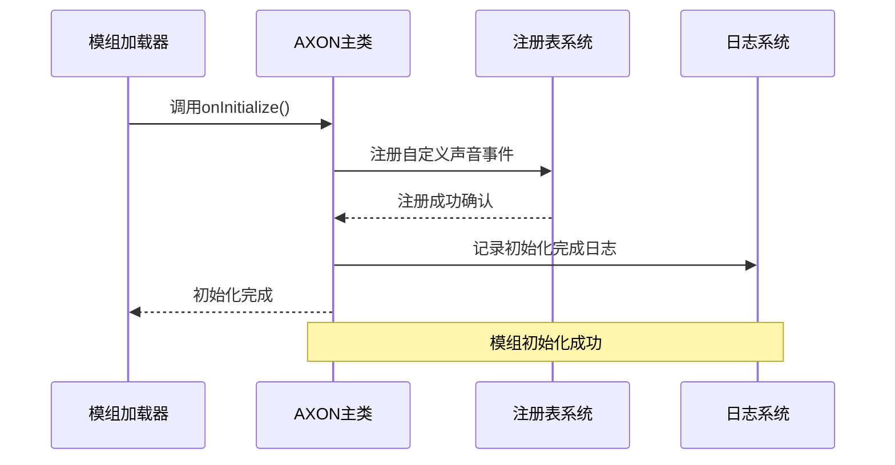

**图表来源**
- [AXON.java:21-25](file://src/main/java/cn/pr0xy/AXON.java#L21-L25)

**章节来源**
- [AXON.java:13-26](file://src/main/java/cn/pr0xy/AXON.java#L13-L26)

### 客户端模组类AXONClient

AXONClient负责处理客户端特定的初始化逻辑，包括HUD渲染和网络事件监听。

#### 核心功能

1. **HUD渲染注册**：注册BodyCam HUD覆盖层渲染器
2. **网络事件监听**：监听玩家加入游戏的网络事件
3. **音效播放**：在客户端线程中播放启动音效
4. **增强日志记录**：记录音效播放状态

**章节来源**
- [AXONClient.java:14-31](file://src/client/java/cn/pr0xy/client/AXONClient.java#L14-L31)

### HUD渲染系统

BodyCamHUD类实现了HudRenderCallback接口，提供自定义HUD渲染功能。

#### 核心功能

1. **录制指示器**：显示闪烁的红色REC指示器
2. **水印系统**：显示时间戳和设备ID
3. **模组信息**：显示模组名称和版本信息
4. **字体和纹理管理**：使用自定义字体和纹理资源

**章节来源**
- [BodyCamHUD.java:17-93](file://src/client/java/cn/pr0xy/client/BodyCamHUD.java#L17-L93)

## 架构概览

AXON模组采用了典型的Fabric模组架构，结合了服务端和客户端的功能模块：

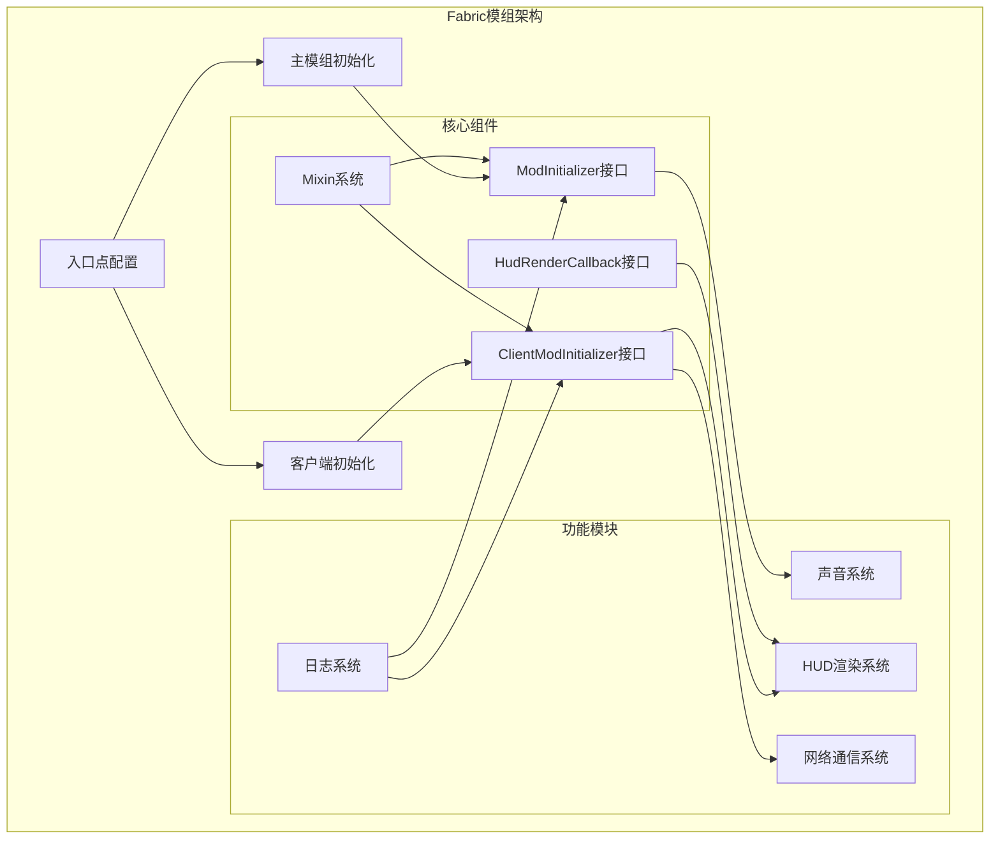

**图表来源**
- [fabric.mod.json:17-24](file://src/main/resources/fabric.mod.json#L17-L24)
- [AXON.java:5-11](file://src/main/java/cn/pr0xy/AXON.java#L5-L11)
- [AXONClient.java:6-12](file://src/client/java/cn/pr0xy/client/AXONClient.java#L6-L12)
- [BodyCamHUD.java:6](file://src/client/java/cn/pr0xy/client/BodyCamHUD.java#L6)

## 详细组件分析

### ModInitializer接口实现

AXON主类实现了Fabric的ModInitializer接口，这是Fabric模组生命周期管理的核心机制。

#### 接口实现模式

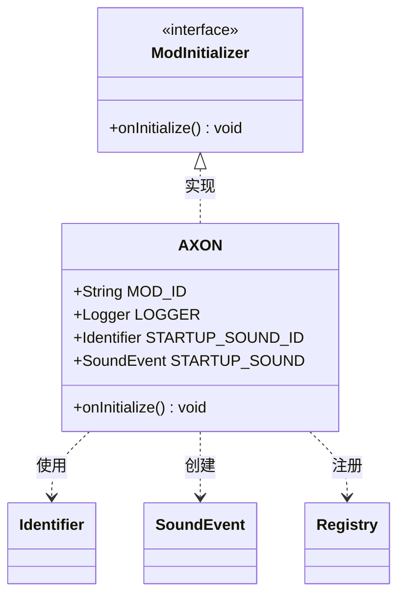

**图表来源**
- [AXON.java:5-26](file://src/main/java/cn/pr0xy/AXON.java#L5-L26)

#### 初始化方法详解

onInitialize()方法是模组初始化的核心入口，负责执行模组启动时需要完成的所有任务。

**章节来源**
- [AXON.java:21-25](file://src/main/java/cn/pr0xy/AXON.java#L21-L25)

### 模组ID定义与管理

模组ID是Fabric模组系统中的唯一标识符，用于区分不同的模组并管理模组间的关系。

#### ID定义策略

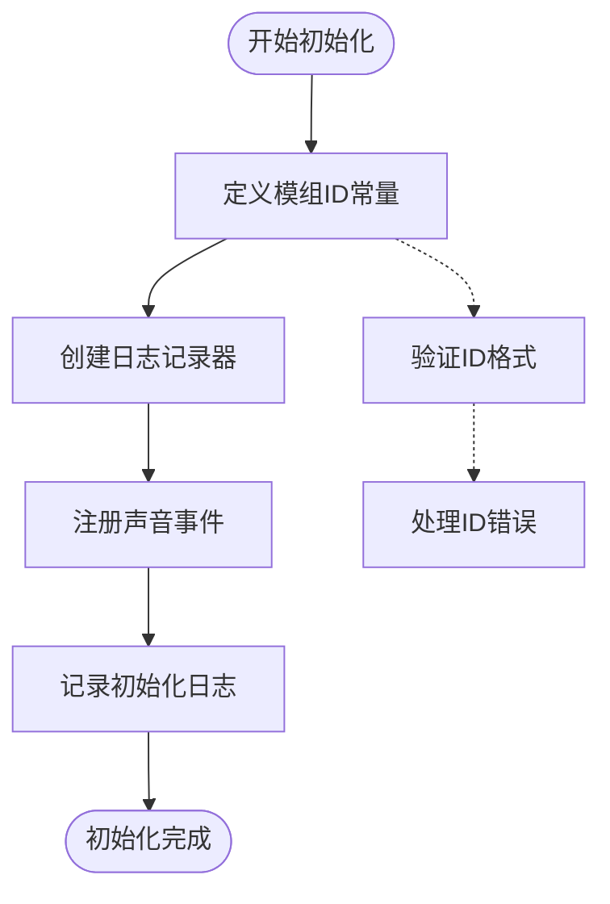

**图表来源**
- [AXON.java:14-15](file://src/main/java/cn/pr0xy/AXON.java#L14-L15)

#### ID使用场景

模组ID在以下场景中被使用：
1. **日志记录**：作为Logger的命名空间
2. **资源定位**：用于创建Identifier对象
3. **模组标识**：在Fabric API中标识模组身份

**章节来源**
- [AXON.java:14-19](file://src/main/java/cn/pr0xy/AXON.java#L14-L19)

### 增强日志记录系统

AXON使用SLF4J（Simple Logging Facade for Java）作为日志记录框架，提供了结构化的日志管理能力。

#### 日志系统架构

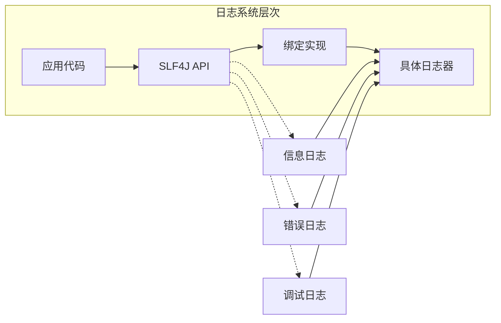

**图表来源**
- [AXON.java:10-11](file://src/main/java/cn/pr0xy/AXON.java#L10-L11)

#### 日志使用模式

日志记录在以下场景中发挥作用：
1. **初始化状态**：记录模组初始化完成
2. **运行时信息**：提供运行时状态反馈
3. **错误诊断**：记录异常和错误信息
4. **客户端功能**：记录音效播放状态

**章节来源**
- [AXON.java:15-25](file://src/main/java/cn/pr0xy/AXON.java#L15-L25)
- [AXONClient.java:28](file://src/client/java/cn/pr0xy/client/AXONClient.java#L28)

### 完善的声音事件系统

AXON实现了自定义声音事件的注册和管理，为模组提供了音频反馈功能。

#### 声音系统架构

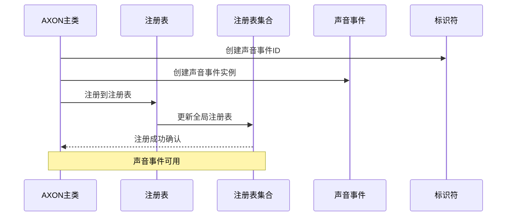

**图表来源**
- [AXON.java:18-23](file://src/main/java/cn/pr0xy/AXON.java#L18-L23)

#### 声音资源配置

声音事件通过sounds.json文件进行配置：

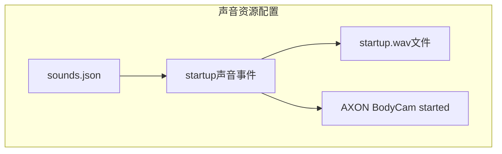

**图表来源**
- [sounds.json:1-9](file://src/main/resources/assets/axon/sounds.json#L1-L9)

**章节来源**
- [AXON.java:17-24](file://src/main/java/cn/pr0xy/AXON.java#L17-L24)
- [sounds.json:1-9](file://src/main/resources/assets/axon/sounds.json#L1-L9)

### 客户端初始化流程

AXONClient实现了ClientModInitializer接口，专门处理客户端环境下的初始化逻辑。

#### 客户端初始化序列

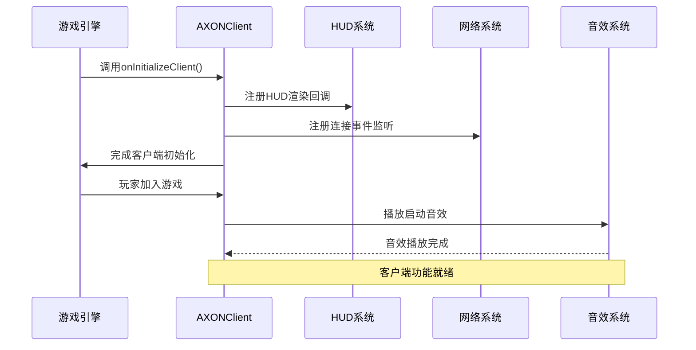

**图表来源**
- [AXONClient.java:16-30](file://src/client/java/cn/pr0xy/client/AXONClient.java#L16-L30)

#### HUD渲染流程

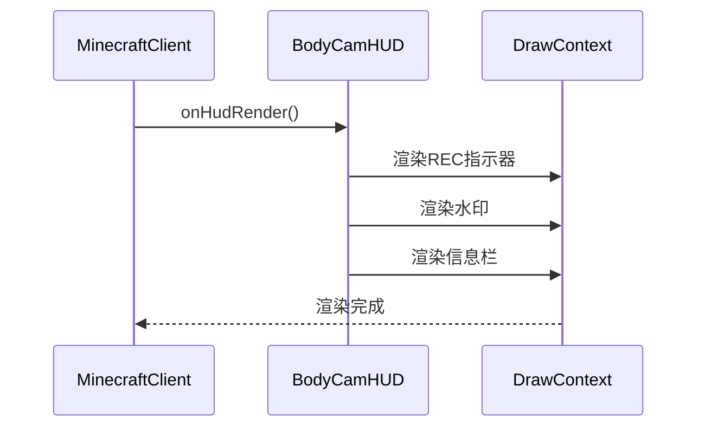

**图表来源**
- [BodyCamHUD.java:38-53](file://src/client/java/cn/pr0xy/client/BodyCamHUD.java#L38-L53)

**章节来源**
- [AXONClient.java:14-31](file://src/client/java/cn/pr0xy/client/AXONClient.java#L14-L31)
- [BodyCamHUD.java:17-93](file://src/client/java/cn/pr0xy/client/BodyCamHUD.java#L17-L93)

## 依赖关系分析

### Fabric API依赖

AXON模组依赖于多个Fabric API组件来实现其功能：

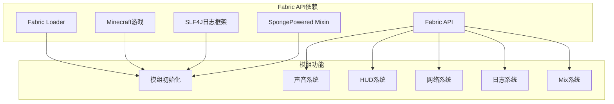

**图表来源**
- [fabric.mod.json:32-37](file://src/main/resources/fabric.mod.json#L32-L37)
- [AXON.java:5-11](file://src/main/java/cn/pr0xy/AXON.java#L5-L11)

### 版本兼容性

模组对不同组件的版本要求确保了兼容性和稳定性：

| 组件 | 最低版本 | 当前版本 | 兼容范围 |
|------|----------|----------|----------|
| Fabric Loader | 0.19.2 | 0.19.2 | >= 0.19.2 |
| Minecraft | 1.20.1 | 1.20.1 | ~1.20.1 |
| Java | 17 | 17 | >= 17 |
| Fabric API | * | 0.92.9+1.20.1 | * |

**章节来源**
- [fabric.mod.json:32-37](file://src/main/resources/fabric.mod.json#L32-L37)

## 性能考虑

### 初始化性能优化

AXON模组的初始化过程相对简单，但仍有一些性能优化建议：

1. **延迟初始化**：对于昂贵的操作可以考虑延迟到首次使用时再执行
2. **异步处理**：避免在主线程中执行阻塞操作
3. **内存管理**：及时释放不需要的对象引用

### 资源管理

模组应该遵循以下资源管理原则：

1. **注册表清理**：在模组卸载时清理注册表项
2. **监听器移除**：移除不再使用的事件监听器
3. **资源释放**：释放图形和音频资源

## 故障排除指南

### 常见初始化问题

#### 模组ID冲突
- **症状**：模组无法加载或出现重复定义错误
- **解决方案**：确保模组ID在整个游戏中是唯一的

#### 依赖缺失
- **症状**：运行时抛出ClassNotFoundException
- **解决方案**：检查fabric.mod.json中的depends配置

#### 日志配置问题
- **症状**：日志输出异常或不显示
- **解决方案**：检查SLF4J绑定配置

#### 声音事件注册失败
- **症状**：启动音效无法播放
- **解决方案**：检查sounds.json配置和声音文件路径

**章节来源**
- [fabric.mod.json:32-37](file://src/main/resources/fabric.mod.json#L32-L37)
- [AXON.java:14-15](file://src/main/java/cn/pr0xy/AXON.java#L14-L15)
- [sounds.json:1-9](file://src/main/resources/assets/axon/sounds.json#L1-L9)

## 最佳实践

### 模组初始化最佳实践

1. **最小化初始化工作**：只在onInitialize()中执行必要的初始化
2. **错误处理**：为初始化过程添加适当的错误处理机制
3. **资源管理**：确保所有注册的资源都能正确清理
4. **日志记录**：提供详细的初始化日志以便调试

### 代码组织建议

1. **模块化设计**：将不同的功能模块分离到独立的类中
2. **依赖注入**：使用构造函数注入依赖而不是静态访问
3. **接口抽象**：为可替换的组件定义清晰的接口
4. **测试覆盖**：为关键功能编写单元测试

### 性能优化建议

1. **懒加载**：延迟加载昂贵的资源直到真正需要
2. **缓存策略**：合理使用缓存减少重复计算
3. **内存优化**：避免创建不必要的临时对象
4. **并发安全**：确保多线程环境下的数据一致性

## 结论

AXON模组展示了Fabric模组开发的标准实践和最佳实践。通过实现ModInitializer接口，模组能够在正确的时机执行初始化逻辑，同时利用Fabric API的强大功能实现复杂的游戏功能。

该模组的成功之处在于：
- 清晰的架构设计和模块化组织
- 合理的依赖管理和版本控制
- 完善的日志记录和错误处理机制
- 符合Fabric生态系统的开发规范

**更新** 新版本进一步增强了日志记录能力和声音事件注册的完整性，为用户提供了更好的体验和更可靠的初始化流程。

对于其他模组开发者而言，AXON提供了一个优秀的参考模板，展示了如何在Fabric生态系统中正确地实现模组初始化和功能扩展。