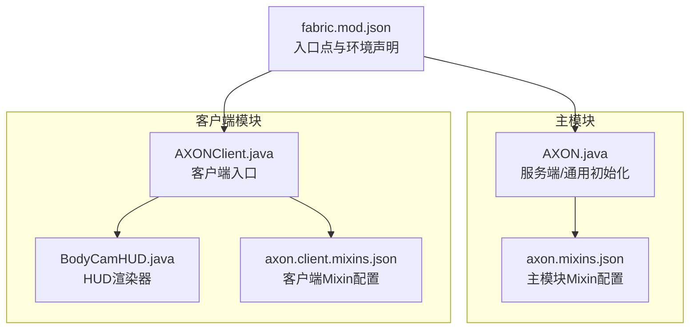
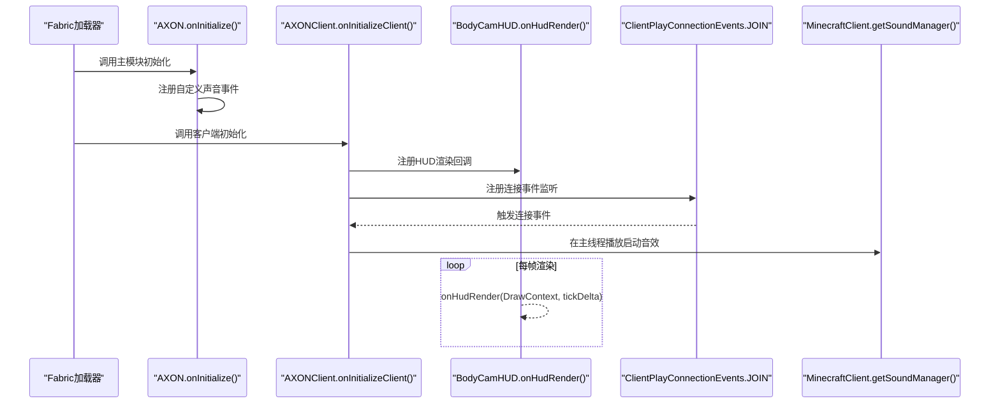
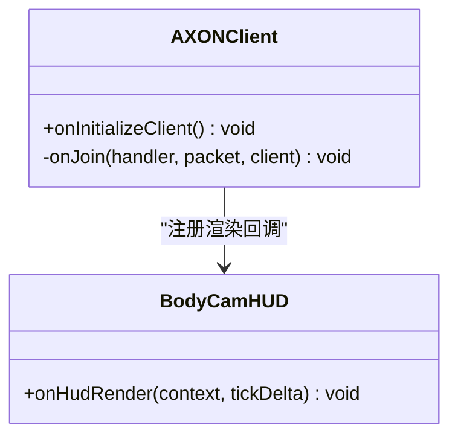
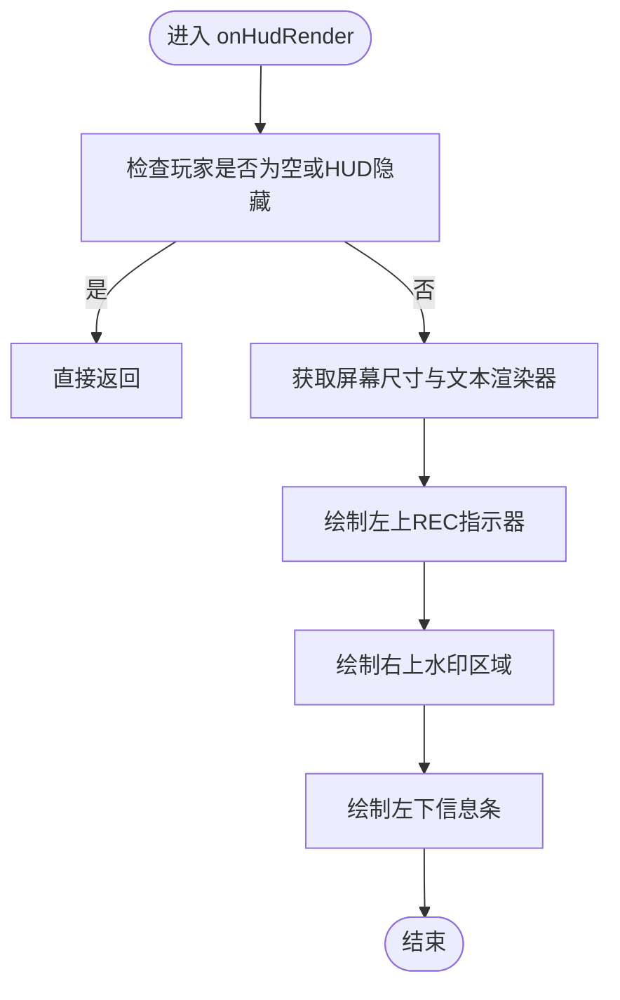
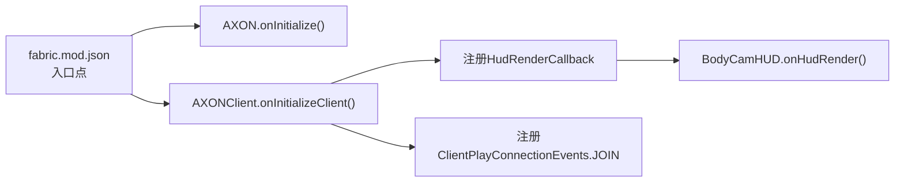

# 客户端模组初始化

<cite>
**本文引用的文件**
- [AXONClient.java](file://src/client/java/cn/pr0xy/client/AXONClient.java)
- [BodyCamHUD.java](file://src/client/java/cn/pr0xy/client/BodyCamHUD.java)
- [ExampleClientMixin.java](file://src/client/java/cn/pr0xy/client/mixin/ExampleClientMixin.java)
- [AXON.java](file://src/main/java/cn/pr0xy/AXON.java)
- [fabric.mod.json](file://src/main/resources/fabric.mod.json)
- [axon.client.mixins.json](file://src/client/resources/axon.client.mixins.json)
- [README.md](file://README.md)
</cite>

## 目录
1. [简介](#简介)
2. [项目结构](#项目结构)
3. [核心组件](#核心组件)
4. [架构总览](#架构总览)
5. [详细组件分析](#详细组件分析)
6. [依赖关系分析](#依赖关系分析)
7. [性能考量](#性能考量)
8. [故障排查指南](#故障排查指南)
9. [结论](#结论)
10. [附录](#附录)

## 简介
本文件围绕客户端模组初始化进行系统化文档化，重点解析 AXONClient 客户端类的实现，涵盖以下主题：
- ClientModInitializer 接口的实现与 onInitializeClient() 的职责
- 客户端模组与服务器端模组的区别及客户端特有初始化需求
- HUD 渲染系统的注册流程（HudRenderCallback）及其回调注册时机
- 客户端模组生命周期管理：模组加载后的资源初始化与渲染系统准备
- 客户端模组开发最佳实践：渲染优化、内存管理、线程安全
- 实际代码示例与调试技巧

## 项目结构
该项目采用 Fabric 模组标准目录结构，区分服务端与客户端代码：
- 主入口位于主模块，负责通用初始化与服务端注册
- 客户端入口位于 client 模块，负责客户端特定初始化与渲染
- Mixin 配置分别在主资源与客户端资源中声明

图表来源
- [fabric.mod.json:17-24](file://src/main/resources/fabric.mod.json#L17-L24)
- [AXON.java:11-25](file://src/main/java/cn/pr0xy/AXON.java#L11-L25)
- [AXONClient.java:12-20](file://src/client/java/cn/pr0xy/client/AXONClient.java#L12-L20)
- [BodyCamHUD.java:14](file://src/client/java/cn/pr0xy/client/BodyCamHUD.java#L14)
- [axon.client.mixins.json:1-14](file://src/client/resources/axon.client.mixins.json#L1-L14)

章节来源
- [fabric.mod.json:17-24](file://src/main/resources/fabric.mod.json#L17-L24)
- [README.md:1-10](file://README.md#L1-L10)

## 核心组件
本节聚焦于客户端模组初始化的核心组件及其职责：
- AXONClient：实现 ClientModInitializer，负责客户端初始化、HUD 注册与连接事件处理
- BodyCamHUD：实现 HudRenderCallback，提供 HUD 渲染逻辑
- AXON：实现 ModInitializer，负责注册自定义声音事件等通用初始化
- Mixin 示例：演示对 MinecraftClient.run 的注入

章节来源
- [AXONClient.java:12-31](file://src/client/java/cn/pr0xy/client/AXONClient.java#L12-L31)
- [BodyCamHUD.java:14](file://src/client/java/cn/pr0xy/client/BodyCamHUD.java#L14)
- [AXON.java:11-25](file://src/main/java/cn/pr0xy/AXON.java#L11-L25)
- [ExampleClientMixin.java:9-15](file://src/client/java/cn/pr0xy/client/mixin/ExampleClientMixin.java#L9-L15)

## 架构总览
客户端模组初始化的关键流程如下：
- Fabric 加载 fabric.mod.json，根据环境选择入口点
- 主模块 AXON 执行 onInitialize，注册自定义声音事件
- 客户端模块 AXONClient 执行 onInitializeClient，注册 HUD 渲染回调与网络连接事件
- 游戏运行时，HUD 渲染回调在每帧被调用；网络连接事件触发后播放启动音效

图表来源
- [fabric.mod.json:17-24](file://src/main/resources/fabric.mod.json#L17-L24)
- [AXON.java:19-24](file://src/main/java/cn/pr0xy/AXON.java#L19-L24)
- [AXONClient.java:13-30](file://src/client/java/cn/pr0xy/client/AXONClient.java#L13-L30)
- [BodyCamHUD.java:39-60](file://src/client/java/cn/pr0xy/client/BodyCamHUD.java#L39-L60)

## 详细组件分析

### AXONClient 客户端入口
- 实现 ClientModInitializer，确保仅在客户端环境执行初始化
- onInitializeClient 中完成：
  - 注册 HUD 渲染回调（BodyCamHUD）
  - 注册网络连接事件（ClientPlayConnectionEvents.JOIN），用于在加入世界时播放启动音效
- onJoin 使用 MinecraftClient.execute 将音效播放调度到客户端主线程，保证线程安全

图表来源
- [AXONClient.java:12-31](file://src/client/java/cn/pr0xy/client/AXONClient.java#L12-L31)
- [BodyCamHUD.java:14](file://src/client/java/cn/pr0xy/client/BodyCamHUD.java#L14)

章节来源
- [AXONClient.java:12-31](file://src/client/java/cn/pr0xy/client/AXONClient.java#L12-L31)

### BodyCamHUD HUD 渲染器
- 实现 HudRenderCallback，提供 onHudRender 方法
- 渲染内容：
  - 左上角录制指示器（带闪烁红点）
  - 右上角水印（时间戳与设备号文本，右侧附带图标）
  - 左下角信息条（模组名称）
- 渲染条件：仅当存在玩家且 HUD 未隐藏时才绘制
- 文本使用自定义字体样式，图标使用自定义纹理资源

图表来源
- [BodyCamHUD.java:39-60](file://src/client/java/cn/pr0xy/client/BodyCamHUD.java#L39-L60)
- [BodyCamHUD.java:65-80](file://src/client/java/cn/pr0xy/client/BodyCamHUD.java#L65-L80)
- [BodyCamHUD.java:86-116](file://src/client/java/cn/pr0xy/client/BodyCamHUD.java#L86-L116)
- [BodyCamHUD.java:121-124](file://src/client/java/cn/pr0xy/client/BodyCamHUD.java#L121-L124)

章节来源
- [BodyCamHUD.java:14-139](file://src/client/java/cn/pr0xy/client/BodyCamHUD.java#L14-L139)

### AXON 主入口（服务端/通用）
- 实现 ModInitializer，负责注册自定义声音事件
- 提供静态标识符与日志记录器，便于客户端引用

章节来源
- [AXON.java:11-25](file://src/main/java/cn/pr0xy/AXON.java#L11-L25)

### Mixin 配置与示例
- 主模块与客户端模块分别声明各自的 mixin 配置
- ExampleClientMixin 展示了对 MinecraftClient.run 的注入示例

章节来源
- [axon.client.mixins.json:1-14](file://src/client/resources/axon.client.mixins.json#L1-L14)
- [ExampleClientMixin.java:9-15](file://src/client/java/cn/pr0xy/client/mixin/ExampleClientMixin.java#L9-L15)

## 依赖关系分析
- 入口点由 fabric.mod.json 声明，分别指向主模块 AXON 与客户端 AXONClient
- 客户端模块依赖 Fabric API 的客户端渲染与网络事件接口
- HUD 渲染依赖 MinecraftClient 的窗口尺寸、文本渲染器与 DrawContext

图表来源
- [fabric.mod.json:17-24](file://src/main/resources/fabric.mod.json#L17-L24)
- [AXONClient.java:13-30](file://src/client/java/cn/pr0xy/client/AXONClient.java#L13-L30)
- [BodyCamHUD.java:39-60](file://src/client/java/cn/pr0xy/client/BodyCamHUD.java#L39-L60)

章节来源
- [fabric.mod.json:17-24](file://src/main/resources/fabric.mod.json#L17-L24)

## 性能考量
- 渲染优化
  - 避免在渲染循环中频繁创建对象；可复用格式化器与样式对象
  - 文本测量与布局计算应尽量避免在高频路径重复执行
  - 圆形近似绘制使用矩形填充，注意像素级精度与性能平衡
- 内存管理
  - 静态常量用于颜色与标识符，减少堆分配
  - 避免持有不必要的长生命周期引用，防止内存泄漏
- 线程安全
  - 音效播放通过 MinecraftClient.execute 调度至主线程，确保与渲染线程隔离
  - HUD 渲染回调在渲染线程内执行，避免跨线程访问客户端状态

## 故障排查指南
- HUD 不显示
  - 检查是否在 HUD 隐藏模式（F1）下渲染被提前返回
  - 确认自定义字体与纹理资源路径正确
- 启动音效不播放
  - 确认声音事件已在主模块注册
  - 检查连接事件是否触发，以及 execute 是否成功调度到主线程
- 渲染异常或卡顿
  - 减少每帧绘制复杂度，合并绘制调用
  - 避免在渲染回调中进行阻塞操作

章节来源
- [BodyCamHUD.java:43-46](file://src/client/java/cn/pr0xy/client/BodyCamHUD.java#L43-L46)
- [AXON.java:19-24](file://src/main/java/cn/pr0xy/AXON.java#L19-L24)
- [AXONClient.java:22-30](file://src/client/java/cn/pr0xy/client/AXONClient.java#L22-L30)

## 结论
本客户端模组通过 Fabric 的客户端入口点与 HUD 回调机制，实现了简洁而高效的 HUD 渲染与音效播放。其设计遵循客户端线程安全与渲染性能原则，适合作为客户端模组开发的参考实现。建议在实际项目中进一步完善资源管理、错误处理与性能监控。

## 附录
- 客户端模组开发最佳实践
  - 初始化顺序：先注册事件与回调，再进行资源加载
  - 渲染策略：最小化每帧绘制调用，避免频繁创建临时对象
  - 线程模型：严格区分主线程与渲染线程，必要时使用 execute 调度
  - 资源管理：集中管理纹理与字体资源，避免重复加载
- 调试技巧
  - 使用日志输出关键事件（如连接事件、渲染开始/结束）
  - 切换 HUD 隐藏模式验证渲染条件分支
  - 使用性能分析工具定位高成本绘制路径