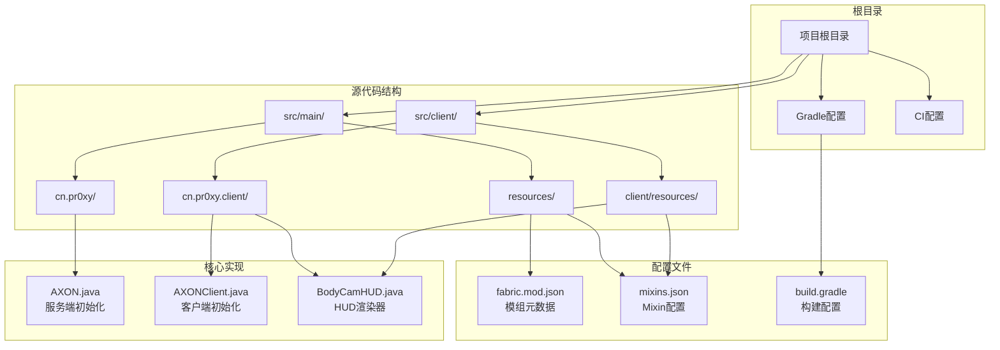
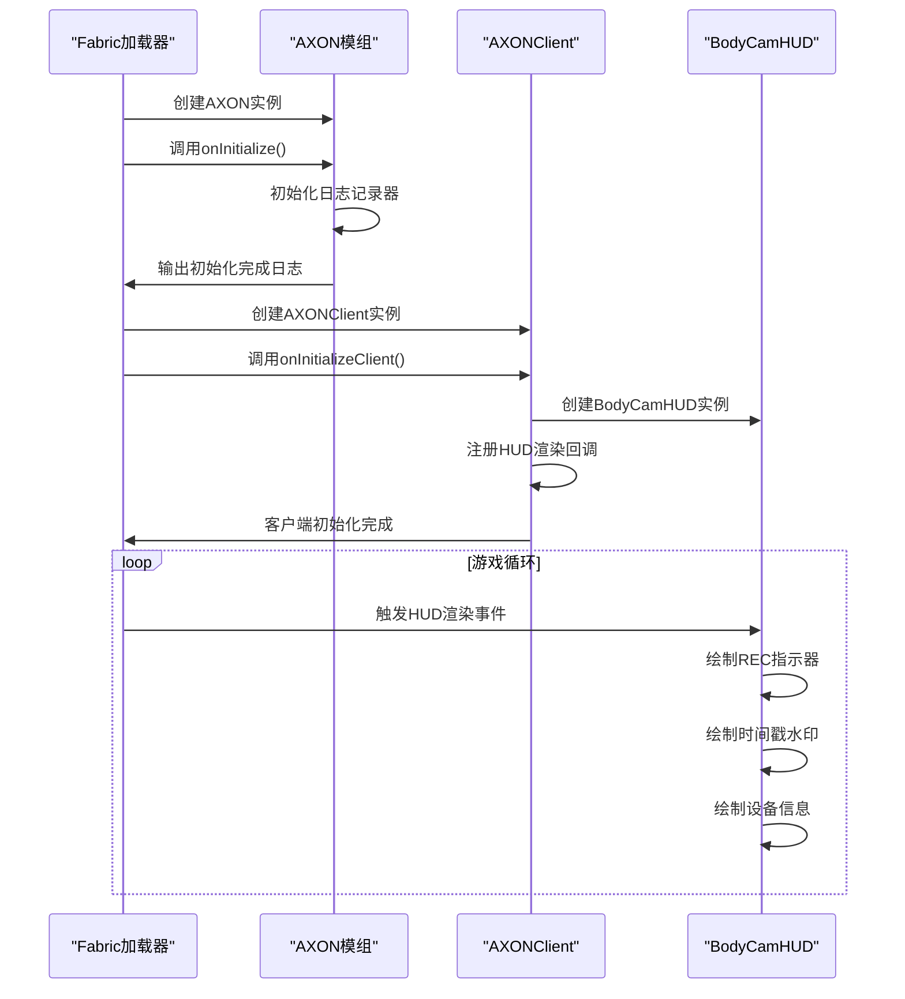
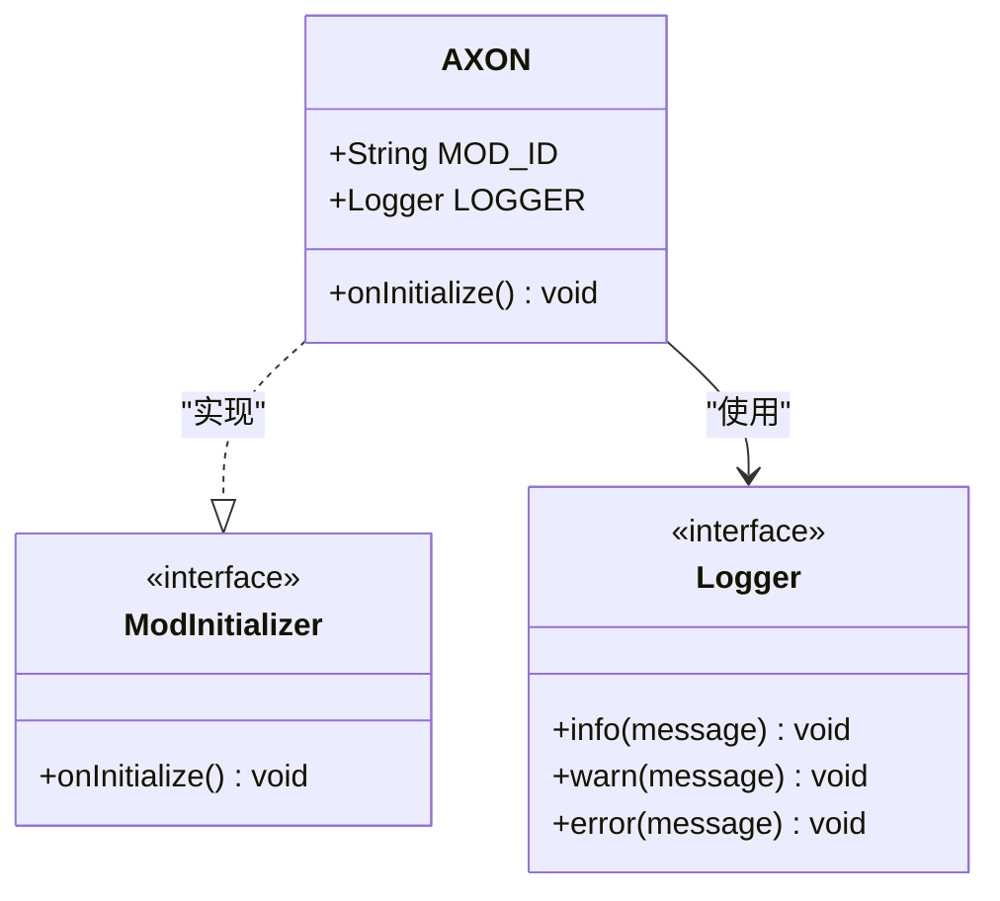
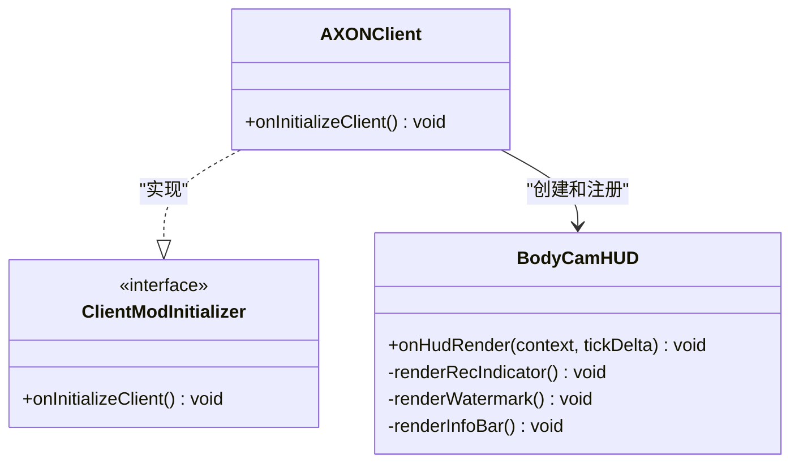
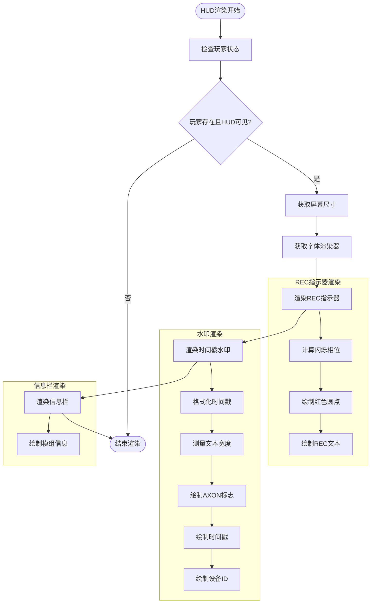
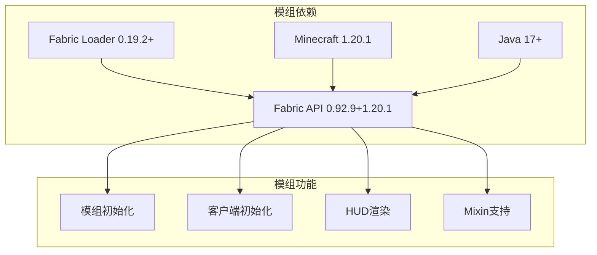

# 模组生命周期管理

<cite>
**本文档引用的文件**
- [AXON.java](file://src/main/java/cn/pr0xy/AXON.java)
- [AXONClient.java](file://src/client/java/cn/pr0xy/client/AXONClient.java)
- [BodyCamHUD.java](file://src/client/java/cn/pr0xy/client/BodyCamHUD.java)
- [fabric.mod.json](file://src/main/resources/fabric.mod.json)
- [build.gradle](file://build.gradle)
- [gradle.properties](file://gradle.properties)
- [axon.mixins.json](file://src/main/resources/axon.mixins.json)
- [axon.client.mixins.json](file://src/client/resources/axon.client.mixins.json)
- [ExampleMixin.java](file://src/main/java/cn/pr0xy/mixin/ExampleMixin.java)
- [ExampleClientMixin.java](file://src/client/java/cn/pr0xy/client/mixin/ExampleClientMixin.java)
</cite>

## 目录
1. [简介](#简介)
2. [项目结构](#项目结构)
3. [核心组件](#核心组件)
4. [架构概览](#架构概览)
5. [详细组件分析](#详细组件分析)
6. [依赖关系分析](#依赖关系分析)
7. [性能考虑](#性能考虑)
8. [故障排除指南](#故障排除指南)
9. [结论](#结论)

## 简介

本文档深入解析BodyCam模组（AXON）的生命周期管理机制，基于Fabric API的模组初始化框架。该模组展示了标准的Fabric模组结构，包含服务端和客户端两个主要部分，通过ModInitializer和ClientModInitializer接口实现模组的初始化流程。

BodyCam模组是一个示例性的模组，演示了如何在Minecraft中实现HUD渲染功能，包括录制指示器、时间戳水印和设备信息显示等特性。模组采用模块化设计，将核心逻辑与客户端特定功能分离。

## 项目结构

BodyCam模组遵循标准的Fabric模组目录结构，采用分层组织方式：

**图表来源**
- [AXON.java:1-24](file://src/main/java/cn/pr0xy/AXON.java#L1-L24)
- [AXONClient.java:1-13](file://src/client/java/cn/pr0xy/client/AXONClient.java#L1-L13)
- [fabric.mod.json:1-38](file://src/main/resources/fabric.mod.json#L1-L38)

**章节来源**
- [build.gradle:17-27](file://build.gradle#L17-L27)
- [fabric.mod.json:17-24](file://src/main/resources/fabric.mod.json#L17-L24)

## 核心组件

### AXON主模组类

AXON类实现了Fabric API的ModInitializer接口，是模组的服务端入口点。该类负责模组的核心初始化逻辑：

- **模组标识符**: 使用静态常量定义模组ID
- **日志记录**: 配置SLF4J日志记录器，使用模组ID作为命名空间
- **初始化方法**: 实现onInitialize()方法，在Minecraft准备好加载模组时调用

### AXONClient客户端类

AXONClient类实现了ClientModInitializer接口，专门处理客户端特定的初始化任务：

- **客户端初始化**: 在客户端环境中执行初始化逻辑
- **HUD注册**: 注册BodyCamHUD到Fabric API的HUD渲染回调系统
- **事件监听**: 通过HudRenderCallback.EVENT.register()注册渲染事件处理器

### BodyCamHUD渲染器

BodyCamHUD类实现了HudRenderCallback接口，提供完整的HUD渲染功能：

- **REC指示器**: 实现闪烁的红色录制指示器
- **时间戳水印**: 显示当前时间戳和设备信息
- **设备标识**: 展示模组设备ID和版本信息
- **纹理渲染**: 使用Minecraft的DrawContext进行自定义纹理绘制

**章节来源**
- [AXON.java:8-24](file://src/main/java/cn/pr0xy/AXON.java#L8-L24)
- [AXONClient.java:6-12](file://src/client/java/cn/pr0xy/client/AXONClient.java#L6-L12)
- [BodyCamHUD.java:13-55](file://src/client/java/cn/pr0xy/client/BodyCamHUD.java#L13-L55)

## 架构概览

BodyCam模组的生命周期架构基于Fabric API的设计模式，展示了清晰的职责分离：

**图表来源**
- [AXON.java:16-23](file://src/main/java/cn/pr0xy/AXON.java#L16-L23)
- [AXONClient.java:7-11](file://src/client/java/cn/pr0xy/client/AXONClient.java#L7-L11)
- [BodyCamHUD.java:34-55](file://src/client/java/cn/pr0xy/client/BodyCamHUD.java#L34-L55)

### 生命周期阶段

模组生命周期分为三个主要阶段：

1. **早期初始化阶段**: Fabric加载器创建模组实例
2. **常规初始化阶段**: 调用onInitialize()方法
3. **后期初始化阶段**: 客户端环境下的onInitializeClient()

每个阶段都有明确的职责和执行时机，确保模组能够在正确的环境中执行相应的初始化逻辑。

## 详细组件分析

### AXON主模组类深度分析

AXON类体现了Fabric模组开发的最佳实践：

**图表来源**
- [AXON.java:3-24](file://src/main/java/cn/pr0xy/AXON.java#L3-L24)

#### 关键特性

- **静态常量定义**: MOD_ID提供统一的模组标识符
- **日志记录最佳实践**: 使用模组ID作为日志命名空间
- **安全初始化**: 在Minecraft准备好加载时执行初始化

### AXONClient客户端类分析

AXONClient展示了客户端模组初始化的标准模式：

**图表来源**
- [AXONClient.java:3-12](file://src/client/java/cn/pr0xy/client/AXONClient.java#L3-L12)
- [BodyCamHUD.java:13-124](file://src/client/java/cn/pr0xy/client/BodyCamHUD.java#L13-L124)

#### 客户端初始化流程

1. **实例创建**: Fabric加载器创建AXONClient实例
2. **HUD创建**: 构造BodyCamHUD实例
3. **事件注册**: 将HUD注册到HudRenderCallback.EVENT
4. **渲染集成**: 在游戏渲染循环中自动触发HUD绘制

### BodyCamHUD渲染器详细分析

BodyCamHUD实现了复杂的HUD渲染逻辑，展示了Fabric API的渲染能力：

**图表来源**
- [BodyCamHUD.java:34-124](file://src/client/java/cn/pr0xy/client/BodyCamHUD.java#L34-L124)

#### 渲染技术实现

- **闪烁动画**: 使用余弦函数实现平滑的闪烁效果
- **文本对齐**: 通过文本测量实现右对齐布局
- **自定义纹理**: 使用Identifier加载和绘制自定义纹理
- **颜色系统**: 实现ARGB颜色格式支持

**章节来源**
- [BodyCamHUD.java:57-124](file://src/client/java/cn/pr0xy/client/BodyCamHUD.java#L57-L124)

## 依赖关系分析

### Fabric API依赖

BodyCam模组依赖于多个Fabric API组件：

**图表来源**
- [fabric.mod.json:32-37](file://src/main/resources/fabric.mod.json#L32-L37)
- [gradle.properties:13-20](file://gradle.properties#L13-L20)

### 构建配置依赖

构建系统配置确保了模组的正确编译和打包：

- **Java 17兼容**: 所有源码使用Java 17特性
- **Loom插件**: 使用Fabric Loom进行构建管理
- **源码分离**: 分离main和client源集
- **版本管理**: 集中式版本属性管理

**章节来源**
- [build.gradle:29-38](file://build.gradle#L29-L38)
- [gradle.properties:10-13](file://gradle.properties#L10-L13)

## 性能考虑

### 渲染性能优化

BodyCamHUD实现了多项性能优化策略：

1. **条件渲染**: 在玩家不存在或HUD隐藏时不执行渲染
2. **最小化计算**: 仅在需要时计算闪烁相位和文本尺寸
3. **批量绘制**: 使用DrawContext的批量绘制方法减少状态切换

### 内存管理

- **对象复用**: 使用单例SimpleDateFormat避免重复创建
- **静态常量**: 将颜色和字符串常量声明为静态以减少内存占用
- **及时释放**: 依赖Fabric API的生命周期管理自动清理资源

### 初始化性能

- **延迟加载**: 客户端渲染器在首次需要时才执行复杂初始化
- **异步处理**: 避免在主线程执行耗时操作
- **缓存策略**: 缓存已计算的渲染参数

## 故障排除指南

### 常见问题诊断

#### 模组未加载

**症状**: 模组图标不显示在模组列表中

**排查步骤**:
1. 检查fabric.mod.json配置是否正确
2. 验证依赖版本是否满足要求
3. 确认模组ID与包名一致

#### 客户端渲染异常

**症状**: HUD不显示或显示异常

**排查步骤**:
1. 检查AXONClient是否正确注册
2. 验证BodyCamHUD构造是否成功
3. 确认HudRenderCallback.EVENT注册位置正确

#### 版本兼容性问题

**症状**: 启动时出现版本冲突错误

**解决方案**:
1. 更新Fabric API版本到兼容范围
2. 确保Minecraft版本与Fabric API匹配
3. 检查Java版本要求

### 调试技巧

#### 日志分析

使用模组的日志记录器输出调试信息：
- 初始化阶段的关键节点
- 异常情况的详细描述
- 性能指标的监控数据

#### 环境检查

1. **依赖验证**: 确认所有必需依赖都已正确加载
2. **配置验证**: 检查模组配置文件的语法正确性
3. **资源验证**: 确认所有纹理和资源文件存在

#### 性能监控

- 监控HUD渲染帧率
- 检查内存使用情况
- 分析初始化时间

**章节来源**
- [AXON.java:11-14](file://src/main/java/cn/pr0xy/AXON.java#L11-L14)
- [fabric.mod.json:32-37](file://src/main/resources/fabric.mod.json#L32-L37)

## 结论

BodyCam模组（AXON）展示了Fabric API模组生命周期管理的完整实现。通过清晰的职责分离和标准的初始化模式，该模组为开发者提供了良好的参考模板。

### 主要成就

1. **标准实现**: 完整实现了Fabric API的模组初始化接口
2. **职责分离**: 明确区分服务端和客户端的初始化逻辑
3. **性能优化**: 实现了高效的HUD渲染机制
4. **可维护性**: 采用模块化设计便于后续扩展

### 最佳实践总结

- 使用ModInitializer和ClientModInitializer接口
- 实现清晰的职责分离
- 采用SLF4J进行日志记录
- 实现适当的错误处理和回退机制
- 考虑性能影响的初始化策略

### 未来发展方向

- 添加配置文件支持
- 实现动态模组卸载
- 增强错误恢复机制
- 扩展更多HUD功能选项

这个模组为Fabric模组开发提供了坚实的基础，展示了如何在保持简洁性的同时实现强大的功能。