# 项目概述

<cite>
**本文档引用的文件**
- [README.md](file://README.md)
- [build.gradle](file://build.gradle)
- [settings.gradle](file://settings.gradle)
- [gradle.properties](file://gradle.properties)
- [fabric.mod.json](file://src/main/resources/fabric.mod.json)
- [AXON.java](file://src/main/java/cn/pr0xy/AXON.java)
- [AXONClient.java](file://src/client/java/cn/pr0xy/client/AXONClient.java)
- [BodyCamHUD.java](file://src/client/java/cn/pr0xy/client/BodyCamHUD.java)
- [ExampleMixin.java](file://src/main/java/cn/pr0xy/mixin/ExampleMixin.java)
- [ExampleClientMixin.java](file://src/client/java/cn/pr0xy/client/mixin/ExampleClientMixin.java)
- [axon.mixins.json](file://src/main/resources/axon.mixins.json)
- [axon.client.mixins.json](file://src/client/resources/axon.client.mixins.json)
</cite>

## 目录
1. [项目简介](#项目简介)
2. [项目结构](#项目结构)
3. [核心组件](#核心组件)
4. [架构总览](#架构总览)
5. [详细组件分析](#详细组件分析)
6. [依赖关系分析](#依赖关系分析)
7. [性能考虑](#性能考虑)
8. [故障排除指南](#故障排除指南)
9. [结论](#结论)

## 项目简介

BodyCam是一个基于Fabric API的专业录制功能界面模组，专为Minecraft 1.20.1版本设计。该项目的核心目标是为玩家提供专业的视频录制界面支持，包括录制指示器、时间戳水印和设备信息显示等核心功能。

### 设计理念

BodyCam的设计理念围绕着"专业性、易用性和稳定性"三大核心原则：
- **专业录制界面**：提供类似专业摄像机的录制状态显示
- **实时信息展示**：在屏幕角落显示关键录制信息
- **最小化干扰**：确保HUD元素不会影响游戏体验

### 主要功能特性

1. **录制指示器**：顶部左侧显示闪烁的红色圆形指示器，清晰表明当前录制状态
2. **时间戳水印**：顶部右侧显示精确的时间戳、设备ID和品牌标识
3. **设备信息栏**：底部左侧显示模组信息和版本标识
4. **响应式布局**：自适应不同分辨率和窗口大小的屏幕

## 项目结构

项目采用标准的Fabric模组目录结构，分为客户端和通用模块两个主要部分：

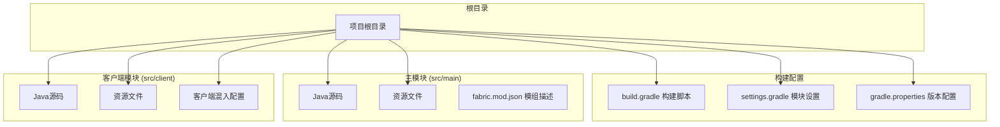

**图表来源**
- [build.gradle:1-88](file://build.gradle#L1-L88)
- [settings.gradle:1-14](file://settings.gradle#L1-L14)
- [gradle.properties:1-20](file://gradle.properties#L1-L20)

**章节来源**
- [build.gradle:1-88](file://build.gradle#L1-L88)
- [settings.gradle:1-14](file://settings.gradle#L1-L14)
- [gradle.properties:1-20](file://gradle.properties#L1-L20)

## 核心组件

### 模组初始化系统

项目采用Fabric API的标准初始化模式，包含主模组初始化器和客户端初始化器：

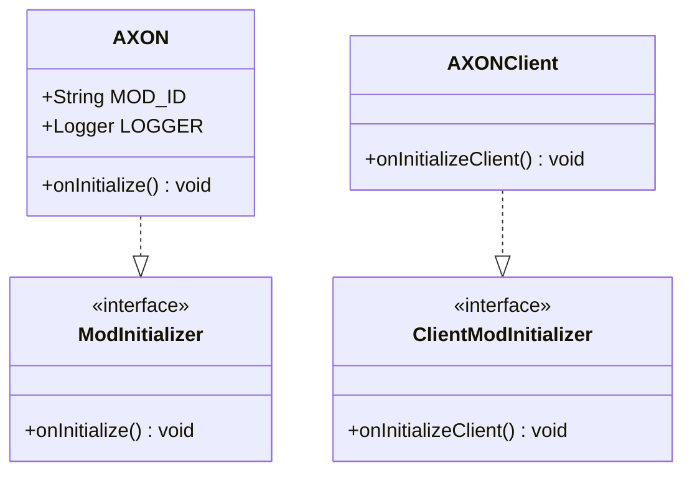

**图表来源**
- [AXON.java:8-24](file://src/main/java/cn/pr0xy/AXON.java#L8-L24)
- [AXONClient.java:6-12](file://src/client/java/cn/pr0xy/client/AXONClient.java#L6-L12)

### HUD渲染系统

BodyCam的核心功能通过自定义HUD渲染器实现，提供三个主要区域的信息展示：

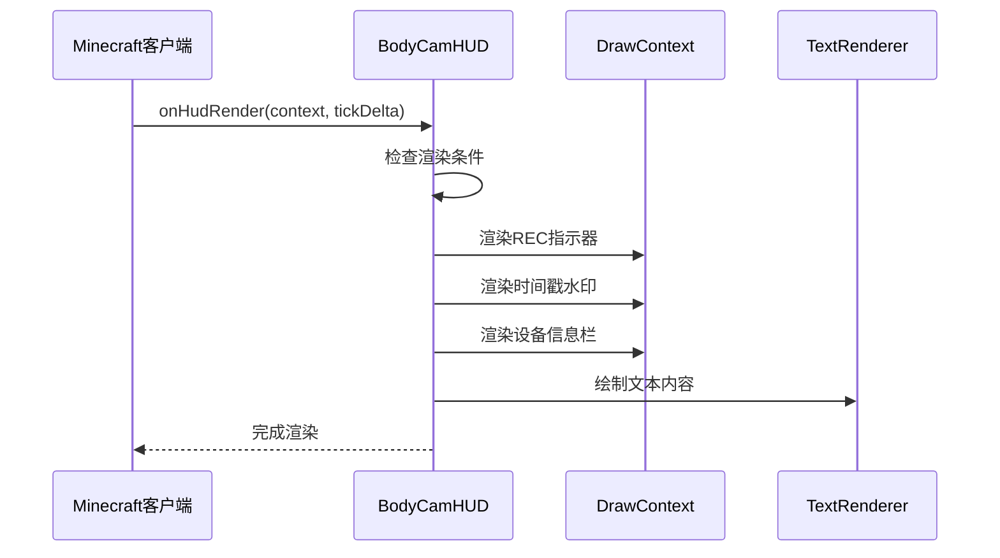

**图表来源**
- [BodyCamHUD.java:34-55](file://src/client/java/cn/pr0xy/client/BodyCamHUD.java#L34-L55)

**章节来源**
- [AXON.java:8-24](file://src/main/java/cn/pr0xy/AXON.java#L8-L24)
- [AXONClient.java:6-12](file://src/client/java/cn/pr0xy/client/AXONClient.java#L6-L12)
- [BodyCamHUD.java:13-124](file://src/client/java/cn/pr0xy/client/BodyCamHUD.java#L13-L124)

## 架构总览

项目采用分层架构设计，结合Fabric API的事件驱动机制和SpongePowered Mixin的字节码注入技术：

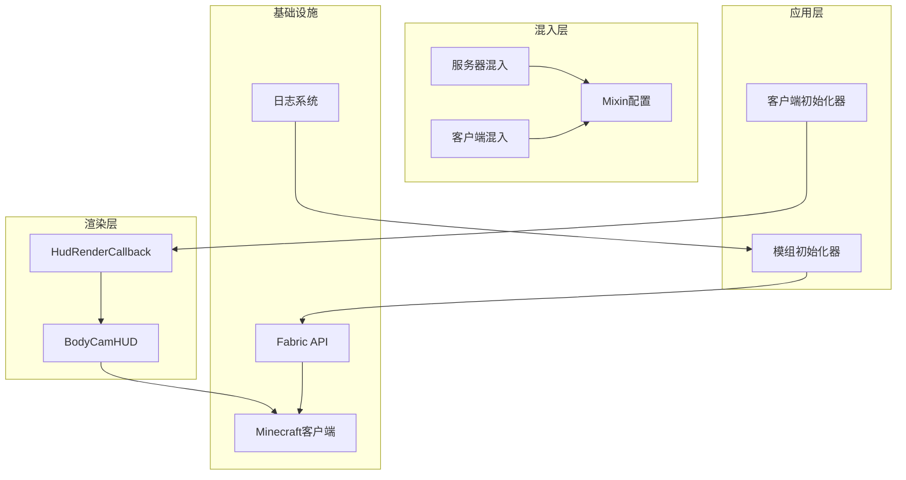

**图表来源**
- [fabric.mod.json:17-31](file://src/main/resources/fabric.mod.json#L17-L31)
- [AXONClient.java:10](file://src/client/java/cn/pr0xy/client/AXONClient.java#L10)
- [BodyCamHUD.java:35-55](file://src/client/java/cn/pr0xy/client/BodyCamHUD.java#L35-L55)

### 技术栈概览

项目使用以下核心技术栈：

| 技术组件 | 版本/要求 | 用途 |
|---------|----------|------|
| Java | 17+ | 开发语言和运行时 |
| Fabric Loader | >=0.19.2 | 模组加载器 |
| Fabric API | 0.92.9+1.20.1 | 模组开发框架 |
| Minecraft | 1.20.1 | 游戏版本 |
| SpongePowered Mixin | 字节码注入 | 方法注入和重写 |
| SLF4J | 日志接口 | 应用日志记录 |

**章节来源**
- [gradle.properties:10-20](file://gradle.properties#L10-L20)
- [fabric.mod.json:32-37](file://src/main/resources/fabric.mod.json#L32-L37)

## 详细组件分析

### BodyCamHUD组件详解

BodyCamHUD是整个模组的核心渲染组件，负责所有屏幕元素的绘制工作：

#### 核心渲染流程

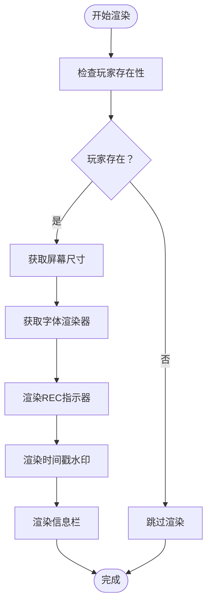

**图表来源**
- [BodyCamHUD.java:34-55](file://src/client/java/cn/pr0xy/client/BodyCamHUD.java#L34-L55)

#### 录制指示器实现

录制指示器采用动态闪烁效果来表示录制状态：

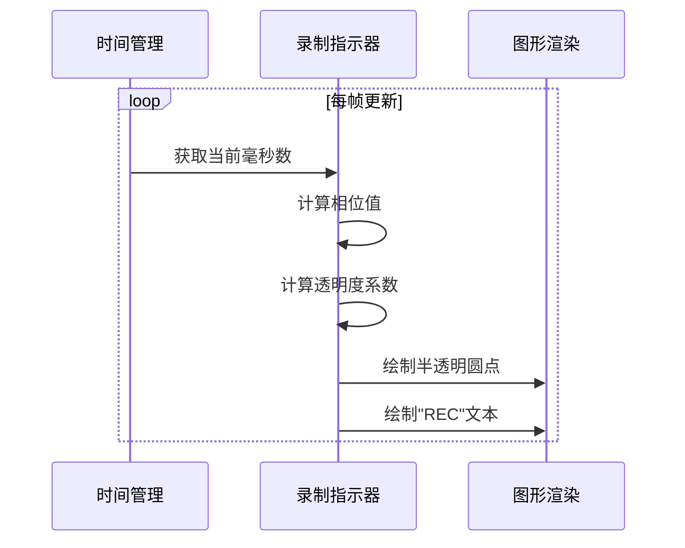

**图表来源**
- [BodyCamHUD.java:60-76](file://src/client/java/cn/pr0xy/client/BodyCamHUD.java#L60-L76)

#### 时间戳水印系统

时间戳水印提供精确的时间信息和设备标识：

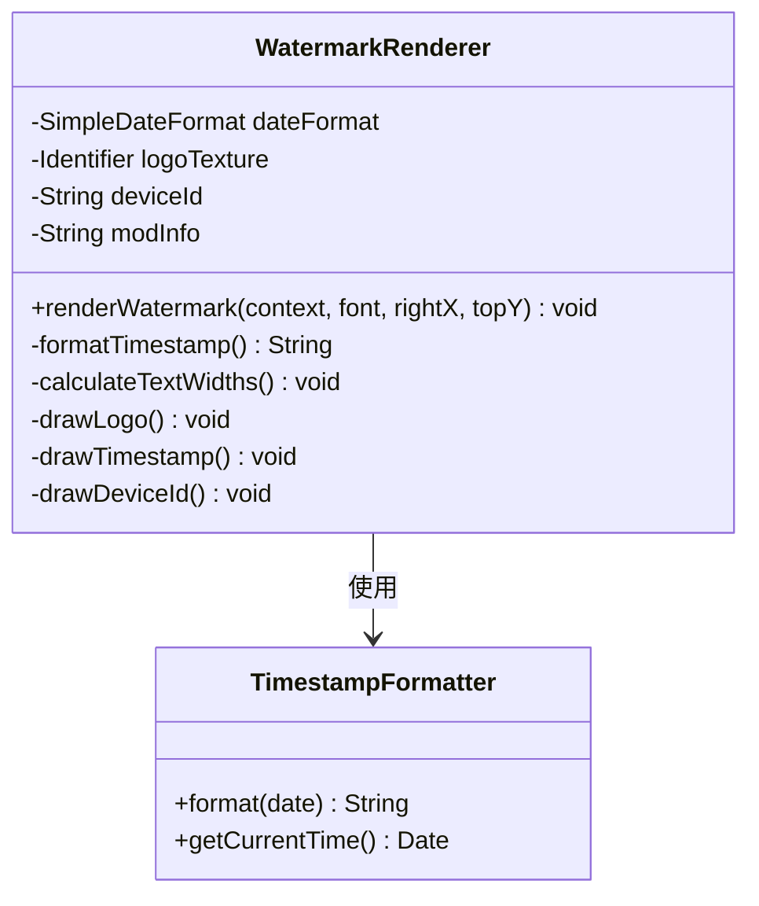

**图表来源**
- [BodyCamHUD.java:81-102](file://src/client/java/cn/pr0xy/client/BodyCamHUD.java#L81-L102)

**章节来源**
- [BodyCamHUD.java:13-124](file://src/client/java/cn/pr0xy/client/BodyCamHUD.java#L13-L124)

### Mixin系统集成

项目使用SpongePowered Mixin进行字节码级别的方法注入：

#### 服务器端混入

服务器端混入用于监控世界加载过程：

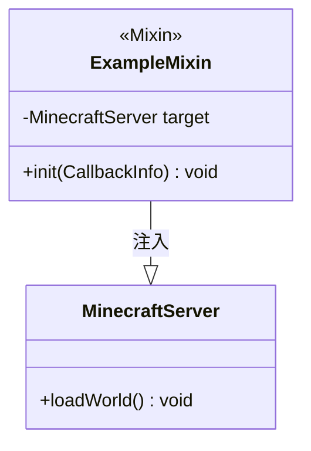

**图表来源**
- [ExampleMixin.java:9-15](file://src/main/java/cn/pr0xy/mixin/ExampleMixin.java#L9-L15)

#### 客户端混入

客户端混入用于监控主循环：

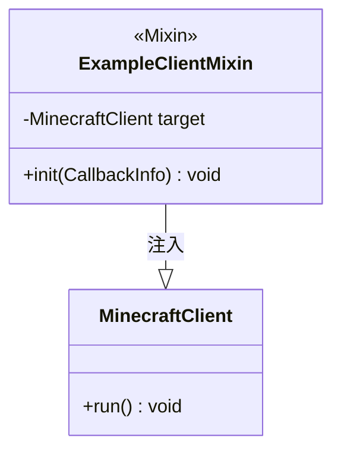

**图表来源**
- [ExampleClientMixin.java:9-15](file://src/client/java/cn/pr0xy/client/mixin/ExampleClientMixin.java#L9-L15)

**章节来源**
- [ExampleMixin.java:1-15](file://src/main/java/cn/pr0xy/mixin/ExampleMixin.java#L1-L15)
- [ExampleClientMixin.java:1-15](file://src/client/java/cn/pr0xy/client/mixin/ExampleClientMixin.java#L1-L15)

### 模组配置系统

模组通过fabric.mod.json进行配置声明：

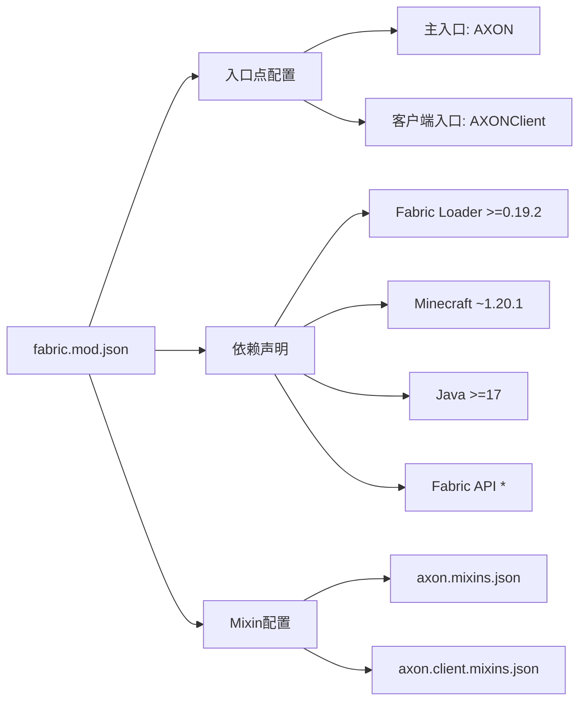

**图表来源**
- [fabric.mod.json:17-31](file://src/main/resources/fabric.mod.json#L17-L31)

**章节来源**
- [fabric.mod.json:1-38](file://src/main/resources/fabric.mod.json#L1-L38)

## 依赖关系分析

项目依赖关系清晰明确，遵循Fabric模组的标准依赖模式：

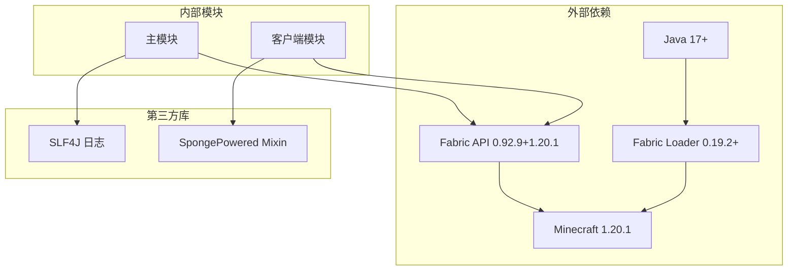

**图表来源**
- [build.gradle:29-38](file://build.gradle#L29-L38)
- [gradle.properties:10-20](file://gradle.properties#L10-L20)

### 构建系统配置

项目使用Gradle构建系统，配置了完整的Fabric模组开发环境：

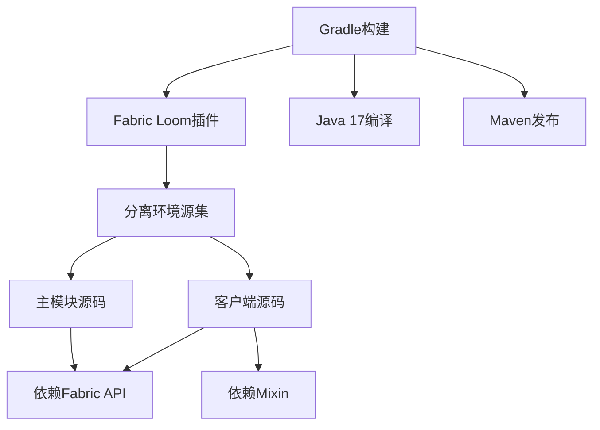

**图表来源**
- [build.gradle:17-27](file://build.gradle#L17-L27)
- [build.gradle:49-61](file://build.gradle#L49-L61)

**章节来源**
- [build.gradle:1-88](file://build.gradle#L1-L88)
- [gradle.properties:1-20](file://gradle.properties#L1-L20)

## 性能考虑

### 渲染性能优化

BodyCamHUD实现了多项性能优化措施：

1. **条件渲染**：仅在有玩家且HUD未隐藏时进行渲染
2. **最小化计算**：使用简单的三角函数计算闪烁效果
3. **批量绘制**：利用DrawContext的批量绘制能力
4. **缓存策略**：复用字体渲染器实例

### 内存管理

- 避免在渲染循环中创建临时对象
- 复用SimpleDateFormat实例
- 合理使用静态常量减少内存分配

## 故障排除指南

### 常见问题及解决方案

#### 模组无法加载

**症状**：启动时出现模组加载错误

**可能原因**：
- Fabric Loader版本不兼容
- Minecraft版本不匹配
- Java版本过低

**解决步骤**：
1. 检查gradle.properties中的版本配置
2. 确认Fabric API版本兼容性
3. 验证Java 17+环境

#### HUD不显示

**症状**：录制指示器或水印不显示

**排查步骤**：
1. 检查是否在单人游戏中
2. 确认HUD未被禁用（F1模式）
3. 验证BodyCamHUD注册是否成功

#### 性能问题

**症状**：游戏帧率下降

**优化建议**：
1. 减少屏幕分辨率
2. 关闭不必要的模组
3. 增加系统内存

**章节来源**
- [AXON.java:16-23](file://src/main/java/cn/pr0xy/AXON.java#L16-L23)
- [BodyCamHUD.java:38-41](file://src/client/java/cn/pr0xy/client/BodyCamHUD.java#L38-L41)

## 结论

BodyCam模组项目展现了现代Minecraft模组开发的最佳实践。通过精心设计的架构和实现，该项目成功地将专业录制功能无缝集成到Minecraft客户端中。

### 项目优势

1. **架构清晰**：分层设计使得代码易于维护和扩展
2. **性能优秀**：合理的渲染策略确保不影响游戏性能
3. **可扩展性强**：基于Fabric API和Mixin的架构便于功能扩展
4. **兼容性好**：严格遵循版本要求，确保稳定运行

### 技术亮点

- **事件驱动渲染**：利用HudRenderCallback实现非侵入式HUD集成
- **字节码注入**：通过Mixin实现方法级的功能增强
- **响应式设计**：自适应不同屏幕尺寸的布局系统
- **性能优化**：多层优化策略确保流畅的游戏体验

### 发展建议

1. **功能扩展**：可以考虑添加更多录制状态指示和配置选项
2. **用户界面**：提供更丰富的用户自定义选项
3. **性能监控**：集成性能监控工具以便持续优化
4. **文档完善**：补充详细的API文档和开发者指南

该项目为Minecraft模组开发提供了优秀的参考范例，展示了如何在保持高性能的同时实现复杂的功能需求。